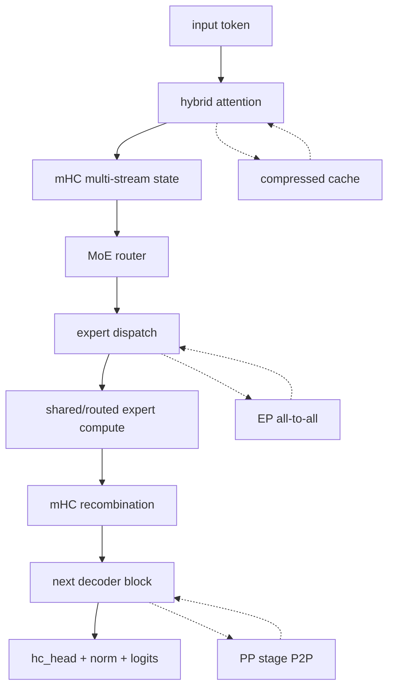

**比较 DeepSeek-V4 时，不能只比较总参数量或单个 benchmark。更有用的比较方式是：它如何分配计算、如何保存上下文、如何路由 token、需要哪些通信，以及这些设计对训练和部署提出什么要求。**

本文把“模型能力”和“系统代价”放在同一张表里。具体得分会随版本、权重、提示词、推理模式、硬件和评测集变化；下表主要比较架构与工程特征。

---

## 一、先给结论

| 模型类别 | 核心取舍 | 最适合的场景 | 最大风险 |
| --- | --- | --- | --- |
| Dense Transformer（Llama/Qwen Dense 等） | 每个 token 经过所有层的完整 FFN，结构简单稳定 | 中小规模部署、生态兼容、可控延迟 | 达到很大容量时每 token 计算和显存线性上涨 |
| 传统稀疏 MoE（Mixtral 等） | 每层只激活少数专家，attention 通常较传统 | 低于同等总容量的激活计算、较容易复用现有框架 | 专家负载不均、跨卡 token 通信、容量因子和 drop 策略 |
| DeepSeek-V3 | MLA + DeepSeekMoE + MTP + 辅助损失自由负载均衡 | 大容量、较高推理效率、已有成熟开源实现 | 长上下文 attention/缓存仍比 V4 更直接，部署单元较大 |
| DeepSeek-V4 | 混合注意力 + mHC + MoE + hash routing + MTP | 超长上下文、agent/code、集群级协同优化 | 架构、cache、kernel、并行和调试复杂度最高 |

DeepSeek-V4 的优势不是某一个模块单独“击败”所有模型，而是把多个系统层优化组合起来；缺点也正来自同一件事：任何一层的实现不成熟，都会抵消上层的理论收益。

---

## 二、Dense Transformer：最简单的基线

### 结构

```text
embedding
  -> [attention -> dense MLP] × N
  -> norm -> output
```

每个 token 在每一层都经过完整的 MLP。现代 Dense 模型可以使用 GQA/MQA、滑动窗口或 RoPE 变体，但基本执行图相对稳定。

### 优势

- 参数、activation、KV cache 和权重映射比较容易理解；
- 单机、多卡、量化和推理引擎生态最成熟；
- 没有专家 dispatch/all-to-all，延迟更可预测；
- 适合中小团队维护、微调和排障；
- PP/TP 的 stage contract 更简单，通常只需传 hidden state。

### 缺陷

- 总参数变大时，每个 token 的激活计算也变大；
- 不能把“总知识容量”与“每 token 成本”分离；
- 长上下文通常需要更大的 KV cache 或额外的稀疏注意力设计；
- 在相同硬件预算下，难以同时做到很大容量和很低激活计算。

### 与 V4 的关键差异

Dense 的瓶颈主要是矩阵乘、KV cache 和显存；V4 的瓶颈还包括压缩/索引、专家通信、sidecar、cache state 和 stage 调度。因此 Dense 往往“算得更多但系统更容易跑”，V4 往往“理论上算得更少但系统更难跑”。

---

## 三、传统稀疏 MoE：V4 的直接参照

### 通用执行图

```text
hidden
  -> router top-k
  -> token dispatch to selected experts
  -> expert FFN
  -> unpermute + weighted combine
```

典型稀疏 MoE 用少数专家替代 dense FFN，通常继续使用较传统的 full attention/GQA/MQA。它比 Dense 多了专家路由和通信，但比 V4 少了混合压缩注意力和 mHC 等结构。

### 优势

- 在近似的每 token 激活预算下提供更多专家容量；
- 专家可以形成一定程度的领域/模式专门化；
- 相对 V4，已有训练框架和推理实现更容易接入；
- 适合把专家并行作为独立优化维度。

### 缺陷

- router 负载不均导致某些设备成为 straggler；
- all-to-all 的通信成本可能超过省下的 FFN 计算；
- capacity factor、token drop、padding 和重复消息会影响质量与吞吐；
- 专家组合的 checkpoint、量化、热迁移和故障恢复更复杂。

### V4 在此基础上的变化

- shared expert 让所有 token 保留一条通用路径；
- 早期层可以使用 token-id 到 expert-id 的 hash routing；
- routed expert 的 GMM/SwiGLU 融合更强调 kernel 级执行；
- MoE 不再是唯一重点，attention/cache 同样被重新设计。

---

## 四、DeepSeek-V3：V4 的上一代基线

DeepSeek-V3 技术报告明确描述了 671B 总参数、37B 每 token 激活参数，并采用 MLA、DeepSeekMoE、辅助损失自由的负载均衡策略和 MTP；它还使用 FP8 训练与系统优化来降低训练成本。[DeepSeek-V3 Technical Report](https://arxiv.org/abs/2412.19437)

### V3 的主要优点

- MLA 通过低秩联合压缩减少 KV cache；
- DeepSeekMoE 把总参数容量与每 token 激活量分离；
- 辅助损失自由的负载均衡减少了额外均衡损失对主目标的干扰；
- MTP 为训练和推理提供额外预测信号；
- 开源代码、训练经验和工具链相对成熟。

### V3 相对 V4 的限制

- attention 仍以 MLA 为主，不具备 V4 的 sliding/CSA/HCA 混合长程路径；
- 没有 V4 这种多路 residual streams + mHC 的主干结构；
- 不需要处理 V4 的压缩池、indexer、hash sidecar 和多类 cache；
- 在长上下文和超大规模部署时，V4 可能有更高的上下文效率，但代价是更高的实现门槛。

### 什么时候 V3 反而是更好的选择

- 团队更看重开源实现的稳定性和生态兼容；
- context 长度没有达到 V4 的设计目标；
- 需要在较多现有推理引擎和硬件后端上快速上线；
- 业务更关注可预测延迟和排障成本，而不是极限模型容量。

---

## 五、DeepSeek-V4：把多个瓶颈同时重构

### 架构对比

| 维度 | Dense | 传统稀疏 MoE | DeepSeek-V3 | DeepSeek-V4 |
| --- | --- | --- | --- | --- |
| FFN | 每 token 全量激活 | Top-K 专家 | DeepSeekMoE Top-K | shared + routed experts |
| Attention | 常规 full/GQA/MQA | 多为常规 attention | MLA | sliding + CSA + HCA |
| Residual | 单路残差 | 单路残差 | 单路残差 | mHC 多路 streams |
| 路由 | 无 | 动态 router | 动态 router + balance | 早期 hash + 后续动态 Top-K |
| KV/cache | 直接保存 KV 或 GQA 压缩 | 与 attention 方案相关 | MLA latent KV | sliding KV + CSA/HCA compressed cache |
| 并行通信 | TP/PP/DP | 加 EP all-to-all | TP/PP/EP 等 | PP/TP/CP/EP + cache/sidecar |
| PP stage 输入 | 通常 hidden | hidden + routing metadata | hidden + MoE metadata | hidden streams + input_ids/MTP/cache sidecars |
| 实现复杂度 | 低到中 | 中 | 中到高 | 高 |

### V4 的系统执行路径



### V4 的主要优势

1. **长上下文效率**：用不同压缩率和索引策略处理近程、中程、远程依赖，目标是比完整 dense attention 更节省 KV/计算。
2. **容量/激活解耦**：MoE 保留大总容量，同时每 token 只激活少数专家。
3. **通用路径 + 专门路径**：shared expert 承载共性，routed experts 承载差异化知识。
4. **深层稳定性目标**：mHC 通过约束多路残差组合，试图改善信号传播。
5. **硬件协同空间**：压缩、稀疏、PP/TP/CP/EP 和专用 kernel 可以共同优化。

### V4 的主要缺陷

1. **工程复杂度高**：模型实现、编译器、通信库和推理引擎都必须理解多种状态。
2. **稀疏通信可能成为瓶颈**：省下的 FFN FLOPs 不一定抵消 EP all-to-all 和负载不均。
3. **压缩带来信息权衡**：HCA/CSA 的摘要和 Top-K 选择可能损失细粒度远程信息，需要任务级验证。
4. **PP 侵入性高**：`input_ids`、`hc_head`、MTP offset、compressor state 不能丢在 stage 边界。
5. **后端适配成本高**：CSA/HCA、mHC、SwigluGroup、dynamic cache 和低精度需要专门 kernel 与 autograd 测试。
6. **硬件要求和部署门槛高**：总参数仍然巨大，需要大规模内存、通信和并行编排；“激活参数少”不等于单机可部署。
7. **结果解释需要谨慎**：发布方能力宣称和实际业务收益之间，还隔着权重版本、推理模式、提示词、工具链和评测设置。

---

## 六、按场景选择哪类模型

| 场景 | 优先考虑 | 原因 | 需要确认 |
| --- | --- | --- | --- |
| 本地小规模服务 | Dense 或小型 MoE | 生态、延迟、故障成本更可控 | 质量是否满足需求 |
| 企业 RAG/长文档 | V4 类长上下文架构或专用检索 + 普通模型 | 可能减少显式切片和上下文拼接 | 长程召回、压缩信息损失、成本 |
| 高并发 API | V3/传统 MoE 或 V4 Flash | 激活量与服务吞吐更重要 | batching、KV/cache、通信和实际 token/s |
| 超大规模训练 | V3/V4 等 MoE + PP/TP/EP | 总容量、集群效率和硬件协同 | stage balance、all-to-all、checkpoint |
| 代码 agent | V4-Pro/V4-Flash 或同级 coding 模型 | 长上下文代码库、工具调用和规划能力 | 真实仓库成功率、回滚和工具安全 |
| 快速原型/二次开发 | V3 或 Dense | 参考实现更多、debug 成本低 | 与目标硬件的算子支持 |
| 极低延迟单请求 decode | Dense/GQA/MQA 小模型 | PP/MoE/压缩 cache 的调度开销可能不划算 | 质量与 latency 的折中 |

---

## 七、怎样做公平对比

### 能力维度

- 普通问答、数学、代码生成、代码修改和多轮 agent；
- 长上下文定位、跨文件引用、结构化输出和工具调用；
- 中文/英文/代码混合，短输入与 1M 级长输入分别测试；
- thinking/non-thinking 或不同 reasoning effort 单独分组；
- 输出长度、温度、工具权限和失败重试次数固定。

### 系统维度

- 首 token 延迟、生成 token/s、端到端请求延迟分位数；
- prefill/decode 的 GPU/NPU 利用率；
- KV cache 每 token 内存、压缩/索引开销；
- EP/PP/TP/CP 通信占比、最慢 rank 和负载均衡；
- 峰值内存、功耗、节点数量和每百万 token 成本；
- 量化后质量、长上下文退化、故障恢复和滚动升级。

### 不应使用的简化结论

- “总参数量大，所以一定更强”；
- “激活参数少，所以一定更快”；
- “上下文窗口 1M，所以能等价读取 1M token”；
- “开源权重，所以部署成本低”；
- “benchmark 第一，所以在我的代码仓库也第一”。

---

## 八、最终评价

DeepSeek-V4 的核心优势是**把模型容量、长上下文、稀疏激活和分布式硬件效率放在一个共同设计空间里优化**。它的核心缺陷也是同一件事：**优化收益建立在大量精细的实现、通信和状态管理之上，任何一层没有跟上，理论优势就可能变成部署复杂度。**

对学习和适配而言，V4 的价值不只是“又一个模型”，而是一个很好的系统级案例：

```text
模型结构
  -> attention/cache
  -> router/experts
  -> TP/PP/CP/EP
  -> compiler/kernel
  -> profiling/precision/debug
```

真正掌握它，不是背下所有模块名，而是能在任意输入、shape、rank、cache 或通信异常出现时，回答：数据从哪里来、在哪里被切分、谁拥有它、谁会修改它、失败如何传播，以及如何用最小实验验证假设。

## 参考资料

- [DeepSeek-V4 官方预览发布](https://api-docs.deepseek.com/news/news260424/)
- [DeepSeek-V4-Pro GA 发布](https://api-docs.deepseek.com/news/news260813/)
- [Hugging Face DeepSeek-V4 文档](https://huggingface.co/docs/transformers/v5.12.0/model_doc/deepseek_v4)
- [DeepSeek-V3 Technical Report](https://arxiv.org/abs/2412.19437)
- [PyTorch Pipeline Parallelism](https://docs.pytorch.org/docs/stable/distributed.pipelining.html)
- [[deepseek-v4-architecture-and-execution]]
- [[pipeline-parallel]]
