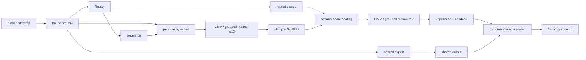
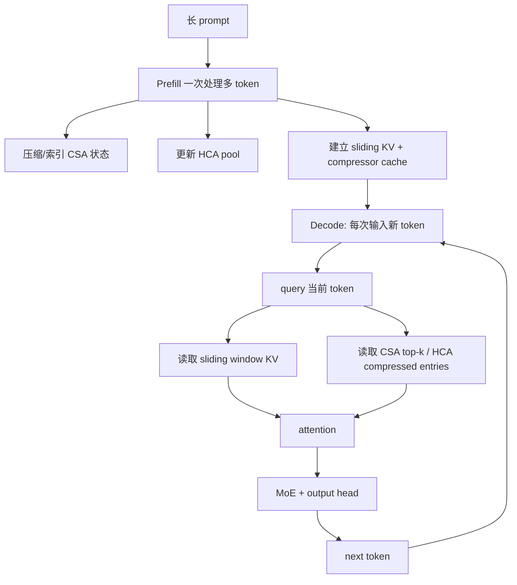
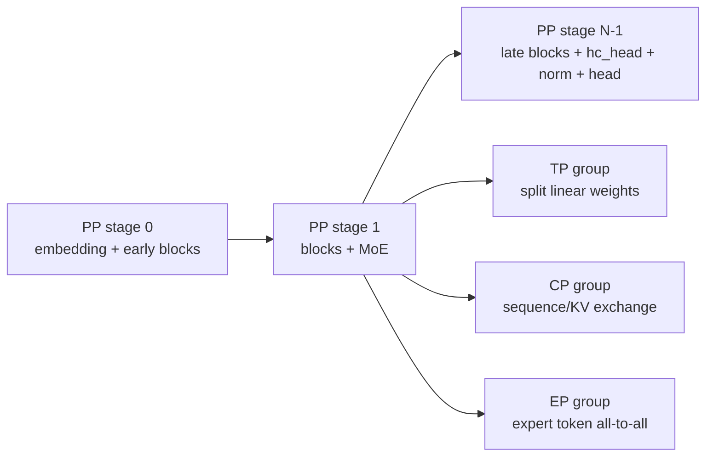

**DeepSeek-V4 不是简单把 DeepSeek-V3 放大，而是把长上下文注意力、残差连接、MoE 路由和训练/部署协同一起重新设计。**它的核心思路可以概括为：用混合注意力降低长上下文的 KV/计算成本，用 mHC 稳定多路残差流，用稀疏 MoE 保留很大的总容量但只激活少量专家，再用 PP/TP/CP/EP 把执行拆到集群上。

本文分开记录三类事实：

1. **公开架构事实**：来自 DeepSeek 官方发布信息和 Hugging Face Transformers 的 V4 实现文档；
2. **当前模型执行推断**：根据公开配置、模块关系和仓库中的适配记录整理；
3. **本仓库实现边界**：重点说明 PP、CP、GMM/SwigluGroup 等适配时真正需要传递和验证的数据。

公开发布信息中，DeepSeek-V4-Pro 被描述为约 1.6T 总参数、49B 激活参数，V4-Flash 约 284B 总参数、13B 激活参数；这些是发布方口径，不等价于独立 benchmark 结论。两者共享同一类架构，但宽度、深度、专家数和权重不同。[DeepSeek-V4 Preview Release](https://api-docs.deepseek.com/news/news260424/)

---

## 一、先看全模型：从 token 到 logits

```mermaid
flowchart TD
    A[input_ids / position_ids] --> E[Token Embedding]
    E --> H0[多路 hidden streams\n[B,S,hc_mult,D]]
    H0 --> L0

    subgraph DECODER[重复 N 层 Decoder Block]
      L0[Hyper-Connection pre mix] --> ATT[按 layer_type 选择注意力]
      ATT --> AMIX[Hyper-Connection post/comb]
      AMIX --> R[Router / MLP 路径]
      R --> FMIX[Hyper-Connection post/comb]
    end

    FMIX --> MORE{还有 layer?}
    MORE -->|yes| L0
    MORE -->|no| HC[hc_head\n多路流 -> [B,S,D]]
    HC --> N[Final RMSNorm]
    N --> O[Output projection / vocab logits]
    O --> LOSS[训练: next-token loss]
    O --> SAMPLE[推理: sampling / decoding]

    R -.-> ROUTE[Top-K / hash expert routing]
    ROUTE -.-> EXP[Shared Expert + Routed Experts]
    EXP -.-> R

    ATT -.-> CACHE[CSA/HCA compressor + sliding KV cache]
    CACHE -.-> ATT
```

### 一次 decoder block 的逻辑顺序

不要把图理解为普通的 `x + Attention(x) + MLP(x)`。在 V4 中更准确的抽象是：

```text
多路 hidden streams
  -> attn_hc：决定哪些 stream 进入 attention
  -> hybrid attention：局部/压缩/稀疏地读取上下文
  -> attn_hc：把 attention 输出写回多路 streams
  -> ffn_hc：决定哪些 stream 进入 FFN/MoE
  -> shared expert + routed experts
  -> ffn_hc：把 FFN 输出重新组合
```

注意力类型和 MLP 类型由配置数组按 layer 选择；不能用“所有层都走同一个 attention/FFN”来解释 V4。

---

## 二、模型的主要组件

### 1. Decoder-only Transformer 外壳

V4 仍然是自回归 decoder-only 语言模型：输入 token 序列，按因果方向计算隐藏状态，最终预测下一个 token。训练时可以并行处理完整序列；推理时分为 prefill 和逐 token decode 两个阶段。

从公开的 V4 配置示例可以看到一些代表性默认值：`hidden_size=4096`、`num_hidden_layers=43`、`n_routed_experts=256`、`num_experts_per_tok=6`、`n_shared_experts=1`、`max_position_embeddings=1048576`。这些是一个 V4 配置的默认示例，不应未经核对就当作 Pro/Flash 所有版本的固定规格。[Hugging Face DeepSeek-V4 文档](https://huggingface.co/docs/transformers/v5.12.0/model_doc/deepseek_v4)

### 2. mHC：Manifold-Constrained Hyper-Connections

普通残差通常可以写成：

```text
x_next = x + F(x)
```

V4 使用多路 residual streams。可以把主干形状抽象为：

```text
[B, S, hc_mult, D]
```

`attn_hc` 和 `ffn_hc` 在子层前后混合这些 streams，组合矩阵受到流形约束（例如 doubly-stochastic 投影），目的是让深层网络中的信号传播更稳定、不因不断叠加而无界放大。公开实现文档将 mHC 描述为对传统 residual connection 的替换，并指出 `comb` 由 Sinkhorn–Knopp 迭代产生。[Hugging Face 架构说明](https://huggingface.co/docs/transformers/v5.12.0/model_doc/deepseek_v4)

这会直接影响工程实现：

- 中间 layer 的 hidden 不是普通 `[B,S,D]`；
- PP stage 边界必须保持 `hc_mult` 维度和 stream 语义；
- 最后需要 `hc_head` 把多路流压回 `[B,S,D]`；
- final norm/output head 不能在 `hc_head` 之前执行；
- TP/CP/compile 适配不能只看最后两维，必须确认 stream 维如何布局。

### 3. 混合注意力：Sliding / CSA / HCA

V4 的 attention layer 由 `layer_types[i]` 选择，公开实现至少包含三类：

| 类型 | 做法 | 解决的问题 | 主要代价 |
| --- | --- | --- | --- |
| Sliding-window attention | 只看局部滑动窗口 | 保留局部细节、计算可控 | 单层不能直接看到很远的 token |
| Compressed Sparse Attention（CSA） | 重叠压缩池 + Lightning Indexer + Top-K 压缩块 | 用较少的长程候选近似全局上下文 | 压缩、索引、gather 和 mask 复杂 |
| Heavily Compressed Attention（HCA） | 高压缩、非重叠窗口，不做 indexer | 以极低 KV 数量覆盖更长距离 | 长程细节更粗，压缩窗口需精心选择 |

三种 attention 共享一些底层约定：

- `num_key_value_heads=1` 的 shared K=V / MQA 风格；
- 只对部分 head 维应用 RoPE；
- 有可学习 attention sink；
- 输出侧使用 grouped low-rank projection；
- 长程压缩分支与滑动窗口 KV 分支共同进入核心 attention。

#### CSA 的执行路径

```text
hidden
  -> query / local KV
  -> compressor（重叠窗口）
  -> Lightning Indexer 为每个 query 打分
  -> top-k compressed entries
  -> gather selected entries
  -> 与 sliding KV 拼接
  -> causal attention
```

#### HCA 的执行路径

```text
hidden
  -> query / local KV
  -> compressor（非重叠、大压缩率窗口）
  -> 所有已完成的 compressed entries
  -> 与 sliding KV 拼接
  -> causal attention
```

CSA 需要 indexer buffer、top-k 索引和重叠状态；HCA 不需要 indexer，但需要 compressor pool、count 和窗口可见性状态。两者的 cache 不能用同一套“普通 KV cache”描述。

### 4. MoE：共享专家 + 路由专家

每个 MoE 层可以拆成：

```text
hidden
  ├─ shared expert：所有 token 固定经过
  └─ routed experts：Router 选择 Top-K 后才执行
```

这两个分支解决不同问题：

- **共享专家**承载所有 token 都可能需要的通用变换，不参与专家竞争；
- **路由专家**提供稀疏的专门化容量，只让当前 token 激活少数专家。

路由的通用抽象是：

```text
router_logits = Router(hidden)
expert_ids, routed_scores = TopK(router_logits)
dispatch(hidden, expert_ids)
expert_output = Experts(routed_rows, counts)
combine(expert_output, expert_ids, routed_scores)
```

在 V4 的早期 hash-routing 层，专家编号可以由 token id 的静态映射初始化或决定；后续层则使用动态 router。**因此 `input_ids` 不只是 embedding 的输入，在部分层还是路由计算的 sidecar。**

### 5. MTP：多 token 预测

V4 配置和上游模型接口保留 `num_nextn_predict_layers`/MTP 相关字段，用于让训练目标或推理策略利用未来多个 token 的预测信号。需要把 MTP 和普通 output head 区分开：

- MTP 可能需要额外的 hidden、offset、目标 token 对齐和 loss 逻辑；
- 它不一定等价于“在最后加几个 Linear”；
- 当前 Hugging Face 文档说明其模型实现没有实例化上游 checkpoint 的 MTP 层；
- 当前仓库 PP 修复先覆盖 `num_mtp_modules=0`，开启 MTP 需要单独定义 stage contract。

---

## 三、DeepSeek-V4 的执行流程

### 1. 训练 forward：完整路径

```mermaid
flowchart TD
    IDS[input_ids] --> EMB[Embedding]
    IDS --> HASH{早期 hash routing?}
    EMB --> STREAMS[初始化 hc_mult streams]
    STREAMS --> BLOCK[Decoder block i]
    HASH -->|yes: tid2eid[input_ids]| EIDS[static expert ids]
    HASH -->|no| ROUTER[Router(hidden)]

    BLOCK --> PREA[attn_hc pre mix]
    PREA --> ATTYPE{layer_types[i]}
    ATTYPE -->|sliding| SW[local sliding KV]
    ATTYPE -->|CSA| CSA[compress + indexer top-k]
    ATTYPE -->|HCA| HCA[heavy compress pool]
    SW --> ATTCORE[causal attention]
    CSA --> ATTCORE
    HCA --> ATTCORE
    ATTCORE --> POSTA[attn_hc post/comb]
    POSTA --> PREF[ffn_hc pre mix]
    PREF --> ROUTER
    EIDS --> DISPATCH
    ROUTER --> TOPK[Top-K expert ids + routed scores]
    TOPK --> DISPATCH[token permute / counts]
    DISPATCH --> SHARED[shared expert]
    DISPATCH --> ROUTED[routed experts / GMM]
    SHARED --> ACT[SwiGLU / activation]
    ROUTED --> ACT
    ACT --> COMBINE[combine / unpermute / weighted sum]
    COMBINE --> POSTF[ffn_hc post/comb]
    POSTF --> NEXT{last layer?}
    NEXT -->|no| BLOCK
    NEXT -->|yes| HCHEAD[hc_head: streams -> hidden]
    HCHEAD --> NORM[final norm]
    NORM --> LOGITS[vocab projection]
    LOGITS --> LOSS[next-token / optional MTP loss]
```

### 2. 单个 MoE 层的细化



在当前仓库的 `npu_swiglu_group` 接入语境中，路由专家的融合区间是：

```text
GMM-1 (w13) -> SwigluGroup -> GMM-2 (w2)
```

而 DeepSeek-V4 专用路径中，`routed_scores` 是否传入 activation 取决于模型调用约定；如果 score 在专家输出之后单独相乘，不能仅凭“用了 SwigluGroup”断言 score 已被融合。详见 [[swiglu-group-接入复盘]]。

### 3. Prefill 与 Decode



**长上下文优化的关键不是“缓存消失了”，而是缓存内容被分成不同粒度和可见性：**局部窗口保存细节，CSA 保存可索引的中等粒度，HCA 保存更高压缩的长程摘要。缓存层必须记录窗口、压缩率、已完成 entry 数、indexer 状态和位置关系。

---

## 四、DeepSeek-V4 与 PP/TP/CP/EP 的组合

### 1. 逻辑 rank 网格



一个真实 rank 可能同时属于：

- 一个 PP stage；
- 该 stage 内的 TP group；
- 该 stage 内的 CP group；
- MoE layer 的 EP group；
- 外层 DP/FSDP replica。

PP 的 P2P 只负责 stage 边界；TP/CP/EP 的通信分别负责层内权重、序列 attention 和专家 token。把这些通信混为“模型并行通信”会导致错误的性能归因。

### 2. DeepSeek-V4 的 PP stage contract

```text
Stage 0 -> Stage 1 -> ... -> Stage N-1

必需主数据：
  hidden streams [B, S, hc_mult, D]

可能的 sidecar：
  input_ids / hash expert ids
  position_ids / attention mask
  MTP offsets / target alignment
  CP compressor boundary state
  cache position / request metadata

最后 stage 额外负责：
  hc_head -> [B,S,D]
  final norm
  output projection / loss
```

### 3. PP+CP 的特别复杂性

CP 让每个 rank 只持有 sequence 的一部分，但 DeepSeek-V4 的 CSA/HCA compressor 又需要跨 rank 传递压缩状态和边界信息。当前仓库的 CP 设计采用 `BoundaryExchange`、AllGatherCompressedKV 以及不同压缩率下的局部窗口处理；这说明 V4 的 CP 不是简单把普通 attention 的 `K/V` 切开。

工程上必须同时验证：

- `freqs_cis` 与压缩率对应的 RoPE 选择；
- window KV 的边界初始化；
- score 的 `-inf` 初始化和梯度方向；
- CP rank 的局部索引是否映射到全局位置；
- PP micro-batch 生命周期是否覆盖 compressor cache。

### 4. PP+MoE 的特别复杂性

MoE 的 token dispatch 和 PP 的 stage P2P 是两层不同的交换：

```text
stage 内：token -> EP experts -> unpermute
stage 间：hidden streams -> next PP stage
```

如果 EP all-to-all 后 token 顺序发生改变，必须在 stage contract 中保存足够的 mapping，避免下一个 stage 或最终 combine 丢失原始 token 顺序。

---

## 五、模型“结果”应该怎样理解

### 1. 能力结果与架构结果要分开

官方发布页对 V4-Pro/V4-Flash 的定位包括长上下文、agent、coding 和 reasoning 能力；这属于产品发布和评测口径。架构层面更确定的结果是：

- 总参数容量很大，但每 token 只激活部分 MoE 专家；
- 注意力将局部细节与长程压缩信息结合，目标是降低长上下文的 KV/计算成本；
- MQA、部分 RoPE、压缩 cache 和 grouped output projection 共同降低 attention 的常驻和计算压力；
- mHC 让多路 residual streams 在深层传递时更容易稳定；
- 代价是 kernel、cache、通信、量化和并行调度比普通 Transformer 复杂得多。

### 2. 不要从参数量直接推导能力

“1.6T 总参数、49B 激活参数”不能单独证明模型一定比某个 Dense 400B 模型好：

- 激活参数只是计算量近似，不等于有效知识量；
- 训练数据、后训练、推理模式、上下文长度和采样参数都会影响结果；
- 稀疏路由可能产生专家不均衡、路由错误或长尾能力损失；
- 1M context 的上限不等于每个位置都能等价地利用全部上下文。

因此比较时至少要固定：任务集、prompt、thinking mode、输出长度、batch、量化、服务实现、硬件和成本口径。

---

## 六、优势：为什么这个设计有吸引力

### 1. 长上下文效率的系统性优化

V4 没有只依赖“把 context window 做大”，而是同时优化压缩、索引、局部窗口、KV cache 和 attention 输出。对长文档、代码仓库和 agent 历史状态，这比单纯增加 dense attention 的上下文上限更有工程意义。

### 2. 总容量和单 token 成本分离

MoE 允许模型保存大量专家容量，但每个 token 只激活 Top-K 路由专家。若路由均衡且硬件/通信配套，能够在保持大容量的同时控制单 token 计算量。

### 3. 共享专家减轻通用能力重复学习

所有 token 都经过 shared expert，路由专家专门处理差异化模式。这比让每个 token 完全依赖 Top-K 专家更容易保留通用变换，但也增加了每 token 的固定成本。

### 4. mHC 提供更强的深层稳定性目标

多路 stream + 受约束的组合矩阵，为深层网络中的信号传播提供了比普通残差更强的结构约束。它的价值更接近“训练稳定性和可扩展性基础设施”，而不是一个单独可见的功能模块。

### 5. 对并行硬件更有可优化空间

PP、TP、CP、EP 可以按维度组合：

- PP 放大可容纳的模型深度；
- TP 提高单层矩阵计算吞吐；
- CP 支持长序列；
- EP 承载稀疏专家通信。

这给硬件/框架协同优化留下空间，也正是本仓库进行 NPU 适配和通信定位的价值所在。

---

## 七、缺陷与工程风险

### 1. 架构复杂度显著高于普通 Dense Transformer

一个普通 dense decoder block 主要处理 QKV、attention、MLP、norm 和 residual；V4 还需要处理：

- layer type dispatch；
- compressor / indexer / top-k / mask；
- 多路 residual stream 和 Sinkhorn 约束；
- shared/routed expert；
- hash routing sidecar；
- PP/TP/CP/EP 多套通信；
- 多种 cache 和 MTP 对齐。

任何一个边界处理不一致，都可能表现为 shape 错、精度漂移、hang、OOM 或吞吐下降。

### 2. 稀疏不等于通信便宜

MoE 降低了每 token 激活的专家数，但 EP all-to-all 可能成为瓶颈；expert load 不均会让快卡等待慢卡；跨节点 token 交换还会放大拓扑和网络抖动的影响。

### 3. 长上下文压缩存在信息损失和索引成本

HCA/CSA 通过压缩减少 KV，但压缩不是无损存储；indexer top-k 也需要额外的计算、内存和 kernel。对精确检索、跨段引用和代码符号依赖，必须通过任务集验证压缩后的可用性。

### 4. PP 对模型结构侵入性更强

普通模型的 stage 边界通常只传 hidden；V4 还可能需要原始 `input_ids`、MTP offset、cache position 和压缩状态。当前仓库已实际遇到：

- 非首 stage 把 hidden 错当 token id；
- 最后 stage 漏掉 `hc_head`；
- Interleaved schedule 产生多个 virtual stage；
- MTP 需要额外 sidecar。

### 5. 生态和 kernel 兼容成本高

模型能在 Transformers 参考实现中运行，不代表它能直接在任意训练框架、编译器、GPU/NPU kernel、量化格式或推理引擎中高效运行。CSA/HCA、mHC、SwigluGroup 和 dynamic cache 都需要专门的实现与测试。

### 6. 能力结果不能只看发布 benchmark

官方发布页的 benchmark/能力表述是产品方口径；在实际项目中还要验证：代码库修改、长上下文召回、工具调用稳定性、中文/英文混合、结构化输出、成本、延迟和故障恢复。对比模型时要避免把“总参数更大”直接等同于“业务结果更好”。

---

## 八、与当前仓库工作的对应关系

| 模型组件 | 当前仓库中应该看什么 | 适配时最容易错的点 |
| --- | --- | --- |
| PP stage/virtual stage | [[DeepSeekV4 PP 通用修复方案]]、[[pipeline-parallel]] | `input_ids` sidecar、`hc_head`、MTP offset |
| CP attention | [[DeepSeek-2026 CP 切分设计方案]]、[[context-parallel]] | global/local index、boundary exchange、压缩 cache |
| Router/专家 | [[deepseek-v4]]、[[swiglu-group-接入复盘]] | hash routing、routed score、dispatch/combine |
| GMM + SwiGLU | [[swiglu-group-接入复盘]] | w13 布局、clamp、score 是否真的传入融合算子 |
| TP | [[tensor-parallel]]、[[tp-module-sharding]] | `[B,S,hc_mult,D]` 的 stream 维布局 |
| 数值验证 | [[deep-learning-training-numerics]]、[[floating-point-error-analysis]] | 压缩/低精度/通信顺序造成的误差 |

### 最小正确性验收矩阵

至少覆盖：

| 维度 | 基线 | 增量验证 |
| --- | --- | --- |
| 模型结构 | PP=1、TP=1、CP=1、EP=1 | 逐项打开 PP/TP/CP/EP |
| attention | sliding-only | CSA、HCA、不同压缩率 |
| routing | 动态 Top-K | 早期 hash routing、shared expert |
| schedule | single stage / GPipe | 1F1B、Interleaved1F1B |
| 训练 | `num_mtp_modules=0` | 再单独加入 MTP |
| 数值 | fp32/bf16 小模型 | 混合精度、真实规模、长上下文 |
| 运行 | eager | compile/graph、真实 NPU kernel |

---

## 九、对工程师最重要的阅读顺序

1. 先读 [[pipeline-parallel]]，理解 stage、micro-batch 和 bubble；
2. 再读本文的“全模型流程”和“单个 MoE 层”；
3. 用 [[context-parallel]] 和 [[DeepSeek-2026 CP 切分设计方案]] 对照 attention cache；
4. 用 [[tensor-parallel]] 对照每个 Linear/GroupedLinear 的切分；
5. 最后阅读 [[swiglu-group-接入复盘]]，确认融合算子位于哪两次 GMM 之间；
6. 用 PP=1/TP=1/CP=1 的小配置复现每个边界，再逐维增加并行度。

**阅读 V4 代码时，最危险的误区是把它当成“普通 Transformer + MoE”。**正确的方法是同时跟踪：shape、stream、position、expert mapping、cache state 和 communicator。

## 参考资料

- [DeepSeek-V4 官方预览发布](https://api-docs.deepseek.com/news/news260424/)
- [DeepSeek-V4-Pro GA 发布](https://api-docs.deepseek.com/news/news260813/)
- [Hugging Face DeepSeek-V4 架构与配置文档](https://huggingface.co/docs/transformers/v5.12.0/model_doc/deepseek_v4)
- [DeepSeek-V3 Technical Report](https://arxiv.org/abs/2412.19437)
- [[pipeline-parallel]]
- [[context-parallel]]
- [[tensor-parallel]]
- [[DeepSeekV4 PP 通用修复方案]]
- [[DeepSeek-2026 CP 切分设计方案]]
- [[swiglu-group-接入复盘]]
