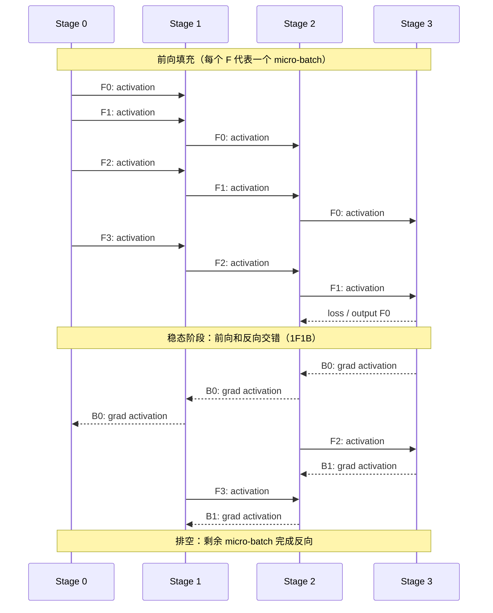
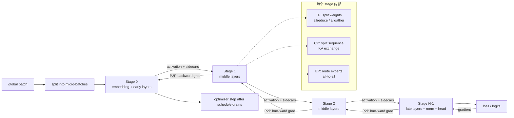
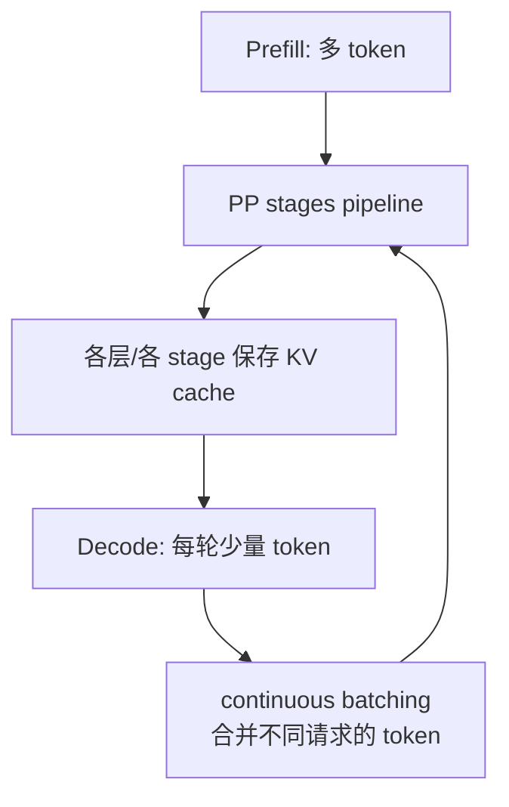

**Pipeline Parallel（流水线并行，PP）沿模型深度切分网络层：每个 stage 只保存连续的一段 Transformer layers，micro-batch 像流水一样依次经过这些 stage。**

PP 解决的主要问题是“单卡放不下完整模型”或“模型参数跨设备传输的带宽比单卡计算更可控”。它切的是**执行深度和参数所属的层**，不是 TP 的权重维度，也不是 CP 的序列维度。PP 通常与 TP、CP、DP、EP 组合成 3D/4D 并行，而不是替代它们。

---

## 一、先用一张图建立直觉

假设有 4 个 pipeline stage、4 个 micro-batch：



图中每一条 stage 间的箭头都是点对点通信，传递的是 activation 或其梯度。一个 stage 内部仍可以执行完整的 TP/CP/EP 集合通信。

### PP 的四个对象

| 对象 | 含义 | 典型问题 |
| --- | --- | --- |
| `stage` | 一段连续的模型执行区间和它拥有的参数 | 层数是否均衡、边界是否放对 |
| `micro-batch` | 一个 batch 被拆出来的流水粒度 | 数量是否足够、梯度如何缩放 |
| `schedule` | 每个 stage 什么时候做哪个 micro-batch 的 F/B | bubble、显存和调度复杂度 |
| `P2P activation` | 相邻 stage 之间传递的中间张量 | shape、dtype、通信等待、autograd |

---

## 二、PP 到底切了什么

一个 decoder-only Transformer 可以抽象为：

```text
input_ids
  -> embedding
  -> layer 0 ... layer k-1       (stage 0)
  -> layer k ... layer 2k-1      (stage 1)
  -> ...
  -> layer L-1
  -> final norm
  -> output head / loss
```

当 `pp_size = p` 时，理想情况是把模型分成 `p` 个参数和计算量接近的 stage。每个 stage 只保留本地层和本地优化器状态；前一个 stage 的输出通过 P2P 发给下一个 stage，后一个 stage 的梯度再反向传回来。

### 1. stage 边界不是简单按层数平均

真正应该均衡的是每个 stage 的**稳态 step 时间和显存峰值**，而不是 `layer_count`：

- 不同层可能使用不同注意力类型、MoE 专家数或压缩率；
- embedding、final norm、output head、loss 和 sampler 可能只在首/尾 stage；
- MoE 的 all-to-all、稀疏路由和负载不均会改变实际耗时；
- CP 的边界交换、TP 的 allreduce、activation checkpoint 会改变 stage 成本；
- DeepSeek-V4 的 `hc_head` 必须在最后输出头之前，不能把它漏出最后 stage。

因此分层时应记录每个候选 stage 的：前向时间、反向时间、激活大小、参数量、通信量和峰值内存。

### 2. stage 的输入不一定只有 hidden state

普通 Transformer 的非首 stage 通常只需要上一 stage 的 hidden state 和必要的 mask/位置状态。但如果模型的后续计算依赖原始 token id，就必须把它作为 **sidecar** 数据沿 PP 传递或在每个 stage 保留可恢复的映射。

DeepSeek-V4 的早期 hash routing 用真实 `input_ids` 映射专家编号。当前仓库的 PP 修复记录已经定位到：非首 stage 把上一 stage 的 hidden state 错当成 token id，会把 `[B,S,hc_mult,D]` flatten 后送进 `tid2eid`。这不是普通的 shape bug，而是 PP stage 接口丢失了模型语义所需的 sidecar。

---

## 三、micro-batch、气泡与调度

### 1. 为什么要拆 micro-batch

如果一个完整 batch 一次性从 stage 0 走到 stage `p-1`，后面的 stage 必须等待前面的 stage 完成，无法形成并行。把 batch 拆成 `m` 个 micro-batch 后：

```text
完整 batch = micro_batch_0 + micro_batch_1 + ... + micro_batch_(m-1)
```

stage 0 可以计算 `micro_batch_1`，同时 stage 1 计算 `micro_batch_0`，stage 2 计算更早的 micro-batch。代价是：每个 micro-batch 的激活需要被保存到对应反向发生时。

理想化的流水线 bubble 比例常写成：

```text
bubble_ratio ≈ (p - 1) / (m + p - 1)
```

它只用于建立直觉，不是实际吞吐保证。stage 不均衡、P2P 延迟、集合通信、重计算、数据加载和调度实现都会使实际 bubble 更大。

**直接结论：**`m` 越大，bubble 越小，但 activation 保存、调度开销和梯度语义越复杂；`p` 越大，流水线越容易空转。

### 2. GPipe：fill-drain

GPipe 先把所有 micro-batch 做完前向，再反向排空：

```text
F0 F1 F2 F3 ... Fm-1 | B0 B1 B2 B3 ... Bm-1
```

优点：调度直观，梯度聚合语义简单。

缺点：在排空前要保留许多前向激活，内存压力大；前向和反向之间的等待较长。它适合先验证 PP 正确性，未必适合最终训练。

### 3. 1F1B：one-forward-one-backward

1F1B 进入稳态后，每个 stage 交替处理一个 forward 和一个 backward：

```text
warmup:  F0 F1 F2 ...
steady:  F? B? F? B? F? B?
drain:   B? B? B?
```

它降低了同时保存的 activation 数量，通常是训练 PP 的默认思路。要重点理解：不同 stage 在同一时刻可能处理不同 micro-batch，反向必须匹配对应的 activation 和梯度。

### 4. Interleaved 1F1B

一个 rank 不只承载一个连续 stage，而是承载多个 virtual stage：

```text
rank 0: virtual stage 0, virtual stage 4
rank 1: virtual stage 1, virtual stage 5
rank 2: virtual stage 2, virtual stage 6
rank 3: virtual stage 3, virtual stage 7
```

更多 virtual stage 可以缩短单次 pipeline 的深度、降低 bubble，但会增加：

- stage 间切换和 P2P 数量；
- 参数/激活的调度复杂度；
- checkpoint、FQN、状态字典和 debug 的复杂度；
- 对 micro-batch 数量整除关系的约束（具体实现可能支持 flex 规则）。

PyTorch 的 `torch.distributed.pipelining` 当前提供 GPipe、1F1B、Interleaved 1F1B、Looped BFS 和 Zero Bubble 等 schedule；官方文档同时标注该 API 仍处于 alpha 阶段，使用前应固定 PyTorch 版本并验证实际行为。

---

## 四、训练时一轮 step 的完整数据流



### 一个 micro-batch 的反向依赖

```text
stage 0 forward(x0) -> a0 -> stage 1 -> a1 -> stage 2 -> loss
stage 2 backward(grad_loss, a1) -> grad_a1
stage 1 backward(grad_a1, a0) -> grad_a0
stage 0 backward(grad_a0, x0) -> parameter gradients
```

stage 间传递的不是“整个模型状态”，而是每个边界所需的 activation、梯度以及显式声明的 sidecar。若某个模型依赖 `input_ids`、动态路由索引、MTP offset 或 cache position，就必须把这些数据纳入 stage contract。

---

## 五、PP 与其他并行方式如何组合

| 维度 | 切分对象 | stage 内部/之间的典型通信 | 解决的问题 |
| --- | --- | --- | --- |
| DP/DDP | batch 样本 | 反向 allreduce 梯度 | 多副本吞吐 |
| FSDP/ZeRO | 参数、梯度、优化器状态 | all-gather / reduce-scatter | 显存 |
| TP | 单层权重/hidden 维 | allreduce、allgather、reduce-scatter | 单层太大、矩阵并行 |
| PP | 层深度 | 相邻 stage P2P activation/gradient | 整个模型太深/太大 |
| CP | sequence/KV | allgather、all-to-all 或 ring P2P | 长上下文激活/KV |
| EP | experts | token dispatch all-to-all | MoE 专家扩展 |

一种常见的 rank 组织是：

```text
global rank
  = (((dp_rank * pp_size) + pp_rank) * cp_size + cp_rank) * tp_size + tp_rank
```

具体 rank-major 顺序因框架而异，不能把这个公式当成固定 API；真正需要验证的是：

- PP group 的相邻 rank 是否真的对应相邻 stage；
- TP group 是否只包含同一 stage 的设备；
- CP/EP 的 communicator 是否和模型的 token/sequence 布局一致；
- checkpoint 的全局 FQN 能否在切分后恢复。

### 1. TP + PP

最常见的组合。每个 PP stage 放一段 layers，每层内部再按 TP 切权重。stage 边界传完整的逻辑 activation，stage 内部先完成 TP 所需集合通信。

关键成本是：TP 通信发生在每个 layer，PP 通信发生在 stage 边界；两者需要尽量使用不同的通信域和拓扑。

### 2. CP + PP

CP 在每个 stage 内沿 sequence 切 activation/KV，attention 时跨 CP group 交换 KV；PP 只传 stage 边界的局部 hidden state及 sidecar。需要确认 position ids、attention mask、compressor cache 和 CP boundary state 是否跨 micro-batch 正确保存。

### 3. EP + PP

MoE layer 的路由 all-to-all 通常发生在同一 PP stage 的 EP group 内。不要把“专家分布在多卡”误认为“PP 自动负责专家通信”：PP 只传 stage 边界 activation，EP 才负责 token 到专家的交换。

---

## 六、推理中的 PP 与训练中的 PP 不一样

### Prefill

Prefill 一次处理较长输入，micro-batch 或请求批次可以填充流水线；PP 的计算分摊有机会覆盖一部分通信和等待。

### Decode

Decode 通常每次只生成一个或少量 token，单请求的 micro-batch 很小，pipeline bubble 和 stage 间同步更明显。实际服务通常依赖 continuous batching、请求并发和 KV cache 复用来提高流水线利用率。



推理部署必须额外回答：KV cache 按 layer 属于哪个 stage、请求迁移时如何搬 cache、不同 stage 的 batch 是否能动态变化、以及 stage 间传输是否成为 token/s 的瓶颈。

---

## 七、DeepSeek-V4 使用 PP 时的特殊边界

当前仓库的 DeepSeek-V4 PP 复盘已经记录了两个必须纳入设计的边界：

### 1. `hc_head` 是输出语义边界

DeepSeek-V4 的主干 hidden 可能是：

```text
[B, S, hc_mult, D]
  -> hc_head
[B, S, D]
  -> norm
[B, S, D]
  -> output head
[B, S, vocab]
```

最后 stage 必须包含 `hc_head`、final norm 和 output head 的正确顺序。把 `norm/output` 放在 `hc_head` 之前会让输出头看到错误的 rank/shape。

### 2. hash routing 需要 `input_ids` sidecar

前几层如果通过 `tid2eid[input_ids]` 产生专家编号，非首 stage 不能从 hidden state 伪造 token ids：

```text
stage 0:
  input_ids -> tid2eid -> expert ids
  hidden -> layer 0

stage 1:
  hidden from stage 0
  + original input_ids sidecar
  -> layer 1 hash routing
```

可选方案有两种：

1. 每个 PP stage 显式接收/保存原始 `input_ids`，让 hash routing 在本地重算；
2. stage 0 计算并传递后续层所需的专家索引，减少重复计算但增加 sidecar 生命周期。

无论选哪种，都必须测试 virtual stage、micro-batch 重排和 checkpoint 恢复。

### 3. MTP 不能被当作普通 output head

当 `num_mtp_modules > 0` 时，MTP 可能需要额外的 input offset、隐藏状态或目标 token 对齐信息。当前仓库的通用 PP 修复优先覆盖 `num_mtp_modules = 0`；开启 MTP 时应单独定义 stage contract，不要只把 MTP 模块移动到最后 stage 就认为完成了 PP 适配。

相关实现复盘：[[DeepSeekV4 PP 通用修复方案]]、[[DeepSeek-2026 CP 切分设计方案]]。

---

## 八、PP 的常见错误与排查顺序

| 现象 | 优先检查 |
| --- | --- |
| 训练第一步就 hang | P2P 两端的 send/recv 顺序、group、micro-batch 数量和 stage schedule |
| loss 变成 NaN | stage 间 dtype/shape、loss 缩放、重复反向、低精度通信 |
| 非首 stage 出现 token id 越界 | 把 hidden 当 input_ids，或 sidecar 与 micro-batch 错位 |
| 最后 logits shape 多一个维度 | `hc_head`/norm/output stage 边界错误 |
| PP=1 正确，PP>1 错误 | stage contract、P2P、参数切分和 sidecar，而不是先怀疑 kernel |
| 吞吐没有随 stage 增加提升 | bubble、stage 不均衡、P2P 带宽、TP/CP 集合通信和数据加载 |
| OOM 出现在稳态 | micro-batch 太多、保存 activation、checkpoint 未生效或 virtual stage 映射错误 |
| 只在 Interleaved1F1B 出错 | virtual stage FQN、局部 stage 次序、sidecar 生命周期和 schedule 约束 |

推荐的验证顺序：

1. PP=1、单 micro-batch，建立无并行基线；
2. PP>1、GPipe，验证 stage 切分和 P2P；
3. PP>1、1F1B，验证 activation 保存/释放和梯度；
4. 再开启 Interleaved、TP、CP、EP 和 MTP，每次只增加一个维度；
5. 最后做吞吐、峰值显存、通信占比和故障恢复测试。

---

## 九、选不选 PP：一个实用决策表

适合优先考虑 PP：

- 单卡或单个 TP group 无法容纳模型参数/优化器状态；
- 模型层深、层间依赖清晰，stage 边界可以稳定定义；
- 集群的节点内/节点间带宽允许高频 activation P2P；
- 有足够 micro-batch 或请求并发摊平 pipeline bubble；
- 团队能够维护 schedule、checkpoint、故障排查和 stage contract。

不应仅因为“PP 是大模型标配”就使用 PP：

- batch 很小、单请求 decode 为主，bubble 会吞掉收益；
- 模型有大量跨层跳连、动态控制流或未定义的 sidecar；
- stage 负载极不均衡，切完后最慢 stage 决定吞吐；
- P2P 链路慢，通信无法被计算隐藏；
- 模型本身还没在单卡/PP=1 下验证正确。

**PP 的价值不是把一层魔法般放到另一张卡，而是用可接受的 P2P 和调度复杂度换取更大的可训练/可部署模型容量。**

## 参考资料

- [PyTorch Pipeline Parallelism](https://docs.pytorch.org/docs/stable/distributed.pipelining.html)
- [GPipe: Efficient Training of Giant Neural Networks using Pipeline Parallelism](https://arxiv.org/abs/1811.06965)
- [PipeDream-2BW / Interleaved 1F1B](https://arxiv.org/abs/2104.04473)
- [[tensor-parallel]]
- [[context-parallel]]
- [[DeepSeekV4 PP 通用修复方案]]
