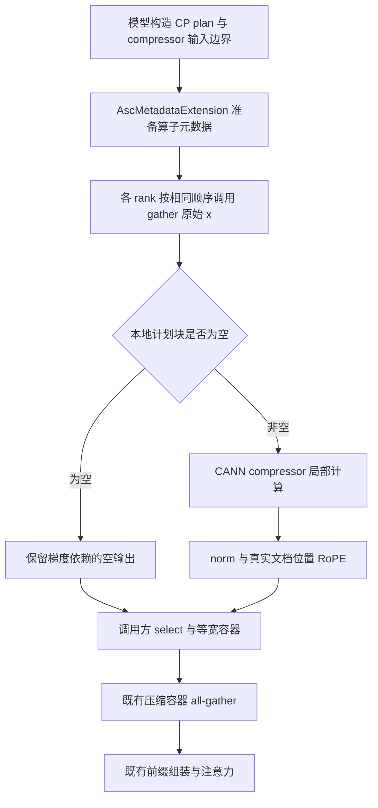

# DeepSeek-V4 融合 Compressor 的 CP 支持方案

本方案在不修改 CANN 算子接口的前提下，为 DeepSeek-V4 的融合 compressor 增加上下文并行（Context Parallelism，CP）支持。推荐复用现有 CP plan，先交换压缩所需的原始输入行，再将每段完整块区间打包成独立序列，调用现有 CANN compressor；保留压缩块归属、norm、RoPE、容器打包和下游注意力通信。

本文是设计稿，尚未实现或通过 NPU 验证。代码依据为本仓 `d58c937`，包含 PR #878 的合入提交 `60dd5c2`。用户已确认实现边界为「优先仅修改 torchtitan-npu，保留现有算子接口」。首期训练实现以原生 CompressorGrad 可用的设备为前提；不同硬件的边界见第 2 节。

## 1. 方案选择

| 方案 | 实现方式 | 代价与限制 | 决策 |
| --- | --- | --- | --- |
| 按 CP plan 交换原始输入 | 按需收集跨 rank 行，打包局部完整块序列，复用整个融合 compressor | 输入通信可能比投影后通信更宽；边界行会重复投影 | 推荐，符合当前接口约束 |
| 全量收集隐藏状态 | 每个 rank all-gather 全文档输入，执行完整 compressor，再选择所需块 | 隐藏状态内存与重复计算随 CP 增长，削弱 CP 的主要收益 | 仅可作为诊断基线，不作为产品路径 |
| 拆分融合算子 | 本地投影，交换窄的 KV/gate，再调用融合 pooling | 需要新增接受投影结果的算子及其反向接口 | 不纳入本次，后续性能优化另行设计 |

仅在 CP 时退回现有 `Compressor._forward` 可以改善配置兼容性，但不算实现「融合 compressor + CP」。本方案要求非空 CP 压缩分支实际执行 CANN compressor。

## 2. 目标、前提与支持范围

### 2.1 首期交付范围

- 同时覆盖主注意力 compressor 和 Indexer compressor。
- 覆盖 ratio 4 的 overlap 压缩，以及 ratio 128 的非 overlap 压缩。
- 复用现有 plain、headtail、文档打包和块归属规则；不跨真实文档压缩，不把文档尾部不足一块的 token 补成有效块。
- 采用当前 DSV4 CP 使用的 `spmd_types` 后端，`local_batch_size=1`、DSA 的 TP=1；输入切分仍遵守现有序列长度整除条件。
- 首先验证 eager 前反向，再验证 `torch.compile` 的项目实际后端及 activation checkpointing。编译支持以专项验收结果为准，不由 eager 结果推断。
- CP=1 保留现有整文档输入路径；参考 compressor 和其他 override 的计算路径保持原有职责。
- 保持参数名称、shape、初始化和 checkpoint 格式不变。

不在本方案内扩展 GraphTrainer CP、`full_dtensor` CP、TP>1 或 LoRA 投影融合。尤其不能在 LoRA 配置下继续直接读取基础 `.weight` 并声称 LoRA 生效；融合入口应识别不支持的投影实现并提前报出配置错误。

### 2.2 算子能力是训练支持的前置条件

2026-09-22 核对的 CANN [Compressor 文档](https://gitcode.com/cann/ops-transformer/blob/master/attention/compressor/README.md) 与 [CompressorGrad 文档](https://gitcode.com/cann/ops-transformer/blob/master/attention/compressor_grad/README.md) 表明：

- 前向支持 A2/A3 和 Ascend 950；原生反向文档只列出 Ascend 950PR/950DT 支持，A2/A3 不支持。
- 输入为 FP16/BF16；`H` 在 1K～10K 范围且按 512 对齐；`D` 为 128 或 512。APE 和反向缓存为 FP32。
- 前向支持空输入，但反向不支持 `B/S/T=0` 的空张量。
- CANN 的确定性重跑不等同于不同 batch 布局间的逐位一致；Ascend 950 的 batch 一致性另有运行时要求。

因此，首期「融合前向 + 原生反向 + CP」的设备基线设为 Ascend 950，并记录实际 CANN、`cann_ops_transformer`、torch、torch-npu 和驱动版本。仓库依赖与 CI 镜像的 torch 版本并不完全相同，验收必须使用实际运行版本。

若目标是 A2/A3，在不改算子的约束下只能另加本仓反向实现，例如融合前向加局部数学重算反向。这会增加 backward 开销，并要求独立验证其与融合前向的数值关系、编译支持和梯度精度；不能标成原生融合反向支持，也不能假设该路径已经可用。未选择并验收该扩展前，应在进入训练通信前明确拒绝不支持的设备组合。

## 3. 当前实现与复用边界

当前融合入口 [AscCompressor.forward](../../../torchtitan_npu/override/deepseek_v4/compressor/ascendc.py) 在发现 `window` 或 `plan.exchange` 后直接抛异常。其输入是本地 `x`，而 CANN 接口预期的是每条序列具有完整压缩历史的输入流。

当前参考 [Compressor._forward](../../../torchtitan_npu/models/deepseek_v4/compressor.py) 采用：

```text
本地 x → wkv / wgate 投影 → 两次 dispatcher.gather
       → 分块与 overlap → softmax pooling → norm → RoPE
```

已有 [build_cp_plan 与 CPTokenDispatcher](../../../torchtitan_npu/models/deepseek_v4/token_dispatcher.py) 已经提供所需几何与通信契约：

| 字段或组件 | 现有职责 | 本方案处理 |
| --- | --- | --- |
| `gather_indices`、`exchange` | 收集并重排计划块的 token 行 | 路由不变，载荷由投影结果改为原始 `x` |
| `first_indices` | 标记每段的第一个计划块，重置 overlap 链 | 作为打包序列边界的一致性依据 |
| `block_positions` | 每个计划块在真实文档中的位置 | 原样传给 RoPE |
| `compressed_rows` | 删除借入源块的池化输出 | 继续由调用方 `select` 应用 |
| `out_width` | 各 rank 等宽压缩容器 | 不变 |
| `cmp_k_global_gather_indices` | 从 all-gather 容器中取出各段所需的文档前缀块 | 不变 |
| `cu_seqlens_cmp_k`、`block_remainder` | 下游注意力可见前缀的边界与余数 | 不可用作新 compressor 输入边界 |

现有 [CP 指南](../../feature_guides/deepseek_v4_cp.md) 中的「融合路径」主要指稀疏注意力融合，当前 compressor 本身仍可采用参考实现。功能合入后需要区分这两个融合层次，更新通信次数和输入载荷说明。

## 4. 核心算法：将计划块区间作为独立输入序列

### 4.1 构造合法的融合算子输入

对某 rank 的第 `s` 个文档片段，沿用 `_block_range` 已经给出的压缩区间：

```text
[A_s, E_s)，E_s 为完整块终点
L_s = E_s - A_s
N_s = L_s / r
```

仅保留 `L_s > 0` 的区间。`A_s` 和 `E_s` 均按压缩比 `r` 对齐，区间包含现有计划需要的前驱借入块与跨 rank 块尾。

执行一次：

```text
x_packed = compressor.token_dispatcher.gather(x, plan)
```

得到 `[1, T_plan, H]`，其中 `T_plan = sum(L_s)`。每段行在真实文档中连续，段与段之间通过新边界显式分隔；同一文档的不同 headtail 片段也分别处理。

传给 CANN 的数据为：

```text
x             = x_packed.reshape(T_plan, H).contiguous()
cu_seqlens    = [0, L_0, L_0 + L_1, ..., T_plan]，int32
seqused       = [L_0, L_1, ...]，int32
start_pos     = None
cmp_ratio     = r
coff          = 2 if r == 4 else 1
cache_mode    = 1
```

`cu_seqlens` 描述收集后的计划块流，不是 `metadata.varlen.cu_seq_q`，也不是注意力用的 `cu_seqlens_cmp_k`。后两者分别描述局部查询 token 与可见压缩前缀，长度和归属都不同。

### 4.2 为什么 `start_pos=None` 正确

每个区间被当作独立序列，从局部位置 0 开始压缩：

- `A_s=0` 时，区间从真实文档首块开始，首块没有前驱，算子的序列起点处理正好符合要求。
- `A_s>0` 时，首个计划块是借入源。其池化输出缺少更早的前驱，可以不等于全局同名块；现有 `compressed_rows` 会删除该输出。其 token 投影仍为下一块提供真实 overlap 数据，因此后续保留块正确。
- APE 是块内位置偏置，`A_s` 按 `r` 对齐后，重置局部序列位置不会改变块内偏置索引。
- RoPE 保留真实文档位置，由 `plan.block_positions` 单独提供。

不能把 `A_s` 直接传作 CANN `start_pos`：那会让算子按历史 cache 语义解释输入，而本方案没有准备对应历史状态。也不能在借入源块压缩前删除它，否则 overlap 依赖再次丢失。

### 4.3 ratio 4 示例

一个文档有 16 个 token，CP=2，rank 0 持有 0～7，rank 1 持有 8～15。rank 1 的计划区间是 `[4, 16)`：

```text
收集后原始输入： [4,5,6,7 | 8,9,10,11 | 12,13,14,15]
算子输入边界：   cu_seqlens=[0,12]，seqused=[12]，start_pos=None
算子输出块：     b1（借入源） | b2 | b3
真实 RoPE 位置： 4            | 8  | 12
select 保留：                  b2 | b3
```

`b2` 的前半 overlap 来自 `b1` 的 token 投影，`b3` 的前半来自 `b2`；首个借入源输出是否具有完整更早历史，不影响这两个保留块。

若同一 rank 还有另一段 `[A_1,E_1)`，应追加第二条输入序列边界，不能把两段直接当作一条序列。否则算子会把前一段尾块错误地当作后一段的 overlap 前驱。

### 4.4 输出契约

CANN 的 TND 输出有容量 padding。有效输出数量严格由计划确定：

```text
N_plan = T_plan / r = plan.block_positions.numel()
pooled = cann_output[:N_plan]
```

采用每段长度均为 `r` 的整数倍的输入，使有效结果按段紧凑排列；按当前算子文档约定，额外容量位于有效前缀之后。NPU 验收必须实测这一点，CPU fake 的尾部应填入 NaN，以检出错误消费 padding。

随后沿用 `compressor.norm` 和 `compressor.rope`，输出仍为 `[N_plan,D]`。`Attention` 中的 `select`、Indexer 的后处理与 `select`、压缩容器 all-gather 和注意力前缀组装保持各自原有位置。不能在 `AscCompressor` 内提前返回已剥离的块，否则调用方会二次选择。

## 5. 元数据与模块设计

### 5.1 只增加表达输入分段所需的信息

在模型侧 `metadata.py` 增加不含 NPU 依赖的 `CompressorInputLayout`，由 `CompressedBlockLayout.compressor_input` 持有。拟定字段为：

| 字段 | 类型 | 含义 |
| --- | --- | --- |
| `cu_seqlens` | int32 Tensor，`[n_segments+1]` | 收集后输入的序列边界 |
| `seqused` | int32 Tensor，`[n_segments]` | 每段完整块 token 数 |
| `max_seq_len_host` | int | 在 eager 元数据构造阶段得到的最长段长度，仅用于准备算子元数据 |

`_assemble_block_plan` 已在遍历 `(A, block_end, strip)`，可直接从这次遍历构造字段，无需新增通信或从设备读取数值。ratio 1 和现有非 CP 路径设为 `None`；空计划的边界为 `[0]`、长度为空、最大长度为 0。

必须验证以下不变量：

```text
cu_seqlens[-1] == gather_indices.numel()
seqused == diff(cu_seqlens)
每个 seqused > 0，且能被 ratio 整除
cu_seqlens[:-1] / ratio == first_indices
gather_indices.numel() / ratio == block_positions.numel()
```

这些检查在 eager 构造边界执行；不在每层调用 `.item()`、`.tolist()` 或按文档执行 Python 循环。新增 dataclass 注册为 pytree 节点，按既有机制标注动态维度。

### 5.2 CANN 专属状态留在 override 层

`AscMetadataExtension` 从 `compressor_input` 准备每 ratio 一份全零 `compressor_state_block_table`，存放于 `AscBlockLayoutMetadata`。其大小为：

```text
[n_segments, max(ceil(max_seq_len_host / block_size), 1)]
block_size = 8 if ratio == 4 else 16
```

该表只承载 `cache_mode=1` 的未分配标记，不承载历史 token。它可以由相同比率的主 compressor 与 Indexer 共用；不与不同 batch 共用可变 cache。工作 `state_cache` 沿用本地、全零、固定 shape `[1,block_size,2*coff*D]` 的模式。

将可变 shape 的 block table 在每 batch 的 eager 元数据边界准备好，避免在每层编译区域使用变化的 Python `max_seq_len_host` 分配表并引发 shape 特化。动态标注覆盖 block table 的两个维度，以及输入边界、长度和计划行数；参考 compressor 不消费这些 CANN 元数据。

CP 的端到端入口继续使用现有 `sparse_attn.asc_metadata`。CPU 组件测试可直接构造相同记录，不需要加载 NPU metadata 算子。非 CP 的 `_state_inputs` 保留原有整文档规则。

### 5.3 前向控制流程



这是设计流程，不是可直接复制的实现代码。非空计算使用同一个融合算子，不按文档或片段逐次发起 kernel。

## 6. 反向与并行语义

### 6.1 主 compressor 的输入梯度

前向顺序由「先投影后交换」变成「先交换后投影」，线性投影在实数运算中与行收集可交换。反向对应为：

```text
容器与 select 的反向
→ norm / RoPE 反向
→ CANN backward，得到 d_x_packed 与参数梯度
→ gather 索引的 scatter-add
→ 反向 all-to-all，交换 forward 的 send/recv splits
→ 累加至原始 token 所在 rank 的 d_x
```

复用 `CPTokenDispatcher` 和 `_GatherReceivedRows` 已有路由。相同源 token 被多个消费者使用时，梯度必须求和，不能覆盖。不得 detach 主分支 `x_packed`、重新创建无依赖 Tensor，或手写一条不支持 autograd 的通信替代路径。

原参考路径在 token 所在 rank 计算投影参数梯度，新路径在消费压缩块的 rank 计算参数梯度。权重沿 CP 复制，最终各 rank 贡献求和后数学等价；保留现有 FSDP/并行参数梯度归约和 loss scaling，不额外乘除 CP degree，也不额外 all-reduce 一次参数梯度。数值上投影批次与求和顺序改变，不承诺逐位相等。

### 6.2 Indexer 的 detached 输入必须单独处理

`Attention.forward` 向 Indexer 传入 `x.detach()`，但 Indexer 的 `wkv`、`wgate`、APE 等仍可能训练。当前 CANN Python 封装按 `x.requires_grad` 设置 `grad_enabled`，因此仅沿用公开 wrapper 不能保证该路径保存有效反向中间量。

推荐在 `torchtitan_npu/ops/ascendc/compressor.py` 增加局部适配函数，复用现有已注册的 `cann_ops_transformer::_compressor_forward` 及其 native autograd，显式设置：

```text
need_backward = 当前启用 autograd
                且 x / wkv / wgate / ape 中至少一个需要梯度
```

该底层入口已经具有 `grad_enabled` 参数，不修改 CANN schema、实现或反向公式。本仓适配层只返回 `cmp_kv`，由现有 autograd 保存、消费 `softmax_score/kv`。其版本依赖必须显式记录，并在启用 override 时检查入口存在；它属于现有内部 API，不能假定未来任意版本仍兼容。

Indexer 的原始输入继续 detached，不允许梯度泄漏回主干。也不采用在 forward 中临时 `requires_grad_(True)` 的办法，避免伪造输入依赖和编译问题。参数需要梯度而输入不需要梯度时，原生 backward 对输入产生的梯度可由 autograd 丢弃；参数梯度必须保留。

同一适配层服务 CP 与非 CP，使 Indexer 的缓存开关具有一致语义。若目标运行包没有这个带 autograd 的入口，先报版本不兼容；不要静默调用另一套无法保证缓存条件的接口。

### 6.3 SPMD 局部计算边界

融合算子只负责局部计算，CP 集合通信保持在 dispatcher 内。在融合计算边界显式传入 `x_packed`、`wkv`、`wgate`、APE 和元数据 Tensor，避免通过闭包捕获分布式状态后只转换输入。

对 `spmd_types`，按当前局部计算接口表达：

- 收集后的不等长输入与未打包输出沿 CP 是各 rank 独立的局部数据，即 `V` 语义；它们不是等宽的 `S(1)` 容器。
- 权重在 CP 上为复制状态；各 rank 的局部参数梯度是最终归约的贡献。
- `select` 之后，才恢复现有等宽容器的 CP `S(1)` 契约。
- 保留 DP、CP、TP 的实际 mesh 身份，不能把复合并行 mesh 当作单一 CP group。

固定依赖的 `spmd_types==0.2.1` 的 `local_map` 只声明前向类型，不自动提供梯度类型契约。实现时必须检查 AOT 图和 FSDP 中的实际参数梯度归约；单纯补一个 `local_map` 装饰器不构成反向正确性的证据。`full_dtensor` 的局部状态转换另行设计，不通过隐式复制强行放行。

## 7. 空 rank 与集合通信一致性

必须区分「本 rank 无需计算压缩块」和「本 rank 不参与通信」。本 rank 即使 `N_plan=0`，仍可能持有其他 rank 需要的块尾或 overlap 行。

### 7.1 统一通信，再决定本地是否调用 kernel

CP 各 rank 对每个 compressor 都先执行一次 `gather(x, plan)`。不能根据本地 `gather_indices.numel()==0` 提前返回，也不能在该分支调用原 `_forward`：原实现会执行两次投影后 gather，与其他 rank 的一次原始输入 gather 不匹配，可能挂起。

收集完成后：

- 非空 rank 调用 CANN，之后执行原有后处理。
- 空 rank 不调用 CompressorGrad，返回 `[0,D]` 的可微空结果。
- 空结果必须连到已执行的 gather 及当前训练参数，反向返回相应零梯度，保证应参与的反向 collective 不被裁掉。
- 不可用独立的 `new_empty` / `new_zeros` 切断图。实现可采用局部空张量数学路径；若运行框架要求显式 VJP，则将零梯度行为限制在小型空路径适配中，不复制非空 compressor 的反向。
- `select` 继续产生相同 `out_width` 的 padding 容器，所有 rank 参加后续容器通信。

Indexer 的 `x` 在所有 rank 都 detached 时不要求沿输入交换回传梯度，但参数梯度仍有效。不能根据单个 rank 是否拥有非空输出，独立切换通信或训练语义。

### 7.2 元数据前置检查也需要调整

当前 `AscMetadataExtension` 对任何 ratio 的本地 `gather_indices` 为空直接报错，早于 compressor。因此仅修改 `AscCompressor` 仍不足以允许空 rank。

应区分两种情况：

1. 全局存在有效块：CP plan 的统一 `out_width>0`，允许本地无块，执行上述空路径。
2. 全局没有任何有效块：`out_width=0`，首期保留明确的全局限制；所有 rank 在进入层内通信前一致拒绝，不能仅有部分 rank 报错。

还必须验证下游 LI/SMLA/SLIG 对「本地查询可见的压缩前缀为空」的实际支持。`out_width>0` 不代表每个 rank 的 `cu_seqlens_cmp_k[-1]>0`。在现有 vendor 接口无法接受此组合时，使用全局 plan 可推导的条件，在所有 rank 一致报出不支持的 batch 布局；不能因放宽上层检查而让部分 rank 在 kernel 中失败。此限制是否可解除是验收项，不能从 compressor 空路径单独推断。

## 8. 编译、重算与错误处理

- 计划和分段元数据每 batch 构造一次，沿用当前模型的元数据接缝。每层只消费 Tensor，不重新推导文档区间或增加设备到 host 同步。
- `N_plan` 从 `gather_indices` 或 `block_positions` 的 shape 推出，不对输出值调用 `nonzero` 或 `.item()`。
- CANN state table 和工作 cache 不保存跨 step 历史；使用全零 block table、`cache_mode=1`，保证重算不会读到前次调用写入的状态。确认目标版本符合零 block ID 跳过缓存写入的约定。
- 空与非空可以使用各自的编译图，但每个图都必须保留相同顺序的必要通信。不得假定 Dynamo 会自动安全处理所有数据相关分支。
- 同时测试动态文档数、不同段长度、empty/non-empty 切换与 checkpoint 重算，观察 graph break、重编译和 collectives 的次数。
- 配置、设备、dtype、shape、后端、投影类型及依赖接口等静态错误，在进入训练前检查。由 batch 几何导致的拒绝，尽可能根据各 rank 都能推导的全局 plan 一致判定。
- 不静默降级到参考 compressor；不在异常发生后让单个 rank 自行切换实现。

## 9. 性能预期与评估方法

设每个 compressor 的边界交换行数为 `E`，隐藏宽度为 `H`，压缩 head 维度为 `D`，overlap 系数为 `c`。忽略协议开销时：

```text
原路径的前向载荷：E × 2 × c × D × bytes(projected_dtype)
新路径的前向载荷：E × H × bytes(x_dtype)
```

调用次数减少不等于字节数减少。例如 `H=4096`、输入 BF16、投影结果 FP32 时，ratio 4 主 compressor（`D=512,c=2`）两者载荷相同；Indexer（`D=128,c=2`）新路径为原来的 4 倍；ratio 128（`D=512,c=1`）为 2 倍。实际比例应使用运行时 dtype 和 shape，而非只用元素数量。

每层前向 all-to-all 次数的计划变化为：

| 层类型 | 现有参考 compressor | 本方案 |
| --- | --- | --- |
| ratio 1 | 1 次窗口交换 | 不变 |
| ratio 128 | 窗口 + KV + gate，共 3 次 | 窗口 + 原始输入，共 2 次 |
| ratio 4，含 Indexer | 窗口 + 两个 compressor 各 2 次，共 5 次 | 窗口 + 两个 compressor 各 1 次，共 3 次 |

每个 compressor 仍自带 dispatcher，首期不把主分支与 Indexer 的输入交换合并。后续若通信成为主要瓶颈，可在保持 Indexer detach 边界的前提下复用 ratio 4 的一次输入收集；这会改变模块接口，应另行验证。

新路径会对借入行执行重复投影，并保存收集后的 `x_packed` 供反向使用；另一方面不再对不参与压缩的所有本地 token 都执行两次投影。收益取决于文档碎片程度、压缩比、CP degree 和算子效率，不能预先承诺加速。

性能验收分别记录 gather 的时间与字节数、融合前反向时间、重算开销、峰值内存、整体 step 时间和吞吐。比较基线是相同 CP 配置的参考 compressor，其他 norm、RoPE、attention override、checkpoint 和数据保持一致。只有测得收益后才讨论将融合 compressor 加入默认配方。

## 10. 验证矩阵与验收标准

### 10.1 CPU：验证计划、路由和数学语义

复用现有 CP 测试及独立逐文档 oracle，增加融合输入边界测试。fake CANN 只模拟本地计算边界，不代替真实 NPU 能力验证。

| 测试 | 必须观察的结果 |
| --- | --- |
| plain/headtail，CP=1/2/4，ratio 4/128 | 输入行、分段边界、有效输出数量和真实文档位置准确 |
| 单文档、多文档、短文档及文档尾余数 | 不跨文档、不压缩不足一块的尾部 |
| rank 边界整除与不整除 ratio | overlap 前驱和跨 rank 块尾均正确 |
| 同一 rank 的多个片段 | 段间 overlap 被重置；不能继承另一段历史 |
| 借入源块 | 输出被剥离，但其 token 对后继块的梯度保留 |
| TND 输出 padding 为 NaN | 只消费 `N_plan` 个有效输出 |
| 本地无块但需要发送数据 | forward 不跳 collective，backward 能收到远端输入梯度 |
| Indexer detached 输入、部分参数冻结 | 主干输入无 Indexer 梯度；应训练参数梯度与 oracle 对齐 |
| 所有参数冻结或 no-grad | 不请求无用反向缓存 |

计划字段、索引、选择结果要求精确相等；使用相同数学运算的 CPU FP64 小规模 VJP 对比采用 `rtol=1e-10, atol=1e-12` 作为验收目标。若重排后的规约次序使该阈值失败，必须解释误差来源，不直接放宽以掩盖路由错误。

现有 `cp_dispatch_worker.py` 的 gloo transport 在 `no_grad` 下收集数据，不能用于证明新路径的跨进程梯度。需要为这一验收提供支持反向的真实 transport，或在 NPU/HCCL 用例中完成完整反向验证。CPU 只用全局 Tensor 切片模拟通信的测试也必须明确其证据边界。

### 10.2 NPU：验证真实算子与通信

先使用合法维度的小模型或组件 fixture：`H=1024`，主 compressor `D=512`，Indexer `D=128`。现有 `_debugmodel` 的 `H=256` 不满足所查算子约束，不能只向原 debug case 追加 compressor override，也不能只改单个 Linear 而让整个模型维度不一致。

验收分为三层：

1. **单卡局部语义**：对已收集的分段输入验证 CANN 输出、padding、序列边界重置，以及原生 `d_x/d_wkv/d_wgate/d_ape`。特别覆盖 `x.requires_grad=False` 且参数可训练，以及 ratio 4 的借入源输出上游梯度为零但后继梯度非零。
2. **多卡 compressor**：CP=2 和 CP=4，plain/headtail，验证全局输出恢复、输入梯度回传、参数梯度归约和空 rank。将主分支与 Indexer 分开测，再组合测。
3. **模型训练**：使用合法模型配置，先验证相同 CP 下参考与融合 compressor，再比较 CP1、CP2 plain、CP2 headtail。覆盖已有 EP/FSDP 组合、eager、实际 compile 后端及 activation checkpointing。

不得直接将 `compressor.asc` 加入共享 `NPU_OVERRIDES`，以免把当前不满足 shape 或设备约束的全部 case 一起改变。新增独立融合 compressor 配方，再逐项扩展。

### 10.3 数值验收口径

- 路由、metadata 和 CP1 原有输入路径的非计算性变化必须精确对齐。
- 融合算子与参考数学路径属于计算性替换，必须测量最大绝对误差、相对 L2 误差、输出与输入/参数梯度；不能只检查 shape 或 loss 是否为有限值。
- NPU 组件首轮门槛沿用当前 compressor UT 已使用的 `rtol=0.006, atol=0.004` 作为暂定逐元素检查标准，同时记录上述误差指标。它是设计验收起点，不是现有 NPU 精度保证。大规模 BF16 规约如超出门槛，应定位到 kernel 或归约顺序并形成评审结论，不能自动放宽。
- CP 重分片改变投影 batch 形状与求和顺序，必要时验证 CANN batch 一致性设置。不能把「逐 token 运算」写成「任意不同 GEMM 切分均逐位相同」。
- 首先比较同一 CP 配置的参考/融合路径，避免把现有 LI top-k tie、SMLA 几何差异误判为本方案问题。跨 CP 对齐先在 compressor 层和固定上游梯度条件下完成，再观察整模型。
- 相同 checkpoint、数据、全局 batch 和随机性设置下记录未截断逐 step loss、grad_norm、Indexer loss。短训练验证有限值与步进正确性，代表性数据上的收敛验证作为训练发布条件；不以一条 smoke 或 stdout 打印精度证明收敛。
- 性能报告至少区分预热与稳态，给出重复运行波动；功能通过但性能下降时，保持显式 opt-in，不默认启用。

## 11. 修改文件与实施顺序

| 文件或目录 | 计划修改 |
| --- | --- |
| `models/deepseek_v4/metadata.py` | 新增 `CompressorInputLayout`、plan 字段和 pytree 注册 |
| `models/deepseek_v4/token_dispatcher.py` | 在既有块遍历中构造输入分段；保留路由和归属算法 |
| `override/deepseek_v4/sparse_attn/ascendc.py` | 准备 compressor state table、动态标注、区分本地空与全局空的校验 |
| `override/deepseek_v4/compressor/ascendc.py` | 新增 CP 原始输入 gather、融合分段调用和可微空路径；保留现有后处理契约 |
| `ops/ascendc/compressor.py`，新增 | 现有 CANN 内部入口的版本适配、显式反向缓存开关和局部 Tensor 边界 |
| `tests/unit_tests/models/deepseek_v4/` | 元数据、片段与路由不变量回归 |
| `tests/unit_tests/override/deepseek_v4/test_compressor.py` | CP 融合输入契约、detached 输入参数梯度、空路径与 padding 测试 |
| `tests/integration_tests/deepseek_v4.py` 及对应合法模型配置 | 独立 NPU 融合 compressor 训练配方及验证 |
| `docs/feature_guides/deepseek_v4_cp.md`、`fused_ops.md` | 实现验收后更新激活方式、硬件范围、通信代价和证据 |

表中的 `models/`、`override/`、`ops/` 相对于包目录 `torchtitan_npu/`；`tests/` 和 `docs/` 相对于仓库根目录。新增项目前不存在。预计无需修改上游 torchtitan checkout 或新增包导入时生效的全局 patch。

按以下阶段落地，每阶段都具有可独立审阅的退出条件：

1. **确认依赖与单卡算子契约**：固定实际设备和 CANN 包，验证分段输入、原生参数梯度、内部 API 和 output padding。若原生反向能力不成立，不进入多卡原生反向实现。
2. **增加计划输入边界**：只增加元数据，保持已有 plan 字段与参考 compressor 输出不变，完成 CPU 不变量与 oracle 检查。
3. **实现 CP 前反向**：连接原始输入 gather、分段 CANN 调用、Indexer 缓存适配和空路径，通过真实多卡梯度验证。
4. **验证编译与模型训练**：检查动态 batch、重算、SPMD、FSDP/EP、loss/grad_norm 和收敛，再记录性能。
5. **文档与配方发布**：只对已验证组合声明支持，保留显式 override 激活；尚未验证组合保持明确限制。

## 12. 设计交付检查与待实测事项

本次只新增本文，没有修改训练代码、依赖包或测试。

| 检查 | 本次状态 | 说明 |
| --- | --- | --- |
| 当前 CP plan、dispatcher、融合入口与下游调用方 | `passed`，静态核对 | 依据本仓 `d58c937` |
| CANN schema、缓存开关、shape 与硬件约束 | `passed`，公开源码核对 | 不代表目标机器已安装相同版本 |
| 固定 `spmd_types==0.2.1` 的 `local_map` 语义 | `passed`，源码核对 | 其契约只覆盖前向类型 |
| 文档相对链接、标题、代码块与空白格式 | `passed`，静态检查 | 本地链接目标均存在；无占位内容或尾随空白 |
| CPU UT、NPU 算子、多卡与性能测试 | `not-run` | 本次为设计任务；当前 Python 环境未安装 torch/torch-npu |

实施前需要实测确认的项目已转化为阶段退出条件：目标包内部入口可用性、packed 段与 output padding 的精确契约、Indexer 参数梯度、空 rank 的前反向参与、下游空压缩前缀支持、编译动态 shape，以及整体性能。任何一项失败，都应收窄发布范围或修正对应实现，不能仅移除当前 CP guard 后宣称支持。

参考依据：

- [本仓 CP 功能说明](../../feature_guides/deepseek_v4_cp.md)。
- [本仓压缩器与 Indexer](../../../torchtitan_npu/models/deepseek_v4/compressor.py)、[CP plan 与 dispatcher](../../../torchtitan_npu/models/deepseek_v4/token_dispatcher.py)、[分片配置](../../../torchtitan_npu/models/deepseek_v4/sharding.py)。
- [融合 compressor 入口](../../../torchtitan_npu/override/deepseek_v4/compressor/ascendc.py)、[融合 metadata 与注意力](../../../torchtitan_npu/override/deepseek_v4/sparse_attn/ascendc.py)。
- [CANN compressor Python 封装，版本 a3ce3ded](https://gitcode.com/cann/ops-transformer/blob/a3ce3ded570258a3e753b194e16d8e89682fd2db/attention/compressor/torch_extension/compressor.py)。公开 wrapper 的缓存开关及内部 autograd 入口依据此文件；不推定任意运行包都相同。
- [CANN Compressor 约束](https://gitcode.com/cann/ops-transformer/blob/master/attention/compressor/README.md)、[CompressorGrad 约束](https://gitcode.com/cann/ops-transformer/blob/master/attention/compressor_grad/README.md)，核对日期 2026-09-22。
- [spmd_types 项目](https://github.com/meta-pytorch/spmd_types)，局部计算接口依据 PyPI 发布的 0.2.1 源码。
