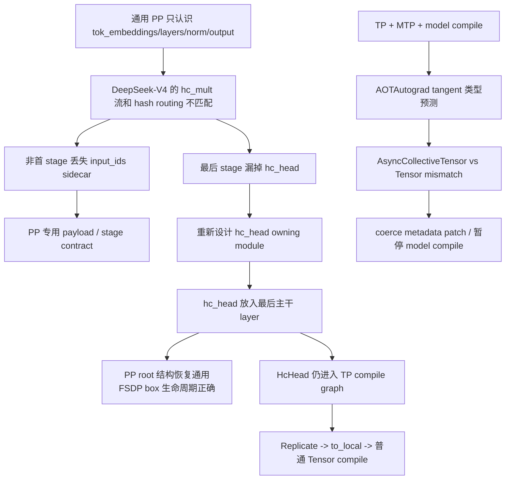

# DeepSeek-V4 2026-05 日志归档与问题关系分析

这组日志来自 `torchtitan-npu/log`，记录的是 DeepSeek-V4 在 PP、TP、MTP、FSDP 和 `torch.compile` 组合下的真实适配问题。它们不是四个互相独立的 bug，而是同一条模型执行链在不同阶段暴露出的边界：

```text
模型结构
  -> PP stage contract
  -> FSDP/TP 参数布局
  -> MTP 与 loss 图
  -> AOTAutograd / Inductor compile
  -> NPU 训练验证
```

## 一、归档清单

| 笔记 | 时间/性质 | 归档位置 | 主要问题 |
| --- | --- | --- | --- |
| [[dsv4_pp]] | 2026-05-13，PP 初始问题分析 | `work/dsv4_pp.md` | `input_ids` sidecar 丢失、最后 stage 缺 `hc_head` |
| [[tp_mtp_compile_async_collective_tensor]] | 2026-05-22，编译故障分析 | `work/tp_mtp_compile_async_collective_tensor.md` | TP + MTP + model compile 的 AsyncCollectiveTensor tangent 类型不匹配 |
| [[dsv4_pp_hc_head_norm重构_20260529]] | 2026-05-29/30，最终结构重构 | `work/dsv4_pp_hc_head_norm重构_20260529.md` | 将 `hc_head` 从 root 移入最后一个主干 layer，兼容 FSDP/PP/MTP |
| [[PR376_description]] | PR 描述/修复摘要 | `work/PR376_description.md` | TP + compile 下 HcHead 的 DTensor/Inductor 编译崩溃 |

配套阅读：[[pipeline-parallel]]、[[deepseek-v4-architecture-and-execution]]、[[DeepSeekV4 PP 通用修复方案]]。

---

## 二、按时间还原问题演进

### 2026-05-13：先暴露 PP 协议不适配

[[dsv4_pp]] 记录了两个表面上不同、实际上都由通用 PP 假设引起的问题。

#### 问题 A：非首 stage 把 hidden 当成 `input_ids`

DeepSeek-V4 的早期 hash routing 需要真实 token id：

```python
selected_experts_indices = self.tid2eid[input_ids.flatten()]
```

但通用 PP 的非首 stage 收到的是上一 stage 的 hidden state，形状类似：

```text
[B, S, hc_mult, D]
```

错误路径把它截取、转成 `long` 后当作 token id，flatten 后的元素数量也解释了日志里的异常规模：

```text
1 × 4096 × 4 × 4096 = 67108864
```

根因不是简单的 dtype 或 shape 错，而是 **PP stage payload 没有声明并携带 `input_ids` sidecar**。

#### 问题 B：最后 stage 缺少 `hc_head`

DeepSeek-V4 主干输出在经过最后一个 block 后仍是：

```text
[B, S, hc_mult, D]
```

正确出口必须是：

```text
hc_head -> [B, S, D] -> norm -> output -> logits
```

如果通用切分器只把 `norm/output` 放进最后 stage，`output` 会接收到多路 stream，最终 logits 变成多余一维，cross entropy 解释 target 时失败。

#### 初始方案的判断

日志提出为 DeepSeek-V4 增加专用 PP 切分入口，显式生成 virtual stage 的 FQN，并校验首 stage 的 embedding、末 stage 的 `hc_head/norm/output`。这一判断方向正确，但后续实现发现可以通过调整模块归属进一步简化。

### 2026-05-22：TP + MTP + model compile 暴露 tangent 类型问题

[[tp_mtp_compile_async_collective_tensor]] 记录的触发组合是：

```text
DeepSeek-V4
  + TP degree = 2
  + MTP = 1
  + torch.compile(model + loss)
  + full activation checkpoint
```

首个失败发生在 `loss.backward()` 的 AOTAutograd runtime tangent 处理阶段：

```text
Expected: AsyncCollectiveTensor
Runtime:   torch.Tensor
shape:     [1, 2048, 4096]
```

`[1, 2048, 4096]` 与 sequence 被 TP/sequence parallel 切成 2048、hidden size 为 4096 的中间激活一致，因此问题更像是 TP 边界的激活/梯度类型，而不是 vocab logits 或 loss 本身。

#### 根因链

```text
TP rowwise output
  -> functional collective / AsyncCollectiveTensor
  -> model 子模块 AOTAutograd trace
  -> trace-time 记录 tangent 为 AsyncCollectiveTensor
  -> runtime 中某条路径 materialize 为 plain Tensor
  -> metadata/type mismatch
```

对照实验只移除 `compile.components` 中的 `model`、保留 loss compile 即可跑完，说明直接触发点是 **model 子模块编译与 TP functional collective 的交界**。

日志还把它与 PyTorch #172556 的 DTensor tangent 问题联系起来：AOTAutograd 可能提前为 forward output 构造 backward tangent，而运行时 unused output 或 collective 边界返回普通 Tensor，导致 expected/runtime tensor subclass 不一致。

#### 修复方向

记录中的代码修复是在 `torch.Tensor` 与 `AsyncCollectiveTensor` 之间补充 `__coerce_same_metadata_as_tangent__` 兼容路径，并在 NPU patch 初始化时加载。关闭 model compile 只是 workaround，不是根治。

### 2026-05-29/30：通过重构 `hc_head` 简化 PP/FSDP

[[dsv4_pp_hc_head_norm重构_20260529]] 给出了后续最终方案：不再把 root 级 `hc_head` 作为 PP 切分器的特殊 splice，而是把它放进最后一个主干 Transformer layer，在该 layer 的 forward 末尾执行：

```python
x = self.hc_post(x, residual, post, comb)
if self.is_last_layer:
    x = self.hc_head(x)
return x
```

于是 root 结构重新变成通用切分器熟悉的：

```text
tok_embeddings -> layers.* -> norm -> output
```

但最后一个 layer 的输出已经是 `[B,S,D]`，因此 `norm/output` 不再需要理解 `hc_mult`。

#### 为什么 `hc_head` 挂在 `norm` 下的方案失败

FSDP2 按 owning module 的 forward 时机 all-gather 参数。如果 `hc_head` 挂在 `norm` 下，却在 `norm.forward()` 之外先调用：

```text
hc_head(h) -> norm(h)
```

调用 `hc_head` 时，包含它的 FSDP box 还没有打开，参数仍是 sharded DTensor，导致：

```text
mixed torch.Tensor and DTensor
```

把 `hc_head` 放进最后 layer 的 forward 后，layer 的 FSDP box 已经打开，参数在普通 activation 上运算，FSDP 和 PP 的生命周期一致。

#### 与 MTP 的关系

主干 `hc_head` 和各个 MTP 模块的 `mtp_hc_head` 已经解耦。主干出口改到最后 layer 不会改变 MTP 自己的内部出口聚合逻辑，这也是最终方案比 root splice 更稳的原因。

### PR376：进一步解决 HcHead 的 TP + compile 崩溃

[[PR376_description]] 记录了另一个更窄的编译问题：TP 下 `HcHead` 本质上是全 Replicate 的冗余计算，却让 DTensor 子类进入 compile graph，导致：

- 无融合时：`DTensor * DTensor` 类型不支持；
- 有融合且 sequence 动态时：`unhashable type: non-nested SymInt`。

修复策略是：

```text
Replicate input
  -> use_local_input=True
  -> to_local()
  -> HcHead 全程普通 Tensor 运算
  -> parallel style 在出口重新包装布局
```

因为 Replicate 的 `to_local/from_local` 不需要通信，这个修改保留了参数的 DTensor/FSDP/checkpoint 语义，同时把 compile 不擅长的 DTensor 计算移出图。

---

## 三、四份日志之间的因果关系



可以把它们归纳成三个层次：

1. **模型语义层**：`input_ids`、`hc_mult`、MTP offset 和最终 logits shape；
2. **分布式参数层**：PP stage、FSDP box、TP layout、Replicate/Shard；
3. **编译运行时层**：AOTAutograd tangent、DTensor subclass、SymInt 和 Inductor。

先修底层 compile 类型而不修 PP payload，模型仍然会算错；只修 PP stage 而让 HcHead 的 DTensor 进入 compile，编译仍然会崩。必须按层次分别验证。

---

## 四、归档后推荐的阅读顺序

1. [[deepseek-v4-architecture-and-execution]]：先理解 mHC、混合 attention、MoE 和 cache；
2. [[pipeline-parallel]]：掌握 stage、micro-batch、1F1B 和 sidecar contract；
3. [[dsv4_pp]]：看通用 PP 在 V4 上具体错在哪里；
4. [[dsv4_pp_hc_head_norm重构_20260529]]：理解为什么最终选择“放进最后一层”；
5. [[PR376_description]]：理解为什么 Replicate 的 HcHead 应在 compile 前 `to_local()`；
6. [[tp_mtp_compile_async_collective_tensor]]：理解 TP/MTP/model compile 下 AOTAutograd tangent 的失败边界；
7. [[swiglu-group-接入复盘]]：继续看 MoE 专家、GMM 和融合 activation 的实现边界。

---

## 五、后续验证清单

| 组合 | 最小验收 |
| --- | --- |
| PP=1, TP=1, MTP=0 | forward、backward、loss shape、`hc_head` 输出 `[B,S,D]` |
| PP>1, MTP=0 | 首/非首/末 stage、`input_ids` sidecar、virtual stage、P2P 顺序 |
| FSDP + PP | 最后 layer 的 HcHead 参数 all-gather 时机、无 mixed Tensor/DTensor |
| TP>1, compile 关闭 | TP layout、Replicate/Shard、loss/grad 对齐 |
| TP>1 + HcHead compile | HcHead 全程 local Tensor，无 DTensor compile 崩溃 |
| TP + MTP + model compile | AsyncCollectiveTensor tangent 兼容 patch、至少 10 step |
| compile + dynamic sequence | SymInt hash、checkpoint、不同 sequence bucket |
| 旧 checkpoint | `hc_head.*` 到 `layers.{n-1}.hc_head.*` 的 key 迁移 |
| 真实 NPU | loss/grad_norm、吞吐、峰值内存、通信占比和训练完成 |

**归档结论：**当前最稳的结构是“`hc_head` 归属最后主干 layer、主干 PP 使用通用 root 切分、Hash Routing 显式传 sidecar、HcHead compile 前转 local Tensor、AOTAutograd 补 tangent 类型兼容”。这五条分别对应模型语义、PP、FSDP、Inductor 和运行时五个边界。
