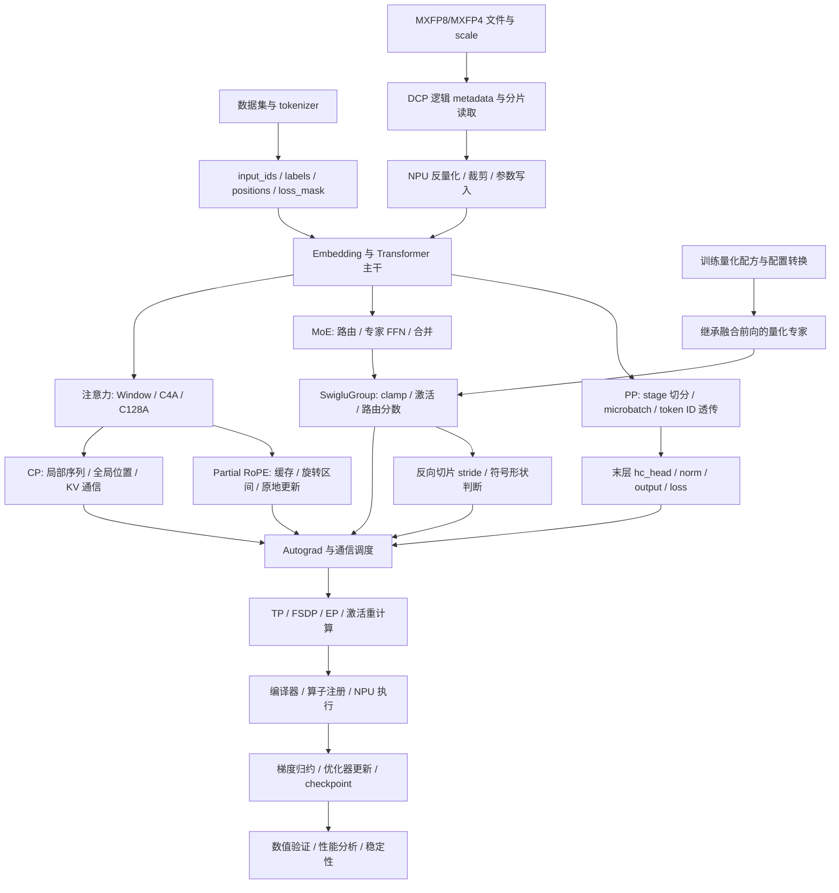

# 简历五项项目：上下游知识体系与学习路线

首次整理：2026-09-14；本次更新：2026-09-24。依据最新版[《东南大学-简历_张伟_含工作经历.docx》](<../resume/东南大学-简历_张伟_含工作经历.docx>)及本目录中的设计、接入和问题复盘材料。

本文围绕简历中的五项内容展开：**DeepSeek-V4 CP 切分、PP 两阶段适配、SwigluGroup 融合与低精训练适配、inplace_partial_rotary_mul 接入、MXFP8/MXFP4 量化权重加载**。目标是明确：这些项目依赖哪些知识，每部分应掌握到什么程度，遇到问题如何定位，以及怎样形成可以用于面试的完整解释。

本次重点对应简历的三处更新：PP 从专用切分演进到结构重构后复用通用切分；SwigluGroup 增加量化专家继承、配置转换和符号形状问题；新增压缩权重按需读取、NPU 反量化与训练精度配置的衔接。简历概述按“问题—方案—作用”组织，本文进一步展开其数学、调用链、版本边界与学习练习。

文中的 DeepSeek-V4、Window、C4A、C128A、MHC、算子接口和配置约束，均以本目录记录的模型实现及对应分支为范围。不同版本的同名模型、框架和 CANN 算子不能直接套用这些细节。原笔记包含方案演进，本文优先采用明确标注的最终方案；公开文档用于补充通用机制，API 应与实际安装版本核对。

## 阅读导航

1. [整体知识地图与掌握标准](#overview)
2. [五个项目共同依赖的基础](#foundation)
3. [CP：从注意力语义到跨卡前反向](#cp)
4. [PP：从模型数据流到参数生命周期](#pp)
5. [SwigluGroup：从激活融合到低精训练兼容](#swiglu)
6. [原地 Partial RoPE：从位置编码到存储与梯度](#rope)
7. [MXFP8/MXFP4：从压缩文件到模型参数](#mx-loading)
8. [共同下游：编译、NPU、工程兼容与性能](#downstream)
9. [验证体系与排障方法](#validation)
10. [学习顺序、练习与面试准备](#roadmap)
11. [项目证据边界与容易混淆的结论](#evidence)
12. [本地材料与官方资料索引](#references)

<a id="overview"></a>

## 1. 整体知识地图与掌握标准

### 1.1 这五项工作对应什么能力

你的工作处于“大模型训练框架、分布式并行与昇腾算子适配”的交汇处。需要能沿着一条训练链路，把模型计算、张量布局、梯度、通信、编译和设备执行连接起来。

| 简历项目 | 直接上游：为什么需要这项工作 | 项目中的衔接 | 直接下游：怎样正确执行 | 最终验收对象 |
| --- | --- | --- | --- | --- |
| CP 切分 | 长序列显存压力；窗口与压缩注意力；位置和因果语义 | 序列分片、边界交换、压缩 KV 汇聚、索引转换 | P2P、集合通信、Autograd、SFA/SDPA、FSDP/AC | 输出与梯度等价、无通信挂起、显存和吞吐 |
| PP 切分 | 通用 splitter 的模块结构约定；mHC 出口聚合；MoE hash routing | 先专用切分和 ID 透传，再调整 hc_head 归属复用通用切分 | PP 调度、FSDP 聚合、TP 计划、HF 权重映射 | 两阶段方案的因果关系、参数可用时机、维护成本与兼容性 |
| SwigluGroup 与低精训练 | 专家激活的读写开销；量化模块需复用融合前向 | 激活融合、量化专家继承、转换顺序、重复包装保护与连续性判断修复 | 量化矩阵乘、算子 Autograd、FakeTensor/SymInt、AOTAutograd | 前反向路径、非连续梯度、符号形状兼容和性能取舍 |
| 原地 Partial RoPE | 部分维度旋转；旧路径切片、拼接与额外分配 | 缓存、位置、形状和原地写回适配 | ops-transformer、别名、Autograd、DTensor、compile | 旋转语义、存储与梯度正确、旧配置隔离 |
| MXFP8/MXFP4 权重加载 | 已保存的压缩权重与 scale；分布式参数需要对应区域 | reader、逻辑 metadata、分片/偏移、对齐裁剪与反量化 | safetensors、DCP planner、NPU stream/event、目标参数与训练配方 | 与独立解码结果一致、省去整份离线转换、加载与训练精度分离 |

### 1.2 用一张图串起上下游



这张图表达依赖关系，不表示代码里一定按图中顺序创建所有组件。实际工程还需核对 converter、TP、FSDP、PP 和 compile 的应用先后顺序。

### 1.3 每一条接口都要回答六个问题

1. **数学语义**：输入代表什么，计算应保持什么等价关系？
2. **张量布局**：全局/局部 shape、dtype、stride、device、分片方式是什么？
3. **存储归属**：是否共享 storage，谁可以修改，何时释放或复用？
4. **梯度路径**：哪些输入需要梯度，反向经过哪些算子与通信？
5. **执行次序**：哪个 rank、stage、stream 先执行什么，等待谁？
6. **状态兼容**：参数对象、state_dict key、配置开关和 checkpoint 是否变化？

例如，`[B, S, D]` 的 shape 一样，并不代表 token 顺序、DTensor placement、通信完成状态或 autograd 连接一样。

对 MX 权重加载，还要补问：**当前坐标表示文件字节还是解码后的逻辑元素？** 对训练量化，要补问：**当前动作是在替换 Config、构造模块，还是执行量化矩阵乘？** 这两组问题分别对应新增权重加载条目和 SwigluGroup 的低精适配。

### 1.4 掌握深度分级

| 等级 | 要求 | 适用内容 |
| --- | --- | --- |
| P0：必须能独立解释和验证 | 能画数据流、推关键公式、写最小例子、定位本项目典型故障 | 五个项目的核心数学、shape、梯度、通信和模块归属 |
| P1：应能沿调用链定位问题 | 能阅读框架实现、识别边界，提出有证据的修复与验证方案 | DTensor、FSDP、compile、自定义算子注册、checkpoint、性能分析 |
| P2：进一步拓展 | 能理解设计取舍，并在岗位需要时深入实现 | Ascend C tiling、流水优化、复杂 PP 调度、长序列负载均衡、内核优化 |

简历中直接写到的行为，至少达到 P0。只知道名词定义不足以支持“设计、实现、接入、修正、适配”等表述。

<a id="foundation"></a>

## 2. 五个项目共同依赖的基础

### 2.1 模型与训练链路：从 token 到参数更新【P0】

需要讲清楚一次训练迭代：数据整理 → 输入和标签移位 → embedding → 多层 attention/FFN → 输出 logits → 主损失与辅助损失 → backward → 梯度归约/裁剪 → optimizer.step → 清梯度。

重点知识及其用途：

| 知识 | 需要理解的具体内容 | 与项目的联系 |
| --- | --- | --- |
| 自回归语言模型 | 第 t 个位置预测哪个标签；padding、文档边界、loss mask | CP 切分不能改变标签对齐；PP 末 stage 正确计算 loss |
| Attention | Q/K/V 的来源；缩放点积；softmax；因果掩码；不同 head 维度 | CP、压缩 KV、稀疏索引、RoPE 都依赖此语义 |
| FFN 与门控 | 两条上投影、门控激活、下投影；参数矩阵的方向和布局 | 区分独立 W1/W3 参数、gate/up 激活拼接与早期 w13 路径 |
| MoE | router 分数、Top-K、token 重排、专家分组、dispatch/combine、共享专家 | 路由权重如何到达 SwigluGroup；PP 为什么需要 token ID |
| 归一化与残差 | RMSNorm 的归一化维度；残差如何传梯度；MHC 的多路流 | hc_head 的输入输出 shape 和正确落点 |
| MTP | 主预测与额外预测分支；输入移位；参数共享或独立；辅助 loss | PP 扩展、embedding 重用、TP+compile 类型问题 |
| 优化器与精度 | Adam 类状态、梯度累积、混合精度、溢出和裁剪 | 内存估算、梯度一致性、断点续训 |
| 权重表示与加载 | qdata、scale、FP4 打包、存储 dtype 和逻辑 dtype | 文件压缩格式怎样映射到 DCP 的目标参数区域 |

本目录的 MHC 表示中，主干 hidden 可为 `[B, S, hc_mult, D]`，记录的配置有 `hc_mult=4`。`hc_head` 把多路 hidden 聚合为 `[B, S, D]`，再交给后续 norm/output。应根据实际实现解释聚合权重及归一化，不能把这一步当成普通 reshape。

**必须分清两种路由语义**：常见的学习式 router 依赖 hidden 计算分数；本项目的部分 hash routing 还依赖原始 token ID。后者正是 PP sidecar 透传的上游原因。

### 2.2 张量基础：shape 正确只是第一层【P0】

必须熟悉 `view`、`reshape`、`transpose/permute`、`contiguous`、`slice`、`cat`、`gather/index_select`、广播及高级索引。

| 概念 | 必须能说明的区别 | 典型风险 |
| --- | --- | --- |
| shape 与 stride | 相同维度大小可以有不同内存步长 | 算子要求连续布局，转置后直接传入出错 |
| view 与 copy | `view/unsqueeze` 通常共享存储；`reshape` 是否复制取决于布局；`cat` 生成新结果 | 原地修改了非目标张量，或修改副本未写回 |
| Python 对象与 storage | 对象不同可以共享底层存储；对象相同也不表示图连接没变化 | 只用 `is` 或只比数值，遗漏别名问题 |
| local shape 与 global shape | DTensor 本地分片和逻辑全局张量不同 | 把局部长度误当完整序列长度 |
| dtype | 激活、累加、路由权重、索引、位置可以有不同类型 | int64/int32 接口不匹配，低精度归约误差 |
| 索引坐标系 | 全局 token、局部 token、压缩 token、拼接后的 KV 地址不同 | CP 越界、位置偏移、注意力读取错误 |
| mask | 布尔 mask 与加性 mask 含义不同；全被屏蔽行需要合法约定 | softmax 输入全为 `-inf`，出现 NaN |

建议固定记录一份张量说明：`语义 / global_shape / local_shape / dtype / stride / device / placement / requires_grad / 是否别名`。对关键边界形成表格，比只打印 shape 更有效。

### 2.3 自动微分与梯度缩放【P0】

需要会读计算图中的输入依赖，理解叶子张量、`grad_fn`、梯度累加、`detach`、`no_grad`、自定义 backward、重计算，以及 forward 保存的张量在 backward 时是否仍有效。

- `detach()` 切断当前输入的上游梯度，不会复制存储；后续使用可训练参数的计算仍可产生参数梯度。
- `no_grad()` 包住整段 Indexer 会让这段参数计算也不建图，不能用它替代“仅切断输入梯度”。
- 同一张量供多条分支消费，反向贡献需要相加；远端 rank 的消费贡献也不能漏掉。
- 自定义通信的 backward 必须与 forward 的数学操作对应，不能只保证 forward 能拿到数据。
- 重计算会再次执行部分 forward；通信、随机数和原地操作是否能安全重复必须单独考虑。

损失缩放要从目标函数出发。若目标是所有有效 token 的平均交叉熵：

```text
L = sum(所有独立样本中有效 token 的 loss) / 有效 token 总数
```

需要逐项检查 CP 局部 loss、DP 梯度平均、梯度累积以及辅助 loss 的系数。某层 ReduceScatter 用 SUM，并不意味着最终梯度就应该再机械除一次 CP 大小。应让完整链路等价于上述目标。

对常见等长样本，独立样本的有效 batch 可写为 `micro_batch × accumulation_steps × 数据并行副本数`。TP、CP、PP 一般是在合作计算同一批样本，不应直接乘进独立样本数量；packed/变长训练还需按有效 token 校正。

### 2.4 分布式并行的边界【P0/P1】

| 技术 | 主要切分对象 | 常见交换内容 | 本项目中必须关注的点 |
| --- | --- | --- | --- |
| DP | 不同数据样本 | 参数梯度 | loss 归一化与梯度同步 |
| FSDP | 参数、梯度和优化器状态的分片管理 | 参数 AllGather、梯度 ReduceScatter 等 | 哪个 module 拥有参数；参数何时可用于计算 |
| TP | 层内矩阵/特征维度 | 局部线性结果或激活 | Rowwise/Colwise、placement、local Tensor 边界 |
| SP | 部分算子的序列维激活 | AllGather/ReduceScatter 等 | 与 TP 配套时的布局转换；不能等同完整 attention CP |
| CP | 注意力上下文的序列分片 | 远端 KV、压缩表示及梯度 | 全局位置、因果关系、跨片依赖 |
| PP | 模型层或 stage | 激活、反向激活梯度、必要 sidecar | 调度、microbatch 对齐、模块完整性 |
| EP | 专家与 routed token | dispatch/combine，常见 AllToAll | 路由负载不均、空专家、token 顺序和权重顺序 |
| MTP | 额外预测任务/分支 | 依实现共享 embedding 等 | 它是模型训练机制，不是独立的设备切分轴 |

只有真实独立的 mesh 轴才可相乘推导 world size。EP 与 DP/FSDP 的映射可能复用设备维度，不能把所有配置中的 degree 直接相乘。

### 2.5 通信与 DTensor 基础【P0/P1】

需要能手算四个 rank 上的 AllGather、AllReduce、ReduceScatter、AllToAll，以及 send/recv 的输入输出。掌握全局 rank、子通信组内 rank、DeviceMesh 坐标、分片顺序和通信组创建顺序。

通信必须满足共同约定：同一组中匹配的操作、次序、dtype、元素数及设备一致；P2P 的发送接收双方和消息顺序对应；异步返回不代表数据已经可读。

DTensor 用 `Shard(dim)`、`Replicate()`、`Partial()` 描述逻辑布局：分片、每 rank 持有副本、各 rank 持有待归约的局部贡献。`to_local()` 提取当前 rank 的本地表示，**不会自动把分片收成完整张量**；要区分之前的 `redistribute` 是否已触发通信。官方接口也说明返回值可能仍是待完成通信的包装张量。[PyTorch DTensor 文档](https://docs.pytorch.org/docs/2.14/distributed.tensor.html)

内存至少拆为：参数 + 梯度 + 优化器状态 + 激活 + 通信缓冲 + 算子 workspace + 分配器缓存。CP/PP 减少其中某项时，可能新增通信缓冲或边界激活，不能只按卡数等比例估算峰值。

### 2.6 量化基础：存储、加载与计算分别决定什么【P0】

先读[量化基础与 MX 权重加载笔记](./量化基础与DeepSeek-V4-MX权重加载-PR813.md)的基础部分，再进入第 7 节。至少掌握以下区分：

| 层面 | 必须理解的对象 | 本简历中的作用 |
| --- | --- | --- |
| 数值表示 | bit/byte、BF16/FP32、FP8 E4M3、FP4 E2M1、范围与有效精度 | 解释相同位宽并不代表相同编码，UINT8 容器不等于 INT8 数值 |
| 量化与反量化 | 舍入、截断、分组 scale、近似重建与误差 | loader 使用已有 qdata/scale，不重新选择 scale，也不能恢复量化前丢失的信息 |
| 文件存储 | safetensors、分片、打包形状、逻辑形状、E8M0 scale | MXFP4 一个字节装两个元素，shape 与 offset 都要换算 |
| 模型初始化 | reader 反量化、目标参数 dtype、HF key 映射 | 压缩文件中的权重最终写到正确的模型参数区域 |
| 训练计算 | 权重/激活量化策略、参数包装、矩阵乘与累加精度 | SwigluGroup 低精适配处理模型运行时的路径，与文件加载开关分开 |

PTQ、QAT、动态量化和低精训练不能作为同义词使用。当前 MX loader 消费已量化的文件；加载 MXFP4 不会自动启用 FP4 QAT，也不表示后续所有算子都用 FP4 运算。

<a id="cp"></a>

## 3. CP：从注意力语义到跨卡前反向

对应材料：[DeepSeek-2026 CP 切分设计方案](<./DeepSeek-2026 CP 切分设计方案.md>)。核心是：序列分片后，每个 query 仍读取它在未切分模型中应读到的 KV，并把梯度完整送回原生产者。

### 3.1 上游模型知识：三种注意力为什么不能共用一种简单切法【P0】

标准缩放点积注意力可概括为：

```text
scores = Q @ K^T / sqrt(head_dim) + mask
output = softmax(scores) @ V
```

CP 把 Q 所在序列切开，但一个局部 Q 仍可能依赖其他 rank 的 K/V。本项目不是直接汇聚所有原始 KV，而是分别处理窗口依赖和压缩后的上下文。

| 类型 | 本目录实现中的特点 | 跨 CP 分片的依赖 | 应掌握的上游知识 |
| --- | --- | --- | --- |
| Window / C1 | 局部因果窗口，记录中窗口为 128 | 前一片末尾的窗口 KV | 滑动窗口、因果 mask、边界 token 数 |
| C4A | 压缩比 4，带 overlap compressor 和 Lightning Indexer | 压缩前的边界、全局压缩 KV、Indexer 表示 | 加权压缩、重叠分组、稀疏选择、辅助损失 |
| C128A | 压缩比 128，记录中采用非重叠压缩 | 全局压缩 KV 与局部窗口 | 压缩块完成位置、压缩 token 的因果可见性 |

此外，MHC 的多路流混合在本实现中按 token 进行，本身不因为 CP 就需要序列通信；但必须正确保留 `[B, local_S, hc_mult, D]` 等 shape。

### 3.2 切分约束与全局坐标【P0】

令全局序列长度为 `S`、CP 大小为 `P`、每 rank 长度为 `c=S/P`，采用连续顺序分片：

```text
rank r 持有原序列区间 [r*c, (r+1)*c)
局部位置 i 的全局位置 g = r*c + i
```

本方案使用顺序切分，约束 `S % (P * 128) == 0`，并关闭不匹配该布局的 head-tail 切法。这是当前压缩块对齐与实现路径的要求，不是所有 CP 算法的共同条件。

以 `S=1024, P=2, c=512` 为例，rank 1 的第一个 token 是全局位置 512。需要同时检查：

- RoPE 使用位置 512 对应的频率，而非重新从 0 开始。
- 因果 mask 根据全局位置判断未来 token。
- 压缩 KV 的索引对应完整压缩序列，不能误用局部块编号。
- labels、loss mask、额外 position 信息与 token 分片一致。

建议为每种索引明确命名：`local_q_idx`、`global_q_pos`、`compressed_idx`、`concat_kv_idx`，避免用同一个变量不断加减偏移。

### 3.3 窗口边界交换：为什么是 127 个 token【P0】

当因果窗口 `W=128` 包含 query 自己时，还需要最多 `W-1=127` 个历史 token。rank r 的局部起点依赖 rank r-1 的末尾 127 个 KV。当前连续分片下，rank 0 没有前驱历史，不应从最后一个 rank 环回读取。

```text
前向边界 KV：rank 0 → rank 1 → rank 2 → ...
对应边界梯度：rank 0 ← rank 1 ← rank 2 ← ...

rank r>0 的 KV 工作区 = [前驱末尾 127 个 KV, 本地 KV]
局部 query i 的窗口索引 = [i, i+127]（包含两端）
```

必须解释清楚两个相反方向：前向把历史 KV 送给后续分片；反向把“后续分片使用该 KV 所产生的梯度”送回 KV 原所属 rank。原所属 rank 再与本地使用贡献相加。

边界通信的粗略数据量是 `B × 127 × KV宽度 × 每元素字节数`，实际还要按传输张量数量计算。它用于估算通信成本，不能直接作为实测吞吐结论。

### 3.4 压缩 KV：AllGather 的反向为什么是 ReduceScatter【P0】

假设 rank r 生成局部压缩 KV `K_r`，前向每个 rank 得到拼接后的 `K_all`。若多个 rank 都消费了其中同一块 `K_r`，该块最终梯度必须加上所有消费者的贡献：

```text
K_all = concat(K_0, K_1, ..., K_(P-1))
dK_r = sum over consumer_rank j of dL_j/dK_r
```

因此，针对这个复制给所有消费者的 AllGather，反向需要把完整梯度求和，再把各分片送回原拥有者，即 SUM ReduceScatter。实际损失是否还有平均系数，应在训练损失链路中另行核对。

**必须掌握通信 API 与逻辑拼接维度的区别。** 逻辑上想从 `[B, L, D]` 得到 `[B, P*L, D]`，不代表底层 `all_gather_into_tensor` 可以直接“沿第 1 维拼接”。常见的底层结果先按 rank 排列，需要打包、转置或恢复布局。例如先还原为 `[P, B, L, D]`，再变换为 `[B, P, L, D]` 后合并序列维。反向必须执行对应的逆布局变换。

`B=1` 时容易看不出 batch 与 rank 顺序混淆，所以必须用 `B>1`，并用 rank、batch、token 三种编号构造可辨识输入进行检查。

### 3.5 C4A 的 overlap compressor 与 Indexer【P0】

压缩器需要区分“被压缩的值”和“生成归一化权重的 score”。重叠分组在片头可能依赖前一片的输入，因此只对压缩结果 AllGather 并不足以恢复正确的跨片压缩过程。

本笔记的边界约定包括：缺失 KV 按零初始化，缺失 score 使用 `-inf` 屏蔽。必须沿 softmax 归一化检查边界，不可把“值是 0”和“该位置不存在”当作相同语义；还要检查有没有整组全被屏蔽的情况。

Indexer 需要掌握：

1. 它从什么 query/key 表示计算选择分数，分数的维度是什么。
2. 本地 query 为什么需要全局的压缩 Indexer key。
3. Top-K 返回的是哪个坐标系中的压缩索引。
4. 离散 Top-K 索引本身不提供普通连续梯度，但参与分数计算的参数可通过选中路径或辅助损失训练。
5. 输入 `x/qr` 的 detach 与 Indexer 参数是否可训练是两个问题。

本方案为压缩 KV 与 Indexer 通信使用不同通信组，以隔离不同分支的集合通信调度。应先检查操作顺序、shape 和组的匹配，再解释分组的作用；不能把每次超时都直接归因为“通信器缓冲区竞争”。

### 3.6 因果裁剪、Top-K 与稀疏索引【P0】

对于按完整压缩块可见的约定，压缩比记为 `a`，全局 query 位置为 `g`，允许的压缩块数量与 `floor((g+1)/a)` 对应。rank 级的最大可见前缀 `((r+1)*c)/a` 只给出这片的上界，不能替代每个 query 的细粒度因果 mask。

例如在上述两卡例子中，C4A 的 rank 1 第一个 query 位于 512，完整压缩块的可见数量按该约定为 `floor(513/4)=128`；这不意味着它可以读取 rank 1 最后一个 query 才能看到的全部压缩块。

| 索引消费方 | 应传入的坐标 | 需要注意的边界 |
| --- | --- | --- |
| 单独接收 `cmp_kv` 的 SFA 接口 | 相对压缩 KV 的索引 | 不应提前叠加窗口 KV 长度 |
| 以 `[window_kv, compressed_kv]` 为统一 KV 的 SDPA 路径 | 相对拼接后 KV 的索引 | 压缩部分索引需加实际 window KV 区域长度 |
| Indexer 辅助损失 LiLoss | 与其压缩 key 张量一致的索引 | key 和 key_index 必须采用一致的因果裁剪 |

还需检查 Top-K 不超过有效候选数量，候选为零时走明确定义的路径；笔记中 `-1` 作为无效索引哨兵，需要消费算子明确支持，不能直接当普通 Python 索引使用。传入 NPU 接口前还要满足约定的 int32、连续布局及合法范围。

一个典型排障线索是：只有 rank 0 报 key 维度不一致，最后一个 rank 正常。因为最后一片的因果前缀常等于完整长度，遗漏某个裁剪步骤容易在该 rank 被掩盖。

### 3.7 反向挂起：要追到“哪个节点没执行”【P0】

本项目的代表性故障是 rank 0 未实际消费边界交换的返回结果，导致 Autograd 不沿该输出执行 backward；而 rank 1 的 backward 仍试图向 rank 0 发送梯度，双方不再匹配。

理解这个问题，需要能区分：

- 前向 Python 函数执行过；
- 其输出参与了最终 loss 的计算图；
- backward 时通信节点确实被调度。

笔记采用数值为零但保留依赖的方式让相关节点进入反向链路。要知道适用边界：依赖对象应是有限值张量，`-inf * 0` 会产生 NaN；加入 compile 或重计算后还需确认依赖仍被正确保留。更一般的修复目标是让所有必要通信有可靠且匹配的执行路径。

另一个难点是 C4A 不同 rank 分别使用 SFA 与 Python SDPA 时，与 FSDP/AC/EP 组合后的反向通信调度不兼容。最终方案对 C4A 使用补 127 个 dummy Q、计算后丢弃前缀输出的方式，使该路径采用兼容的 SFA 执行方式。需要验证 mask 与窗口对齐，以及 dummy 输出没有进入有效 loss。

不要把结论扩展成“所有 rank 的计算图必须逐节点相同”。真正需要保证的是参与通信的路径和调度匹配。最新补充中 C1/C128 的部分 rank 仍存在正确性回退路径，不能把整个 CP 实现描述成全层都走同一个融合内核。

### 3.8 CP 的性能与扩展知识【P1/P2】

- **通信计算重叠**：哪些边界数据必须先到才能开算，哪些内部区域可先算；异步通信何时 wait。
- **因果负载不均**：后段 query 可见的历史更多；压缩、稀疏选择和 fallback 也会造成各 rank 工作量差异。
- **长序列策略比较**：全量 KV AllGather、分块/环式通信、窗口边界通信各自的通信量与调度难度；不要把其他策略未经验证套进当前压缩结构。
- **显存**：局部激活减少，但全局压缩 KV、索引及反向缓冲仍需占用显存。
- **组合效应**：CP × TP × FSDP × EP × AC 会改变通信交织，单独 CP 通过不代表所有组合通过。

### 3.9 CP 必须完成的练习与面试追问

| 问题/练习 | 合格答案或产出 |
| --- | --- |
| 手画两卡 1024 token、128 窗口 | 标明每片起止位置、127 个边界 KV、正反向方向 |
| 为什么 AllGather backward 不能只取本 rank 切片？ | 多个消费者贡献需相加；给出两 rank 梯度求和例子 |
| 如何发现 batch/rank 拼接顺序错误？ | `B=2` 编号张量，核对每个 batch 的完整序列顺序 |
| 为什么只在 rank 0 挂起/越界？ | 从片头特殊分支、裁剪、空候选、反向依赖逐项定位 |
| 为什么不能对 Indexer 整体 no_grad？ | 输入梯度截断与参数学习分开解释 |
| CP 等价性怎么证明？ | 单卡参考；重组多卡输出；比较输入和参数梯度；统一 loss 归一化 |
| 什么情况下不能宣称有性能收益？ | 只有功能通过、通信量估算或单层数据，缺少相同配置的训练测量 |

<a id="pp"></a>

## 4. PP：从模型数据流到参数生命周期

主要依据：[PP 初期问题与专用切分](./dsv4_pp.md)和[hc_head 最终重构](./dsv4_pp_hc_head_norm重构_20260529.md)。最新版简历明确按两阶段讲述，面试时应先解释为什么需要专用适配，再说明什么结构变化使定制逻辑可以删除。

| 阶段 | 当时的问题 | 采取的方案 | 留下的结果 |
| --- | --- | --- | --- |
| 第一阶段：专用 PP 适配 | TorchTitan 通用切分器只识别约定的顶层结构，遗漏 mHC 出口的 hc_head；非首 stage 还缺少 hash routing 所需的 token ID | 专用切分显式把 hc_head 与 norm/output 留在最后 stage；跨 stage 透传 input_ids | 解决出口聚合和路由输入缺失，但需要维护额外切分与校验逻辑 |
| 第二阶段：模型结构重构 | 顶层特殊模块持续增加维护成本；模块注册位置还必须匹配 FSDP 参数可用时机 | 将 hc_head 从模型顶层移入最后一个主干 Transformer 层，在该层 forward 内聚合；同步调整 TP 计划与 HF 映射 | 复用 TorchTitan 通用 PP 切分，删除约 150 行专用切分与校验逻辑 |

结构调整的对象是 **mHC 出口聚合模块 `hc_head`**；`tok_embeddings` 仍属于首 stage。第二阶段解决模块归属问题，hash routing 对 `input_ids` 的依赖仍然存在。通用模型切分规则来自 TorchTitan，底层流水线执行与调度使用 PyTorch 能力，两层职责应分开说明。

### 4.1 上游：模型结构与 PP 切分契约【P0】

通用 splitter 通常依赖约定的模块结构。本项目记录的关键顶层对象为 `tok_embeddings / layers / norm / output`，额外挂在顶层的 `hc_head` 不一定被通用切分逻辑正确保留。

需要掌握三种结构：

1. **模块树**：某个参数注册在哪个 `nn.Module` 下，完整名称是什么。
2. **实际调用图**：forward 真正在哪里使用这个参数。
3. **并行包装边界**：FSDP、TP 和 PP 分别管理哪个子模块。

三者不一致时，即使 module attribute 存在，也可能遇到参数尚未聚合、模块被删掉或 TP 计划未生效的问题。

### 4.2 input_ids 透传：sidecar 不是可有可无的附带数据【P0】

本模型的部分 MoE hash routing 使用类似 `tid2eid[input_ids.flatten()]` 的查表逻辑。首 stage 之后只有 hidden 时，后续 stage 无法还原 token ID。

```text
首 stage：input_ids → embedding → layers → (hidden, input_ids)
中间 stage：(hidden, input_ids) → layers → (new_hidden, input_ids)
末 stage：(hidden, input_ids) → 最后主干层/hc_head → norm/output
反向主要回传 hidden 的梯度；整数 token ID 无需梯度
```

必须掌握：

- hidden 是连续表征，转成 `long` 不会恢复原始词表 ID。
- `input_ids` 必须对应当前 microbatch 的 token 顺序及 CP 分片，不能错配上一批。
- 整数 sidecar 不参与求导，PP 反向接口仍需正确跳过它，不能按所有输出都需要梯度来接收。
- 不建议把它保存成一个跨 microbatch 共用的模块属性；交错调度和重计算会造成覆盖与串批。
- 如果未来需要 positions、文档边界或 MTP offsets，也要明确由哪个 stage 生成和传递，不能默认它们能从 hidden 推出。

PP 通信缓冲依赖输入输出的 shape、dtype 和结构约定。当前项目应保持稳定的 stage 契约；不同 PyTorch 版本对元数据推断的支持有差异，首个 microbatch 推断也不能被当作任意变长输入的自动兼容保证。[PyTorch Pipeline Parallelism](https://docs.pytorch.org/docs/2.14/distributed.pipelining.html)

### 4.3 物理 rank、逻辑 stage 与 microbatch 调度【P0/P1】

PP size 是物理设备分工，逻辑 stage 可以多于物理 rank。例如本地笔记的两 rank 交错方案可有四个 stage：rank 0 持有 stage 0、2，rank 1 持有 stage 1、3。不能用 `rank == pp_size-1` 代替“当前是最后逻辑 stage”。

| 调度概念 | 需要理解的内容 | 与工程正确性的关系 |
| --- | --- | --- |
| microbatch | 一个训练 batch 被进一步切成的小批次 | 激活、sidecar、labels 和反向必须逐批对应 |
| GPipe 式调度 | 先推进多个前向，再执行反向 | 容易理解，但需保存较多未反向的激活 |
| 1F1B | warmup 后交替执行一个前向和一个反向 | 减少部分在途激活；要理解队列与通信顺序 |
| Interleaved 1F1B | 一个 rank 持有多个虚拟 stage | 更多切换和消息匹配，不能硬编码两个 stage |
| bubble | stage 等待上下游形成的空闲 | 层数均分不一定使计算时间均衡 |

在等耗时 stage、忽略通信的简化 GPipe 模型中，`P` 个 stage、`M` 个 microbatch 的 bubble 比例约为 `(P-1)/(M+P-1)`。它帮助理解增加 microbatch 的作用，但不能直接预测交错调度或不均衡模型的实测吞吐。

需要会画一个两 rank、多个 microbatch 的时间表，标出每次 send/recv 对应哪个 stage 和 microbatch。对 embedding、输出层、MHC 和不同 attention 类型，还应按计算与显存实际成本分配层，不能只比较层数。

### 4.4 hc_head 为什么最终放到最后一个主干 layer【P0】

本项目最终方案：把主干 `hc_head` 注册到最后一个 Transformer layer，并在这个 layer 的 `forward` 内调用。该层输出从 `[B, S, hc_mult, D]` 变为 `[B, S, D]`，后面接通用 `norm/output`。

| 方案 | 问题/结果 | 需要掌握的机制 |
| --- | --- | --- |
| hc_head 留在模型顶层 | 需要额外处理通用 PP splitter 不认识的结构 | splitter 依赖模块组织形式 |
| 挂到 norm 下，但在 norm.forward 外提前调用 | 在当时 FSDP 包装下，参数拥有者的聚合时机没有覆盖实际使用 | 注册位置不等于可随时读取完整参数 |
| 放进最后一个主干 layer 并在其 forward 内调用 | 参数归属与计算归属统一，通用 PP 切分自然保留 | 用模块结构满足 PP 与 FSDP 的共同契约 |

FSDP2 会在相应计算前通过 hook 聚合参数，具体 reshard 时机受配置影响。理解本问题时，应追踪参数所属 FSDP 单元的 hook 是否已执行，而非仅判断它是不是一个 DTensor。[PyTorch FSDP2 教程](https://docs.pytorch.org/tutorials/intermediate/FSDP_tutorial.html?highlight=transformer)

面试应能说明：这次结构调整为什么能删除约 150 行专用切分和校验逻辑，以及减少定制逻辑怎样降低未来维护成本。代码行数减少是结构改进的结果，不能当作性能提升指标。

### 4.5 TP 与 DTensor：局部计算边界怎么建立【P1】

移动 hc_head 后，TP 计划需要随完整模块名移动。需要跟踪输入当前是序列分片还是副本，以及 hc_head 的参数采用什么 placement。

相关 [PR376 记录](./PR376_description.md) 中，TP+compile 对 HcHead 的处理思路包括：先按计划把输入转到需要的 Replicate 布局，再进入 local Tensor 计算边界；参数在使用处取得本地表示；输出再按计划恢复后续需要的分片布局。

关键理解：

- `use_local_input=True` 不能代替输入布局转换；只有前置条件满足后，local 输入才表示所需的数据。
- `to_local()` 不是删除 FSDP 或把全局参数永久改成本地普通参数。
- 不要用强行 `.data` 替换、重新创建 `Parameter` 的方式消除类型报错，这会影响优化器和梯度关联。
- 需同时追踪逻辑 shape、local shape、forward placement 与 backward 梯度布局。

### 4.6 checkpoint 与优化器状态兼容【P0/P1】

`hc_head` 从根节点移入最后一层后，本地参数路径发生变化。HF 权重映射需要支持外部键与 `layers.{最后层号}.hc_head.*` 的转换，并保证导出方向也一致。

应会检查以下内容：

1. 源权重每个 key 映射到哪个目标参数，有没有漏掉或重复映射。
2. 形状、dtype 和 TP/FSDP shard 元数据是否匹配。
3. 模型层数改变时，最后层号是否动态计算。
4. HF 导入后再导出，权重是否能对应回去。
5. 旧训练原生 checkpoint 的 key 是否需要迁移。
6. 恢复训练时，优化器状态能否与新参数路径/分布式状态对应。

本次笔记明确指出原生 checkpoint key 不向后兼容，需要迁移。不能因为 HF 映射已更新，就声称所有旧 checkpoint 都能原样续训。

### 4.7 辅助 loss、统计与 MTP 扩展【P1】

某个 PP stage 没有 Indexer 层，并不表示它可以跳过全组参与的统计归约。可采用固定形状的逐层统计容器，分别记录数值、有效标记和计数，然后以一致顺序通信。要区分“该层没有数据”和“该层 loss 恰好为 0”，避免错误平均。

同时要区分两个结论：主干 hc_head 结构调整不改变独立 MTP head 的数学职责；这不等于完整 MTP+PP 的输入移位、offset 透传和所有调度组合已经验证。早期 PP 方案的 `MTP=0` 范围不能在复述时省略。

### 4.8 PP 必须完成的练习与面试追问

| 问题/练习 | 合格答案或产出 |
| --- | --- |
| 为什么要跨 stage 传 input_ids？ | 解释 hash routing 的直接依赖，并说明 hidden 不可逆 |
| 两次迭代分别解决什么？ | 第一阶段显式保留特殊模块并透传 ID；第二阶段通过模块归属重构复用通用切分 |
| 通用切分能复用后，为什么还要透传 ID？ | hc_head placement 与 hash routing 输入是两个独立约束 |
| 移动的是 embedding 吗？ | 说明 hc_head 从模型顶层进入末层；tok_embeddings 仍在首 stage |
| 两 rank 为什么可能有四个 stage？ | 画虚拟 stage 映射；区分末 rank 和末逻辑 stage |
| 把 hc_head 挂到 norm 下为什么仍出错？ | 参数拥有者的 FSDP hook 与实际调用时机不一致 |
| 为什么移入最后 layer 能简化 splitter？ | 模块组织符合通用切分规则，调用也位于正确生命周期内 |
| 如何测试 sidecar 不串批？ | 相邻 microbatch 使用不同 token ID，记录每个 stage 的对应关系 |
| 如何验证权重兼容？ | key 映射、导入导出 round-trip、实际 forward/backward、恢复优化器一步 |
| 增加 PP degree 后为何变慢？ | bubble、microbatch 粒度、通信频次、stage 不均衡、末层额外工作 |
| 某 stage 没有辅助 loss 可以不通信吗？ | 计算可为空，但参与全组协议时仍需匹配归约 |

<a id="swiglu"></a>

## 5. SwigluGroup：从激活融合到低精训练兼容

先用[融合算子接入介绍](./SwigluGroup-融合算子接入介绍.md)和[接入复盘](./swiglu-group-接入复盘.md)理解激活融合，再以[2026-09-18 会话总结](./2026-09-18-TorchTitan-NPU-会话学习总结.md)补齐后续低精适配。新版简历对应三个问题：逐元素算子串联的读写开销、量化专家怎样复用融合前向、反向切片与符号形状怎样触发构图报错。

这些记录包含不同版本。早期 `w13` 布局和 ModelConverter 分工用于解释原接入设计；后续会话中的 W1/W3 是独立参数，拼接的是两路投影激活。应沿各自记录的调用链解释，融合的范围始终是激活及可选路由分数计算，矩阵乘本身另有职责。

### 5.1 上游：MoE 数据如何到达激活函数【P0】

按后续低精适配记录，路由专家的主要链路是：

```text
token hidden
  → router / Top-K / 专家选择
  → dispatch 与 token 重排（跨 EP 时包含通信）
  → 分别使用 W1、W3 做 grouped_mm，得到 gate、up
  → 沿特征维 cat(gate, up)
  → swiglu_group：clamp + SwiGLU + 可选 routed-score 乘法
  → 使用 W2 做 grouped_mm，投影回输出维度
  → combine，恢复 token 顺序并汇总专家结果
```

应掌握 grouped matmul 为什么适合“不同专家处理不同数量 token”的场景，分组边界、token permutation 和权重布局如何对应。某专家没有分到 token、不同专家 token 数差异很大，都会影响调用形状和性能。

设本次路由后共有 `R` 行、FFN 隐藏维为 `F`，两路激活都是 `[R,F]`，拼接后为 `[R,2F]`，融合激活输出恢复为 `[R,F]`。W1/W3 仍是独立参数；简化公式 `gate=x@W1、up=x@W3` 省略了参数实际存储布局所需的转置。R 是本次本地专家输入的总行数，不是单个专家的 token 数；它是否为数据依赖形状取决于实际路由和并行路径。

共享专家一般处理所有 token。当前接入保留原有 `w1/w3/w2`，先得到 gate/up，再组合成算子需要的输入；共享专家不需要 routed score，所以传 `weight=None`。

注意：这里的 `weight` 指路由分数，不是专家线性层的参数矩阵。必须知道分数在哪一步与重排后的 token 对齐，以及后续 combine 是否还会乘同一份分数，防止重复加权。

### 5.2 SwiGLU 与 clamp 的精确前向语义【P0】

设一行输入沿最后一维打包为 `[A | B]`，其中 A 为 gate、B 为 up。启用阈值 `c` 时，本项目的参考语义为：

```text
A_c = min(A, c)              # gate 仅限制上界
B_c = clip(B, -c, c)         # up 同时限制上下界
SiLU(x) = x * sigmoid(x)
Y_origin = SiLU(A_c) * B_c
Y = Y_origin * w             # 存在按行的路由分数时
Y = Y_origin                 # weight=None 时
```

需要记住不对称 clamp，不能把 A/B 都改成对称裁剪。无 clamp 在当前适配接口中使用 `-1.0` 哨兵，应按当前算子包契约解释。

检查清单：gate/up 的先后顺序、激活宽度、最后一维是否可二分、路由分数广播到哪一维、clamp 参数是否与模型配置一致、输出是否保持预期 dtype。

### 5.3 反向推导：必须能解释路由分数梯度【P0】

令上游梯度为 `G=dL/dY`，对每行 token：

```text
dL/dw = sum_feature(G * Y_origin)
dL/dY_origin = G * w         # weight=None 时为 G

SiLU'(x) = sigmoid(x) + x*sigmoid(x)*(1-sigmoid(x))
dL/dA_c = (dL/dY_origin) * B_c * SiLU'(A_c)
dL/dB_c = (dL/dY_origin) * SiLU(A_c)
```

再经过 clamp 的链式法则得到对原 A/B 的梯度。阈值处不可微，具体梯度选择须与参考实现一致；做有限差分时应避开阈值点。

由此可回答：

- 为什么 backward 可能需要未乘路由分数的 `Y_origin`？因为 `dL/dw` 直接依赖它。
- 为什么 input 不需要梯度时，也可能仍需保存中间信息？因为 `weight.requires_grad=True` 时还要计算路由分数梯度。
- 为什么只比较输出不够？前向相同仍可能漏掉 weight 梯度、clamp mask 或某个分支的输入梯度。
- 为什么只用 `Y.sum()` 测反向不够全面？全 1 上游梯度可能掩盖错误广播，应补随机上游梯度。

### 5.4 从激活转换到量化专家继承【P0/P1】

早期接入记录采用以下 ModelConverter 分层：

```text
npu_moe_dispatch → npu_gmm → npu_swiglu_group
```

| converter | 本项目中的职责 | 不应混淆的边界 |
| --- | --- | --- |
| `npu_moe_dispatch` | 安装 NPU MoE 分发相关结构及共享专家封装 | 不是本次激活融合本身 |
| `npu_gmm` | 早期路径安装 GMM 结构、处理 w13 等布局，提供激活替换入口及 compile/AC 能力 | 不能把这一版本的参数拼接套到后续独立 W1/W3 路径 |
| `npu_swiglu_group` | 检查前置条件后，替换激活 callable | 不应重复创建专家参数、改变 checkpoint key 或重做 dispatch |

必须掌握 `nn.Parameter` 身份、模块注册、state_dict hook 和优化器引用的关系。只比较转换前后权重数值不足以证明保持状态，还要检查 key 集合、参数对象、形状以及绑定的 hook。

适配前应核对设备与算子包依赖、目标结构和 converter 顺序，避免部分修改后才发现不兼容。设备支持矩阵由实际安装版本决定，不能从算子名称推断。

后续低精适配要进一步理解**模块继承链、Config 的 owner 与执行顺序**。会话记录中的思路可简化为：

```python
# 说明继承关系的伪代码；实际类名与参数以对应提交为准。
class QuantizedExperts(AscGroupedExperts):
    def __init__(self, config):
        super().__init__(config)
        quantize_(self, ...)  # 安装量化参数包装
    # 未重写 forward：沿继承链使用融合专家的 forward。
```

`super().__init__()` 调用父类初始化；前向复用来自 Python 的方法继承。量化模块继承哪个父类决定它执行哪条前向，安装参数包装本身不会自动获得融合激活。

2026-09-18 核对的 `TrainerEx` 路径为：

```text
GroupedExperts.Config
  → 量化配置转换：NpuQuantizedAscGroupedExpertsModule.Config
  → apply_overrides：识别已有 Asc 配置子类并保留
  → build()：构造量化融合专家
  → 矩阵乘执行时使用相应低精度策略
```

这里的配置转换发生在 override 之前，不能与早期三个 ModelConverter 的顺序混为一条固定流水线。`derive()` 产生配置对象，`build()` 才根据 owner 创建模块；配置里写了 `override.imports` 也不表示替换已经发生。

重复转换保护同时识别固定的融合量化 Config 和工厂生成并缓存的量化类，避免同一节点重复包装。`require_match=True` 仍可能要求本轮匹配到新的转换对象，因此“跳过已量化节点”和“整个 converter 对零匹配不报错”是不同约定。更完整的背景见[动态量化与模型配置树](./TorchTitan-NPU-动态量化与模型配置树梳理.md)，其中基线早于 9 月 18 日的融合适配。

### 5.5 下游接口、Autograd 注册与 compile【P1】

接入复盘记录的算子调用链为：模型激活入口 → `torch.ops.cann_ops_nn.swiglu_group.default` → 算子包中的 Autograd 注册 → 对应 backward 算子。早期在训练仓库自建 Python autograd bridge 的方案已经移除；量化专家复用融合前向后，仍需沿实际版本核对这条算子与反向注册链。

需要理解三层职责：模型适配层准备参数；算子包声明 schema、训练反向和设备实现；NPU 内核执行实际计算。接入者仍需检查最终注册是否覆盖了需要的梯度组合。

本项目接口约定包括 routed score 转为 FP32 且连续、输入满足连续性要求、当前不传 `group_index`。算子名称有 Group，不等于每个调用场景都必须显式传专家分组索引。

compile 与激活替换还有几项细节：

- activation-only compile 的第一维 token 数可能动态变化；需要理解动态维、guard 和重编译。
- 替换激活 callable 后，应清理旧的 compiled callable/cache，避免仍执行旧路径。
- 多专家共享的激活函数不应捕获某一个专家的参数对象。
- 缓存若按配置共享，需要确认 clamp 等配置真的相同，不能忽略逐层差异。
- 选择性激活重计算中，保留 GMM 输出的策略应依赖 GMM 的职责，不能错误绑定到可选的融合激活名称。

自定义算子的训练注册与数值梯度是两类验证。PyTorch 的 `opcheck` 用于检查注册约定，不能替代梯度正确性测试。[自定义算子训练与注册教程](https://docs.pytorch.org/tutorials/advanced/python_custom_ops_registrations.html)

### 5.6 非连续梯度与符号形状为什么会让反向构图失败【P0】

必须能独立解释下面的因果链：

```text
gate/up 各为 [R,F]
  → cat 后 packed 为 [R,2F]
  → 反向切出 dgate/dup，各为 [R,F]，行 stride 仍可能为 2F
  → 梯度进入量化矩阵乘路径
  → Python 分支调用 is_contiguous()
  → R 为无具体值提示的符号整数时，连续性判断依赖 R 是否为 0 或 1
  → AOTAutograd 构图触发 GuardOnDataDependentSymNode
```

例如 `R=2、F=3` 时，`dgate` 的 shape 为 `[2,3]`，stride 可为 `(6,1)`。其逻辑元素对应存储偏移 `0,1,2,6,7,8`，中间隔着另一分支的梯度。shape 没变，不代表存储紧密排列。

| R 的情况 | `[R,F]`、stride `(2F,1)` 的连续性为何不同 |
| --- | --- |
| R=0 | 空张量有特殊连续性规则 |
| R=1 | 没有下一行，行 stride 不影响普通连续性判断 |
| R>1 | 行间有间隙，通常不是普通行连续布局 |

真实执行时能知道 R；编译的 FakeTensor 阶段可能只有形如 `u0` 的 unbacked SymInt。`cat` 确定了特征维从 F 变成 2F，却没有让未知的行数变成常量。错误因此可能出现在追踪反向图时，设备上的反向 kernel 尚未执行。

记录中的修复是在量化分支移除 `or tensor.is_contiguous()` 这类数据依赖的 Python 条件，使图构建不再要求把该符号判断转换成确定布尔值。面试应说明触发条件和修改位置，不能把它推广成“所有连续性检查都应删除”或“所有非连续输入都已被内核支持”。

### 5.7 cat、slice 写入与布局整理的取舍【P0/P1】

对比过 `torch.cat((gate, up), dim=-1)` 与“先分配 `[R,2F]` buffer，再把两路矩阵乘结果写入 slice”。后者仍会产生矩阵乘结果并执行拷贝，还可能改变原地赋值的反向图；它没有让 GMM 直接写进最终 buffer。

会话记录的实际结论是 slice 方案出现性能劣化，随后恢复 cat。符号连续性问题通过量化分支的判断修复单独处理，不能把“删掉 cat”当作这次最终优化方案，也不能仅按 Python 代码行数判断内存或耗时。

量化 grouped matmul 的权重梯度路径还涉及 `_split_k_x()`：`transpose → contiguous → transpose` 用来整理目标转置布局，形状和数值保持不变。singleton/空维度时 `.contiguous()` 可能不产生拷贝，严格 stride 要求是否满足仍有待对应硬件版本验证；这一边界不能记成已经解决。

分析 profiler 中 GMM/量化 BMM 的次数时，需区分独立投影、前向、反向、激活重计算和梯度累积。一次 optimizer step 可以包含多个 microbatch，算子出现次数增加也不能直接等同重复量化或性能回退。

### 5.8 边界输入与性能【P0/P1】

至少覆盖：有/无 clamp、有/无 routed score、不同 dtype、不同 token 数、非连续输入、不同 requires_grad 组合、零 token 的接口行为。

当前适配层没有承诺为空 tensor 自动回退，应核对安装版本后端对空输入的定义。不要把“其他版本修过空输入”当作当前依赖已支持。

预期收益来自减少逐元素 kernel 启动与中间张量读写。但输入 `.contiguous()`、gate/up 拼接、反向保存和重计算也有成本。应分别测原激活链、融合激活链，以及完整 MoE 层/训练 step，不能把激活局部加速比例直接当作整模型加速比例。

### 5.9 SwigluGroup 必须完成的练习与面试追问

| 问题/练习 | 合格答案或产出 |
| --- | --- |
| 写一个原生参考前向 | 明确 gate/up 顺序、不对称 clamp、分数广播 |
| 手推 input 与 weight 梯度 | 包括 SiLU 导数、clamp mask、按特征归约的 dweight |
| 输入不求导而 weight 求导怎么测？ | 反向后检查 weight.grad，并与原生参考对比 |
| 为什么单独做 converter？ | 计算替换与参数布局/dispatch 解耦，方便配置和状态保持 |
| 为什么不在每个专家上重建 module？ | 说明 Parameter 身份、优化器、checkpoint 和 hook 风险 |
| 融合是否包含 GMM？ | 指出融合的是 gate/up 投影后的激活链；后续路径有独立 W1、W3 和 W2 三路矩阵乘 |
| cat 的是权重还是激活？ | W1/W3 保持独立，拼接的是两路投影结果，画出前反向 shape/stride |
| 量化专家怎样复用融合前向？ | 解释父类继承、Config owner、参数包装与 build 的职责 |
| 为什么写了 override，转换器仍看到原始 Config？ | 按实际执行顺序解释量化配置转换在 override 之前 |
| 怎样避免重复量化？ | 固定量化 Config 与动态量化类缓存两类识别；补充零匹配约定 |
| 为什么前向正常，AOTAutograd 却报错？ | 前向紧凑激活与反向切片布局不同，符号行数使连续性条件无法转为 Python 布尔值 |
| 为什么保留 cat？ | slice 写入仍有拷贝和反向成本，记录的最终选择由实际表现决定 |
| 为什么融合后训练可能没变快？ | 局部占比、输入整理成本、通信瓶颈、反向和 compile 开销 |

<a id="rope"></a>

## 6. 原地 Partial RoPE：从位置编码到存储与梯度

主要依据：[接入介绍](./inplace-partial-rotary-mul-接入介绍.md)和[接入复盘](./inplace-partial-rotary-mul-接入复盘.md)。这个项目需要同时维护数学、位置、缓存、存储和梯度五类语义。

### 6.1 上游：RoPE 为什么能表达相对位置【P0】

对于相邻两维组成的一对 `(x0, x1)`，位置对应角度为 θ：

```text
y0 = x0*cos(θ) - x1*sin(θ)
y1 = x0*sin(θ) + x1*cos(θ)
```

记为 `y=R(θ)x`。同一频率下，旋转矩阵满足 `R(θm)^T R(θn)=R(θn-θm)`，因此 Q/K 内积可以包含相对位置关系。需要理解频率随维度变化，而不是所有维度使用相同 θ。

Partial RoPE 只旋转指定区间，剩余维度保持原值。本项目要准确说明：区间起止位置、旋转宽度、pairing 方式，以及调用处选择哪套频率缓存。

**两种配对不能混淆**：interleave 通常配对相邻维度；half 风格配对前半与后半对应维度。即使 cos/sin shape 相同，使用错误配对仍会改变结果。旋转区间宽度应为偶数，并满足内核对区间和配对的约定。

### 6.2 优化对象：旧路径与新路径【P0】

```text
旧路径：切出旋转区间 → 普通 RoPE 得到中间结果 → cat 拼回完整输出
新路径：准备 cos/sin 和区间参数 → 原地更新 x 的旋转区间 → 返回对应结果
```

旧路径需要生成旋转中间结果并拼接完整张量。新路径的目标是减少这部分分配和读写；但缓存索引、dtype/device 转换或连续化仍可能分配内存，不能描述为“整个调用完全零分配”。

应知道优化处在 attention、Indexer 或 compressor 的哪个调用点，它们的输入维度、位置语义和频率缓存可能不同，不能只替换一个同名函数就认为所有路径等价。

### 6.3 cos/sin 缓存和位置坐标【P0】

当前融合入口要求预计算的实数 FP32 缓存，布局为 `[2, cache_seq_len, rotary_dim]`，第一维区分 cos/sin。原材料中的转换包括从复数频率表示取实虚部，再调整维度、按 interleave 需要展开。函数名保留 `complex_` 等历史字样，不代表新入口还接受复数缓存。

需要逐项掌握：

| 条件 | 应有行为 | 要防止的问题 |
| --- | --- | --- |
| `positions=None` | 按调用约定读取连续位置对应缓存 | CP 分片不能无条件都从全局 0 开始 |
| 显式 positions | 按位置索引缓存 | 越界、负值、局部/全局位置混淆 |
| `inverse=True` | 使用逆旋转，等价于改变 sin 符号 | 不能只改变某一侧配对符号 |
| 普通与压缩分支 | 使用各自正确的频率段与位置偏移 | 取错压缩比对应缓存，偏移叠加两次 |
| packed sequence | 每段样本按其约定维护位置 | 把所有 packed token 当成一段连续长文 |
| 二维 positions | 当前接入取第一行，隐含 batch 间共享位置 | 各 batch 位置不同却静默使用同一套频率 |

最后一项是当前实现的重要边界。若要支持 batch 内不同 position 序列，需要扩展缓存索引与广播逻辑并增加测试，不能直接声称现有路径已支持。

缓存还要关注初始化/转换频次、模型设备迁移、是否注册为 buffer、是否写入 checkpoint，以及不同配置之间是否共享了不该共享的状态。

### 6.4 BSND、TND 与形状适配【P0】

| 调用输入 | 含义 | 适配后的示意布局 |
| --- | --- | --- |
| `[B,S,N,D]` | batch、sequence、head、head_dim | 直接按 BSND 使用 |
| `[B,S,D]` | 普通序列，无显式 head 轴 | `[B,S,1,D]` |
| `[T,N,D]` | packed token、head、head_dim | `[1,T,N,D]` |
| `[T,D]` | packed compressor 等无 head 轴输入 | `[1,T,1,D]` |

三维张量可能是 `[B,S,D]`，也可能是 `[T,N,D]`，不能仅凭 `ndim==3` 唯一判断。当前适配利用 positions 等上下文判断，需要理解其假设；更广泛的支持应建立明确的 layout 契约。

`unsqueeze` 形成 view，一般保留与原张量的存储关系。但如果随后 `.contiguous()` 发生复制，内核写入的可能只是副本，必须保证返回值或写回逻辑与入口承诺一致。

### 6.5 原地操作与 Autograd：不报前向错不等于训练正确【P0/P1】

对于固定 cos/sin，旋转区间的梯度满足：

```text
dX_rotary = R(θ)^T * dY_rotary = R(-θ) * dY_rotary
dX_unrotated = dY_unrotated
```

若未来要求 cos/sin 也可训练，还需要对应的参数梯度支持，不能只凭上述输入梯度公式推断算子已支持。

原地接入需要检查：

1. 输入是否为需要梯度的叶子张量；这类输入不能随意原地修改。
2. 输入是否为 view，其 base 是否还被其他分支使用。
3. 上游 backward 是否保存了原输入，原地覆盖会不会破坏它。
4. 同一张量是否被 attention 与另一分支复用，是否会重复旋转。
5. 自定义算子是否准确声明 mutation/alias，训练注册是否正确维护框架约定。
6. backward 若原地写梯度缓冲，是否影响其他消费者或重计算。
7. `detach()` 只断开梯度，不复制 storage，不能当作安全的原地隔离方法。

PyTorch 使用 version counter 检查保存供反向使用的张量是否被修改。对自定义设备算子，仍须正确声明原地行为并验证图连接，不能绕过框架的检查。[PyTorch Autograd mechanics](https://docs.pytorch.org/docs/2.14/notes/autograd.html)

“输入不是叶子张量”只是排除一类直接限制，不能证明所有 view、分支和保存值都安全。返回数值相同、`data_ptr` 相同、对象相同，也各自只能证明一部分性质。

### 6.6 DTensor、compile 与新旧配置隔离【P1】

DTensor 本地化后调用原地算子，需要保留正确的返回对象、别名与梯度链。如果内核/包装返回新的本地结果，直接丢掉它并返回旧 DTensor 包装，可能使计算图与实际设备写入不一致。应分别测试普通 Tensor、view、DTensor 以及 compile 路径。

当前设计使用独立 `npu_rope_inplace_partial` converter，在目标模型的 partial RoPE 绑定点切换；原有 `npu_rope` 继续负责普通入口。两者能否同时配置，由各自绑定点和执行顺序保证，不能依赖不受控的全局函数覆盖。

需要知道 Python 中 `from module import func` 会保留当时的函数引用；后续修改 `module.func` 不一定更新已有引用。模块 reload、测试 mock 和 converter 修改同一个绑定时，容易造成函数身份不一致或测试之间污染。

校验顺序也有设计意义：未匹配到目标模型时不需要触发可选算子包导入；匹配且主动开启后，再检查平台和依赖，避免其他模型被无关依赖影响。

对配置隔离至少构造三组：

```text
A：修改前的原生配置
B：修改后的代码，但关闭新 converter
C：修改后的代码，开启新 converter

A vs B：核对旧配置行为是否保持
B vs C：核对融合替换的数学、梯度及性能
```

A/B 理应保持原执行路径；B/C 的不同内核可能产生浮点舍入差异，应按事先确定的误差标准比较。不能通过悄悄改变 B 来让 C 的测试通过。

### 6.7 Partial RoPE 必须完成的练习与面试追问

| 问题/练习 | 合格答案或产出 |
| --- | --- |
| 用二维向量手算旋转及 inverse | 前向公式、转置矩阵、逆旋转后恢复原值 |
| 只旋转 8 维向量中间 4 维 | 核对区间外完全保持；区间内配对与频率正确 |
| 相邻配对与 half 配对有何区别？ | 给出索引配对例子，说明不能只调整 shape |
| CP 与 RoPE 如何关联？ | local position 映射到 global position，缓存偏移仅应用一次 |
| batch 内 positions 不同怎么办？ | 指出当前第一行复用的限制，提出扩展与验证方案 |
| 为什么原地结果对了但梯度仍可能错？ | saved tensor、alias、version counter、返回值图连接 |
| 为什么要单独 converter？ | 精确绑定、兼容隔离、依赖按需检查、便于回归 |
| 如何证明减少内存开销？ | 观察中间分配、完整输出 cat、峰值与实际拷贝，不只检查 data_ptr |

<a id="mx-loading"></a>

## 7. MXFP8/MXFP4：从压缩文件到模型参数

主要依据：[量化基础与 DeepSeek-V4 MX 权重加载](./量化基础与DeepSeek-V4-MX权重加载-PR813.md)。以下实现细节限定在该笔记记录的固定提交 `9f84a815f9ec52108bf74457e37fb9f11ae9a7f0` 及 TorchTitan `v0.3.0` 背景下。

### 7.1 简历这一条具体解决什么问题【P0】

输入是已保存的 MXFP8/MXFP4 压缩权重及 scale，输出是模型当前参数所需的浮点值、形状和分片区域。加载器使模型能够直接使用这类 checkpoint 初始化，省去事先将整份压缩权重反量化并另存为浮点文件的步骤。

```text
HF safetensors：qdata + E8M0 scale
  → DeepSeekV4StateDictAdapter 选择 MX reader
  → reader 向 DCP 提供解码后的逻辑 metadata
  → planner 按目标参数生成当前 rank 的读取区域
  → 读取对应 qdata/scale，必要时跨文件重组
  → NPU 反量化为 FP32
  → 裁剪请求区域，复制并转换到目标参数 dtype
  → 按独立的训练精度配置执行后续训练
```

应能分别解释三项作用：**直接消费压缩文件、按参数需求处理分片、保持加载格式与训练计算精度分开配置**。省去了离线转换步骤，仍然需要文件读取、传输、反量化和参数写入；没有实测数据时，不将它表述为某个确定的加载加速或显存下降比例。

### 7.2 上游：qdata、E8M0 scale 与 FP4 打包【P0】

| 对象 | 本实现中的含义 | 必须能解释的细节 |
| --- | --- | --- |
| MXFP8 qdata | E4M3 元素及配套分组 scale | FP8 dtype 描述元素，MX 还规定分组缩放 |
| MXFP4 qdata | UINT8 容器中的两个 E2M1 编码 | 1 字节承载 2 个逻辑元素，不能按 INT8 数值解释 |
| MX scale | 每 32 个逻辑元素共享一个 E8M0 scale | scale 的分组边界跟逻辑坐标对应 |
| E8M0 编码 | 普通有限编码 e 对应 `2^(e-127)` | 字节 128 表示 scale=2；特殊编码另按格式约定 |
| 反量化结果 | 低精度编码与 scale 重建出的近似值 | 转成 FP32 不能恢复量化时已经丢失的信息 |

以逻辑权重 `[2,96]` 为例，MXFP4 的 qdata 存储形状是 `[2,48]`，scale 形状是 `[2,3]`。模型仍有 96 个逻辑输入特征，不能按文件的 48 列改模型结构。

必须会手算一字节例子：按本实现测试约定，`0xE2` 的低半字节 `0x2` 解码为 `+1`，高半字节 `0xE` 解码为 `-4`；scale 编码 126 对应 0.5，重建值为 `[0.5,-2]`。低/高半字节顺序和 scale 所属分组出错，都会改变最终参数。

### 7.3 DCP、reader、planner 和 adapter 的分工【P0/P1】

要区分三个层面的分片：不同 tensor 分布在多个文件；同一 tensor 的多个存储 chunk；各 rank 实际持有的运行时参数分片。三者的边界并不一定一致。

| 组件 | 职责 | 不应交给它隐式猜测的内容 |
| --- | --- | --- |
| V4 state dict adapter | HF 名称映射及 reader 选择 | 文件路径名字不能代替格式探测 |
| MX reader | 识别 qdata/scale、维护存储信息、读取及解码 | 不能把任意 UINT8 tensor 当成受支持的 MXFP4 |
| 对外 metadata | 描述解码后的可加载张量 | planner 需要模型逻辑形状，不能直接使用 FP4 字节形状 |
| DCP load planner | 根据 metadata 和目标参数生成区域读取计划 | 不应承担半字节解码、scale 配对等格式细节 |
| NPU 解码后端 | 传输、反量化、裁剪及结果提交 | 与训练时量化模块的构造和前向职责分开 |

`from_quantized` 开启后，V4 adapter 探测到 MX 权重才选择 `MXHuggingFaceStorageReader`；没有 MX 时按记录的回退逻辑使用原 reader。入口仅接入 DeepSeek-V4，不自动覆盖其他模型版本。

### 7.4 metadata：同时维护文件坐标和模型坐标【P0】

reader 保留压缩存储 metadata，并向 DCP 提供另一份逻辑视图：MX 权重的逻辑 dtype 设为 FP32，FP4 最后一维的 size 与 chunk offset 均乘以 2；配套 `.scale` 从对外可加载的 tensor 列表中移除，继续由 reader 用于解码。

例如 FP4 存储 chunk 在压缩张量最后一维的 offset 为 16（按 UINT8 元素计），对应的逻辑 offset 就是 32。这里描述的是张量坐标，不是文件内的绝对字节位置。只改 shape 而不改 offset，会让 planner 把数据写到错误的位置。`.scale` 是解码辅助信息，不表示模型要新增一个同名可训练参数。

对候选权重需检查 key、dtype、scale 是否配对，以及 scale 形状是否为“权重前缀维度 + `ceil(逻辑列数/32)`”。本实现接受记录中的 UINT8 或 `float8_e8m0fnu` scale 表示；单凭 qdata dtype 还不足以证明整份 checkpoint 合法。

### 7.5 非对齐请求：从逻辑切片找到字节与 scale【P0】

继续使用 `[2,96]` 的逻辑权重，某个 rank 请求列 `[7:96]`，每行需要 89 个逻辑元素；若两行都读取，结果形状为 `[2,89]`。MX 量化块为 32 个元素，但当前 NPU scale 成对布局使 reader 按 64 个逻辑元素对齐处理。下表的字节数、scale 数和裁剪长度均按每行描述。

| 步骤 | 这个例子的结果 | 为什么需要 |
| --- | --- | --- |
| 对齐起点 | `floor(7/64)*64 = 0` | 同时覆盖请求元素对应的 scale 对 |
| 对齐并截住终点 | `min(ceil(96/64)*64,96) = 96` | 不超出原权重逻辑长度 |
| 换算 FP4 qdata | 存储字节列 `[0:48]` | 每个字节承载两个逻辑元素 |
| 读取 scale | 3 个分组 scale | 每个 scale 对应 32 个逻辑元素 |
| 整理解码接口 | 将 scale 补为 4 个，再按 `[...,pair_count,2]` 排列 | 补充值字节 127 表示 scale=1，不扩大原权重逻辑长度 |
| 解码与裁剪 | 解码 `[0:96]`，裁掉前 7 个，保留 89 个 | 返回 planner 真正请求的区域 |

请求从奇数逻辑列开始时，位置可能落在一个字节的第二个半字节。不能把 `7//2` 当成完整读取方案，还要处理 scale 的分组范围和解码后的裁剪偏移。

当 qdata 和 scale 分别跨多个文件 chunk 时，reader 依据各自 metadata 查找相交区域并重组。记录中的读取数量检查可以发现部分数据缺失，但不能外推为已验证任意畸形 chunk 的全部空间覆盖关系。

### 7.6 下游：NPU 反量化与异步 buffer 生命周期【P0/P1】

后端把 qdata/scale 放入 pinned host memory，以非阻塞拷贝提交到目标 NPU，调用 `torch_npu.npu_anti_mx_quant` 得到 FP32 解码结果，再裁剪并 `copy_` 到目标 tensor；目标参数若为 BF16，复制时发生对应 dtype 转换。

需要能画出每个请求的生命周期：

```text
CPU 读取 qdata/scale
  → 保留 host buffer
  → stream 中提交 H2D 与反量化
  → event 标记进度
  → 等待相应事件，再提交目标参数结果并释放临时引用
  → 所有请求完成后返回
```

异步提交时源 buffer 必须活到拷贝完成，解码结果也必须活到使用完成。记录的 `npu_max_inflight=2` 控制在途请求数量，不是固定显存字节上限；不同请求大小可以不同。当前 MX 文件读取仍按顺序推进，不能将其描述为文件全并行或调用立即返回、后台继续加载整个模型。

### 7.7 加载开关与训练量化配方为何独立【P0】

| 配置/过程 | 控制什么 | 与其他过程的关系 |
| --- | --- | --- |
| `checkpoint.initial_load_in_hf` | 按 HF 初始权重入口加载 | 不单独决定是否解释 MX 数据 |
| `checkpoint.initial_load_in_hf_quantized` | 使用量化 HF reader 的选择逻辑 | MX 文件加载需要，与是否采用低精训练分开 |
| `checkpoint.initial_load_model_only` | 初始加载只取模型权重 | 不恢复优化器状态和训练进度 |
| `extension.quantization.enable_quantized_training` 与 `recipe` | 为受支持模块安装训练量化策略 | 构造模块及矩阵乘时生效，不由文件位宽自动决定 |
| `enable_mxfp4_qat` | 适用配方中的 FP4 伪量化 | 读取 MXFP4 文件不会自动开启它 |

应会解释同一套 MX checkpoint 如何初始化模型后继续走 BF16 或配置选择的低精训练。9 月 20 日笔记中的启动配方是 `all_block_fp8`；名字也不能被解释为“所有参数、激活、梯度都使用同一种 block FP8”。实际量化范围取决于 converter 筛选与参数/激活策略。

checkpoint 根目录存在可恢复的训练状态时，上游恢复逻辑可能优先使用它，覆盖初始加载路径的选择。排查“改了 MX 路径却没生效”，应先检查加载日志究竟使用了哪个 checkpoint。只加载模型初始化与恢复优化器、调度器和 step 的完整续训，也要分别说明。

### 7.8 能力、价值与验证边界【P0/P1】

| 场景 | 记录中的行为或应保持的判断 |
| --- | --- |
| 合法 MXFP8、MXFP4 或两者混合 | 可以逐 tensor 识别；普通浮点参数/buffer 走对应普通读取路径 |
| 纯 block-FP8 checkpoint | 探测后回退原有 reader |
| MX 与 block-FP8 scale 同时存在 | 当前实现明确拒绝 |
| 任意 INT4/UINT8 或其他模型版本 | 不能根据位宽推断兼容 |
| 加载后再保存为相同 MX 格式 | 当前改动没有新增 MX 导出能力 |
| 运行设备 | 生产路径依赖 NPU 反量化接口；设备冒烟用例限定 Ascend 950，条件不满足会跳过 |
| 工程价值 | 直接消费压缩权重、减少整份离线转换步骤；保留独立训练精度配置 |
| 性能结论 | 加载耗时、峰值 CPU 内存/NPU 显存仍需测量；目标参数和 FP32 解码临时张量仍占空间 |

验证时分清三份权重：量化前原始浮点值 A、从 qdata/scale 独立解码得到的 B、loader 最终写入参数的 C。**A 与 B 衡量量化损失；B 与 C 在相同目标 dtype 转换规则下比较，衡量加载器正确性。** 不应要求 C 恢复已经丢失的 A。

本地笔记对 CPU 单测、NPU 冒烟和作者短程训练记录分别作了说明；该笔记整理时没有在本机执行 CPU pytest 或 NPU 训练。本节的练习与矩阵是进一步学习和验证的要求，不能当作已经完成全部模型、精度与并行组合验证的报告。

### 7.9 必须完成的练习与面试追问

| 问题/练习 | 合格答案或产出 |
| --- | --- |
| 为什么 FP4 文件中的 weight 是 UINT8？ | 用 `0xE2` 手算两个 E2M1 值，区分存储类型与数值格式 |
| scale 的 128 为什么不是乘 128？ | 按 E8M0 有限编码算出 `2^(128-127)=2` |
| 为什么 shape 和 offset 都要乘 2？ | 画出 FP4 字节坐标与模型逻辑元素坐标的对应关系 |
| rank 要 `[7:96]` 怎么加载？ | 写出 64 对齐、48 字节、3 个 scale、补齐以及裁剪得到 89 列的全过程 |
| 为什么 DCP 不直接规划字节切片？ | planner 面向逻辑目标参数；文件打包细节由 reader 封装 |
| 为什么 stream 已提交还要保留 buffer？ | 异步拷贝和解码尚未完成，说明 event 与引用释放的先后关系 |
| 加载 MXFP4 后为什么能继续 BF16 训练？ | 存储格式、解码 dtype、目标参数与训练配方是独立层面 |
| 怎样证明加载正确而非只是能启动？ | 用独立解码的 B 对照 C，覆盖偏移、尾块、混合格式、目标 dtype 和参数区域 |
| 能承诺训练显存降到四分之一吗？ | 不能；压缩文件大小与参数、优化器、激活和解码临时内存不同 |

<a id="downstream"></a>

## 8. 共同下游：编译、NPU、工程兼容与性能

### 8.1 编译链路：先分清问题在哪一层【P1】

推荐结合[本地编译问题总结](<./PyTorch编译问题总结：Dynamo、Inductor与NPU Codegen.md>)阅读。训练编译可以用以下简化链路理解，具体 passes 顺序取决于后端：

```text
Python / nn.Module
  → Dynamo 捕获可编译区域，形成 FX 图及 guards
  → AOTAutograd 等训练图处理，得到前向/反向图
  → decomposition 与图变换
  → Inductor lowering / 调度 / 融合
  → NPU Codegen 或外部算子调用
  → host wrapper / runtime / 设备 kernel
```

Dynamo 负责捕获图并交给后端，不能把 `torch.compile` 入口与所有设备代码生成逻辑视为同一层。[PyTorch Dynamo Overview](https://docs.pytorch.org/docs/main/user_guide/torch_compiler/torch.compiler_dynamo_overview.html)

| 术语 | 负责什么 | 五个项目中的典型联系 |
| --- | --- | --- |
| FX graph | 记录算子调用与数据依赖 | 找到是哪段 RoPE、激活或通信进入了图 |
| guard / SymInt | 约束输入和符号形状，决定图是否可复用 | 动态 routed token 数、TP 局部 shape、重编译 |
| AOTAutograd | 处理训练所需前向/反向图与保存信息 | 融合激活反向切片的符号连续性、异步张量的 tangent 类型 |
| decomposition | 把复合算子拆成更基础的算子 | 提高覆盖率，但可能增加图节点或损失原融合优势 |
| lowering | 把图节点转换到后端可调度的表示 | 算子不支持、layout 约束、device 实现缺失 |
| scheduling/fusion | 决定执行和融合方式 | 数据依赖、临时张量、是否跨算子融合 |
| Codegen | 生成目标设备代码及运行包装 | NPU Ascend C 路径或对应扩展 |
| component | 训练框架选择哪些部分进行编译 | model、loss、activation 等范围不同 |

本地材料区分了 `backend="inductor"` 与 Inductor 内部的 NPU Codegen 配置；旧扩展和当前实现的安装/注册方式也不同。不能把某版本配置项推广成所有环境通用。

### 8.2 三种 fallback 与三类编译问题【P1】

| 情况 | 含义 | 应收集的证据 |
| --- | --- | --- |
| graph break | 一段代码退出捕获，转到 Python/eager 再继续 | break reason、位置、频率、是否影响融合 |
| 图内外部算子调用 | 图仍存在，节点调用预编译/custom kernel | FX/后端图、外部算子节点、设备 trace |
| CPU/device fallback | 运算实际转到另一设备或替代实现 | 拷贝、同步、dtype/device 变化、耗时 |

还要区分：第一次编译失败、输入变化导致频繁重编译、编译成功后设备运行失败。这三者的定位入口不同。

SwigluGroup 低精路径中的 `GuardOnDataDependentSymNode` 属于构图时无法决定符号条件的问题。普通 eager、`backend="eager"`、`backend="aot_eager"` 与完整编译覆盖的阶段不同：后端名字带 eager 仍可能经过 Dynamo，aot_eager 还会经过 AOTAutograd。定位时应明确失败发生在捕图、反向构图还是运行设备 kernel。

遇到问题可按顺序缩小：原生 eager → 捕获但使用轻量后端（若环境支持）→ 完整编译 → 单卡到多卡。调试时用 graph break/guard 日志、导出图或 `fullgraph` 等机制定位，但具体开关须与实际 PyTorch 版本匹配。

不要在被捕获的热路径中临时构建 C++ 扩展、随意导入带副作用的模块，或把符号 shape 当成普通 Python 常量进行哈希缓存。应明确哪些初始化发生在 tracing 前。

### 8.3 AsyncCollectiveTensor：wait 是执行依赖，不只是类型转换【P1】

结合[TP+MTP+compile 记录](./tp_mtp_compile_async_collective_tensor.md)：AOTAutograd 编译时观察到的 tangent 包装类型，与运行时收到的普通 Tensor 不匹配，触发运行失败。

该笔记后半部分的最终建议是在 MTP+compile 的特定 embedding 边界局部 `wait()`，使异步通信结果在需要的边界物化，同时保留必要同步。早期全局修改 functional collective 类型转换逻辑是另一种方案，不能混为最终选择。

需要理解以下取舍：

- 提前 wait 可使边界行为更明确，但可能减少通信计算重叠。
- 直接访问私有 `.elem` 只取出底层对象，不能替代等待通信完成。
- 全局 monkey patch 会影响更多调用点，需更广的回归；局部修复也应清楚限定触发条件。
- 某个 10 step 测试完成，只能支持该配置短程可运行，不能推导长期收敛或普遍性能收益。

### 8.4 自定义算子的完整工程契约【P1】

接入算子应能沿下面几层查看代码：

| 层级 | 需要核对什么 |
| --- | --- |
| 模型包装 | 参数语义、布局转换、缓存、位置与配置 |
| schema / dispatcher | 名称、输入输出、可选参数、dtype/device 分发、mutation/alias 声明 |
| fake/meta | 无真实数据时推导 shape、dtype、device 等元信息，供捕获和编译使用 |
| Autograd | 保存什么、反向调用哪个算子、支持哪些 requires_grad 组合 |
| host / tiling | shape 检查、分块、workspace、调度参数 |
| device kernel | 实际读写范围、计算精度、尾块和同步 |
| 测试与发布 | 构建依赖、版本支持、接口变更、打包和流水线 |

fake/meta 不能只返回“看起来 shape 对”的结果；它需要符合真实算子的输出元数据和可变性约定。原地算子尤其要与框架的别名和函数化机制匹配。[PyTorch Custom Python Operators](https://docs.pytorch.org/tutorials/advanced/python_custom_ops.html)

### 8.5 昇腾硬件与 Ascend C：框架开发者应懂到哪一层【P1/P2】

对当前简历，至少应理解：GMM 主要是矩阵计算，SwiGLU/RoPE 主要涉及逐元素计算与数据搬运，MX loader 还涉及压缩数据传输和反量化。减少中间张量有机会缓解带宽和 launch 开销；是否受文件 I/O、H2D 或 kernel 限制，应按对应阶段测量。

继续深入内核时，学习以下知识：

| 知识点 | 需要回答的问题 |
| --- | --- |
| GM、片上存储/UB | 数据从哪里读入，哪些中间结果能留在片上？ |
| Vector、Cube、Scalar | 哪类指令适合哪个计算，混合路径如何安排？ |
| MTE 与搬运 | CopyIn/CopyOut 的路径、对齐、尾块如何处理？ |
| tiling | 如何按形状、dtype、片上容量和核心数切块？ |
| workspace | 哪些辅助数据必须额外分配，谁管理生命周期？ |
| 队列、事件、double buffering | 如何建立读写依赖并重叠搬运和计算？ |
| 多核负载 | 小输入、尾块或专家不均衡是否导致部分核心空闲？ |
| 数值实现 | exp/sigmoid、累加精度、舍入、溢出和边界值怎样处理？ |

Ascend C 的 double buffering 利用不同指令队列的并行性尝试重叠数据搬运与计算，但会消耗更多缓冲空间，也不是所有大小的输入都会受益。[昇腾 Double Buffering 文档](https://www.hiascend.com/document/detail/en/canncommercial/800/opdevg/ascendcbestP/atlas_ascendc_best_practices_10_0033.html)

需区分“理解内核的接口和性能机制”与“亲自完成了内核开发”。当前材料主要支撑训练框架接入与适配，不能自动延伸成自己实现了底层全部 tiling/kernel。

### 8.6 Python、C++ 与系统工程基础【P0/P1】

- **Python/PyTorch 工程**：模块导入和引用绑定、callable/闭包、类型检查、装饰器、mock、registry、配置解析、Parameter/buffer 注册、hook 顺序。
- **量化配置工程**：模块继承与 Config owner、derive/build、量化类缓存、override 次序、重复转换保护；区分动态建类与执行时动态量化。
- **权重 I/O 工程**：safetensors metadata、DCP reader/planner、逻辑与存储 offset、分片重组、pinned memory、stream/event 和在途 buffer 生命周期。
- **C++ 扩展阅读**：引用和生命周期、连续内存、模板与 dtype 分派、异常、动态链接、算子注册；能从 Python 调用追到设备入口。
- **Linux 多进程环境**：进程与线程、rank 启动参数、环境变量、设备映射、端口和通信拓扑、资源不足与信号退出。
- **构建与依赖**：Python 环境、wheel、CMake/编译器、ABI 与动态库符号；区分 import 失败、链接失败与设备内核失败。
- **版本协作**：Git diff、bisect、最小复现、回归定位、配置开关、CI 分层、review 中明确兼容范围。
- **可复现运行**：保存 commit、配置、随机种子、数据切片、依赖和设备版本；容器镜像也不能替代驱动/固件信息。

建议记录环境清单：训练仓库 commit、PyTorch、torch_npu、CANN、ops-nn、ops-transformer、Inductor/NPU 扩展、Python、编译器、设备型号、驱动与固件。排障时先确认“实际加载的版本”，不只看安装命令。

### 8.7 性能分析：从局部算子到完整训练【P1】

先提出可证伪的假设：CP 是否减少激活峰值，PP 是否改善模型容量/设备利用率，SwigluGroup 是否减少激活链耗时，原地 RoPE 是否减少中间分配和拷贝，MX 直接加载是否减少完整初始化流程的离线转换成本。

| 观察层级 | 指标 | 不能据此直接推出什么 |
| --- | --- | --- |
| 单个 kernel | 设备耗时、带宽、占用与形状 | 整层或训练吞吐一定提升 |
| 算子包装 | 输入整理 + kernel + 输出整理 + backward | 多卡通信组合仍有同样收益 |
| 权重加载 | metadata 扫描、文件读取、H2D、反量化、参数写入、峰值 CPU/NPU 内存 | 文件更小就必然加载更快，或后续训练吞吐一定提升 |
| 模型层 | 前反向、激活内存、重计算 | 所有层与实际路由负载一样 |
| 训练 step | 多 rank 完成时间、有效 tokens/s、峰值显存 | 长期稳定性和收敛质量 |
| 完整训练 | 收敛、故障率、恢复能力、总训练成本 | 换模型和版本后收益仍保持 |

测量方法：设备异步执行时使用正确的设备计时/同步；预热并分开报告首次编译成本与稳态；保持模型、有效 batch、序列长度、dtype、并行策略、AC、输入和版本一致；用多个 step 的分布或稳定统计量，不只取一次最小值。

多卡 step 由关键路径和慢 rank 决定，不能只报告最快 rank。tokens/s 应明确是全局独立 token 还是每卡 token，避免把 TP/CP 的协作数据重复计数。显存要区分活跃分配、缓存保留以及峰值采样区间。

用 Amdahl 定律检查收益是否合理：若可优化部分原占比为 `f`，局部加速为 `s`，忽略其他变化时整体加速约为 `1/((1-f)+f/s)`。这只是分析模型，不能代替训练 profile；融合可能同时改变通信重叠和内存行为。

量化加载比较还应固定源权重、存储介质、文件/参数分片、rank 数和目标 dtype，并说明是否计入离线转换及文件缓存。当前 MX reader 的对齐区域可能重复读取、metadata 也可能重复扫描，这些都应计入实际加载成本。量化 BMM 的调用次数则要按 microbatch、重计算和 optimizer step 拆开，不能仅按 trace 条目数判断快慢。

<a id="validation"></a>

## 9. 验证体系与排障方法

本节是建议用于后续学习和项目验证的方法，不表示本次文档整理已在本机执行这些训练或 NPU 测试。

### 9.1 从小到大建立正确性证据

| 层级 | 测试目标 | 例子 |
| --- | --- | --- |
| 数学参考 | 不依赖复杂并行，确认目标函数 | 原生 SwiGLU、二维旋转、小规模稠密注意力、FP4/E8M0 独立解码 |
| 单元接口 | shape、dtype、可选输入、配置、状态 | converter 顺序失败、缓存选择、state_dict 保持 |
| 文件与读取计划 | 逻辑 metadata、chunk、请求区域和目标写入 | 用小规模 safetensors 检查 FP4 shape/offset、跨文件读取与裁剪 |
| 单设备数值 | 原生与目标设备实现前反向一致 | SwigluGroup、Partial RoPE 的梯度组合 |
| 单一并行 | 隔离一个切分轴 | CP=2 与单卡参考，PP=2 与未切分模型 |
| 组合并行 | 检查交互和调度 | TP+PP+FSDP、CP+AC、TP+算子+compile |
| 训练与恢复 | loss、梯度范数、参数更新、存档续训 | 多 step、checkpoint 恢复后继续一步 |
| 性能与稳定性 | 验证优化收益及边界 | 稳态吞吐、峰值显存、不同输入规模与较长运行 |

组合测试不必一开始穷举所有开关。先覆盖项目实际支持的目标配置，再根据改动边界增加有风险的交互组合。

### 9.2 五个项目的最小验证矩阵

| 项目 | 必须比较的数值 | 必须覆盖的结构/边界 | 推荐组合验证 |
| --- | --- | --- | --- |
| CP | 重组后的输出、输入梯度、attention/compressor/Indexer 参数梯度、loss | 首/中/末 rank；B>1；W=128 边界；C1/C4/C128；有效候选边界 | CP+AC，CP+FSDP，实际 TP/EP 组合 |
| PP | 未切分/切分的输出、loss、参数梯度与一步更新 | 两阶段模块归属变化；多 microbatch；input_ids；末层 hc_head；FQN 迁移 | 专用/通用切分对照，PP+TP+FSDP，HF 权重导入导出，MTP 另立范围 |
| SwigluGroup 与低精训练 | 输出、dinput、dweight、量化专家前反向 | clamp/score；父类/owner；转换顺序；重复包装；切片 stride；符号 R；空/单行边界 | 原生/融合，非量化/目标低精配方，eager/aot_eager/目标后端，AC |
| Partial RoPE | 旋转区间输出、区间外恒等、输入梯度 | inverse；positions；BSND/TND；slice；缓存；view/alias；batch 位置 | 原生/融合，CP 位置，TP/DTensor，compile，配置隔离 |
| MX 权重加载 | 独立解码并转换到目标 dtype 的参考权重，与 loader 写入值比较 | FP4 奇数列；chunk offset；尾块；scale dtype/shape；混合 MX；普通 tensor；reader 回退 | CPU 逻辑参考、目标 NPU 解码、DCP 参数区域、多 rank；后续训练入口单独验证 |

### 9.3 数值比较的正确做法

固定参考实现、输入、参数和损失缩放。若模型有 dropout、路由随机性、重计算 RNG 或其他非确定性，应先控制这些因素再归因于并行/融合修改。

建议同时查看：

```text
最大绝对误差 = max(abs(actual - reference))
平均绝对误差 = mean(abs(actual - reference))
逐元素相对误差 = abs(actual-reference) / max(abs(reference), epsilon)
```

接近零的参考值会放大相对误差，应结合绝对误差、dtype、累加长度和任务规模制定容差。不要给所有算子、FP32/BF16 和所有输入大小统一套一个数字。

梯度比较应使用相同且非平凡的上游梯度，核对每个应求导输入和参数。对于小型纯数学参考，可以在支持 FP64 的 CPU 环境做有限差分/gradcheck；不要要求不支持 FP64 的目标 NPU 算子直接运行同样的检查。clamp 阈值、Top-K ties 等非光滑点要专门说明。

逐层数值定位比只看最终 loss 更有效：先比较最早分歧的 tensor，再看其坐标、布局、mask、dtype 和归约。最终 loss 接近也可能掩盖两个错误互相抵消。

MX 场景要先确定比较对象：量化前权重与独立解码权重的差异，是量化表示本身的损失；相同 qdata/scale 的独立解码值与 loader 结果的差异，才用于检查加载逻辑。SwigluGroup 的数值对照也应固定相同量化配方，避免把配方变化造成的差异误归因于激活融合。

### 9.4 常见故障的定位入口

| 现象 | 优先假设 | 先收集什么 | 下一步最小化 |
| --- | --- | --- | --- |
| HCCL 超时/训练挂起 | 更早的某 rank 异常；P2P 不匹配；collective 次序或组不一致 | 各 rank 第一条异常、最后完成操作、stage/microbatch/通信序号 | 去掉无关并行轴，保留最小挂起链路 |
| rank 0 出错而末 rank 正常 | 片头分支、空候选、因果前缀或反向依赖 | 各 rank 的全局区间、裁剪长度、Top-K 与 mask | 单独测试首片及下一片的边界 |
| 设备非法地址/索引越界 | 索引坐标系、int 类型、负哨兵、布局或生命周期 | 索引范围、KV 实际长度、stride、首个设备错误 | 小输入，关闭异步干扰并逐步定位 |
| 出现 NaN | 全屏蔽 softmax、`-inf*0`、溢出、重复原地修改 | 首个非有限 tensor、mask、边界初始化、数值范围 | 原生 FP32 参考与单分支对照 |
| DTensor 与 Tensor 混用报错 | 参数聚合时机、placement 或 local 边界不一致 | 参数 FQN、所属 FSDP 单元、输入/参数类型和布局 | 独立复现该 module 的 forward |
| backward tensor 类型不匹配 | AOT 记录与运行时 wrapper 不一致 | 编译前后类型、通信完成状态、对应图输出 | TP/MTP/compile 开关逐个比较 |
| GuardOnDataDependentSymNode | Python 连续性分支依赖符号 R 是否为空或单行 | 抛错条件、FakeTensor shape/stride、cat 反向切片路径 | 最小 `[R,F]` 与 `(2F,1)` 布局，逐层比较捕图与反向构图 |
| 已开融合但量化专家仍走原前向 | 配置 owner/父类错误，或后续 override 覆盖量化配置 | 转换前后 Config 类型、owner、最终模块 MRO 和 forward | 只构建一个专家配置，核对转换与 build 顺序 |
| forward 正常但 grad 缺失 | detach/no_grad、注册缺失、未保存中间值、返回错对象 | requires_grad、grad_fn、每个输入/参数梯度 | 仅 input 求导、仅 weight 求导分别测试 |
| 原地写回未生效 | 连续化产生副本、返回对象错误、view 适配不一致 | storage、offset、stride、返回值及 base 内容 | 非连续输入与 view 的独立例子 |
| converter 关闭后旧 loss 改变 | 默认绑定、预计算缓存或公共代码也被修改 | A/B 路径、函数引用、缓存、配置 diff | 完全关闭新路径做原生对照 |
| 单测依赖执行顺序 | 全局 registry、reload、mock 或函数引用污染 | 模块对象身份、patch 清理、单独与整套运行差异 | 拆成两个会互相影响的最小测试 |
| checkpoint missing/unexpected key | 模块路径变化、映射漏项、版本不匹配 | key 集合、目标 FQN、层号、分片元数据 | 小模型导入导出与旧 key 迁移 |
| MX 加载 shape/scale 不匹配 | FP4 字节与逻辑坐标混淆，scale 配对或格式错误 | 原始 metadata、逻辑 size/offset、scale dtype/shape | `[2,96]` 小权重与 `[7:96]` 非对齐请求 |
| MX 加载数值错位或异步不稳定 | 半字节顺序、裁剪偏移、chunk 重组、buffer 提前释放 | 独立解码值、请求区间、stream/event、临时对象生命周期 | 单 tensor/单请求起步，再增加跨 chunk 与在途请求 |
| 初始量化路径修改后未生效 | 输出目录自动恢复优先于 initial_load 配置 | 实际加载路径、恢复 step、reader 类型和启动参数 | 使用无可恢复 checkpoint 的输出目录核对初始加载入口 |
| 融合后性能退化 | 额外 copy/cat、重编译、同步提前、通信关键路径 | 包装层 trace、编译次数、各 rank 时间 | 单算子、整层、训练 step 分层测量 |

分布式排障应寻找**第一处偏离约定的位置**。最后打印的 watchdog 超时可能只是其他 rank 等不到已失败的进程。额外加入 barrier 或 `.item()` 也可能改变调度和同步，只在受控调试边界使用，不把它们作为最终修复。

### 9.5 每次复盘应保存的最小证据

```text
问题：哪个配置、输入、rank、stage、microbatch 触发？
基线：代码 commit、依赖/设备版本、运行命令、种子、输入摘要。
预期：数学关系、布局、梯度或通信应满足什么约定？
现象：第一条异常、关键 tensor 元数据、所有 rank 的对应事件。
假设：最可能破坏了哪一条约定，有什么可推翻它的实验？
修改：改动哪个边界，为什么能恢复预期行为？
验证：哪些测试已运行，结果和日志在哪里？
范围：哪些组合、规模、旧 checkpoint 或硬件仍未验证？
性能：是否有可比基线，是否排除编译/预热，是否报告多 rank 结果？
```

<a id="roadmap"></a>

## 10. 学习顺序、练习与面试准备

### 10.1 建议的知识依赖顺序

```text
线性代数 / 链式求导 / 张量与内存
  → Transformer / MoE / RoPE / MHC
  → 浮点表示 / scale / 量化误差 / FP4 打包
  → Autograd 与通信基础
  → CP、PP 两阶段适配的语义与调度
  → TP / DTensor / FSDP / EP / AC 的组合
  → 算子 schema / 训练注册 / 量化 Config 与融合前向继承
  → safetensors / DCP metadata 与 planner / NPU 反量化
  → 符号形状与反向构图 / NPU 执行 / 性能分析
```

学习时可先用 SwigluGroup 和 RoPE 的小数学例子建立前反向基础，用单个 FP4 字节建立量化表示概念，再处理 CP 通信和 PP 生命周期。最后把“训练侧量化专家”和“加载侧 MX reader”两条链连接起来；不要一开始就在完整多卡模型里同时排查所有问题。

### 10.2 五周学习安排示例

这是可按现有基础伸缩的学习安排，不是对掌握所有内容所需时间的保证。

| 阶段 | 主任务 | 必须形成的产出 | 自测标准 |
| --- | --- | --- | --- |
| 第 1 周：共同基础与两个算子 | 张量布局、Autograd、MoE、SwiGLU、RoPE | 两份小参考实现；前向/梯度推导；原地与 view 实验记录 | 能独立说明 clamp、dweight、旋转区间、inverse 和 alias |
| 第 2 周：CP | 全局位置、窗口边界、压缩 KV、Indexer、前反向通信 | 两卡编号图；AllGather/ReduceScatter 例子；CP 边界测试清单 | 能手算每个 query 可见范围并解释一个挂起案例 |
| 第 3 周：PP 两阶段与组合并行 | 专用切分到通用切分、sidecar、FSDP、TP、checkpoint | 两阶段模块树；调度时序图；hc_head 生命周期图；HF 映射表 | 能解释删除专用逻辑的原因，以及 ID 透传为何仍然保留 |
| 第 4 周：量化基础与 MX 加载 | FP4/FP8、E8M0、DCP、对齐裁剪、stream/event、训练配方 | 字节解码例子；`[7:96]` 读取图；加载/训练开关对照表 | 能解释文件位宽、解码 dtype、目标参数与训练精度的区别 |
| 第 5 周：低精融合、编译与项目表达 | 专家继承、Config/override、符号 stride、AOTAutograd、profile | 最小布局例子；配置构建链；性能报告模板；五张项目复盘卡 | 能从 cat 反向解释构图错误，并区分修复、功能与性能证据 |

有真实 NPU 环境后，再按第 9 节逐步补齐目标设备与组合测试。只有 CPU 时，可先完成数学、模块结构、状态映射与部分通信练习，但不能把它们替代成 NPU 内核的验证结果。

### 10.3 十二个最有价值的动手练习

| 编号 | 练习 | 具体要求 | 完成标志 |
| --- | --- | --- | --- |
| E1 | 张量布局实验 | 对 transpose、slice、reshape、contiguous、cat 记录 shape/stride/是否共享存储 | 解释何时原地修改会影响 base，何时只改了副本 |
| E2 | SwiGLU 参考与梯度 | 覆盖不对称 clamp、weight=None、仅 weight 求导、随机上游梯度 | 输入与路由分数梯度和参考一致 |
| E3 | Partial RoPE 对照 | 旋转部分维度，比较 interleave/half、inverse、不同 positions | 区间外恒等，逆旋转正确，明确 batch 位置限制 |
| E4 | 两 rank AllGather 梯度 | 每 rank 使用全部 gather 结果，推导并检查拥有者收到的总贡献 | 能解释 SUM、损失缩放和 B>1 布局 |
| E5 | CP 边界模型 | 先做小窗口 toy attention，再映射回实际 W=128 和压缩约束 | 未切分与拼接后的输出、输入梯度一致 |
| E6 | PP sidecar 模型 | 两 stage、多 microbatch，让每批 token ID 可区分 | 每 stage 收到正确的 hidden/ID 对；无跨批缓存污染 |
| E7 | 模块归属与 checkpoint | 用小模型移动子模块，观察 FQN、参数对象、state_dict 与映射 | 明确哪些外部键可保持，哪些原生键需要迁移 |
| E8 | 编译与性能分层 | 对一个小算子对比 eager/compile，分别记录首次编译与稳态 | 能指出图边界、额外 copy、同步和测量口径 |
| E9 | cat 反向布局与符号条件 | 对 `[R,2F]` 切出两路梯度，列出 R=0/1/2 时的 shape、stride 和连续性条件 | 能解释 `(2F,1)` 的间隙及符号 R 为什么阻止 Python 判断；静态 R 实验不冒充符号构图验证 |
| E10 | 量化配置构建链 | 记录父类、Config owner、derive、override、build 与量化包装；检查重复转换 | 能指出最终 forward 来源，避免配置被覆盖或同一节点重复包装 |
| E11 | FP4/E8M0 独立解码 | 用 48 个 `0xE2` 字节构造一行 96 个元素，配 3 个编码为 126 的 scale；用标准 Python 解包并取 `[7:96]` | 得到以 -2 开头的 89 个元素；明确量化误差与解码/加载错误的区别 |
| E12 | MX 区域读取与提交模型 | 先在 CPU 模拟多个 qdata/scale chunk，再对照 DCP 请求和 event 生命周期 | 正确换算 shape/offset、对齐裁剪；真实 NPU 解码与异步行为另行验证 |

练习中每次只新增一个难点。比如 E5 先验证连续分片和边界，再增加压缩 KV；不要直接引入 SFA、FSDP、EP、AC 后才开始建立参考结果。

### 10.4 每个项目准备一张“复盘卡”

建议每张卡控制在一页，包含六项内容：

1. **问题和约束**：原实现在哪个真实配置下无法满足要求。
2. **上下游依赖**：哪些模型语义、框架契约和设备接口不能改变。
3. **最终方案**：自己改了哪些边界，保留了哪些状态和行为。
4. **一个关键难点**：按现象 → 假设 → 证据 → 根因 → 修复说明。
5. **验证与收益**：区分已运行的测试、代码结构收益和实测性能。
6. **剩余边界**：哪些组合、版本、输入规模或 checkpoint 还需处理。

每个项目再准备一个 1 分钟概述和一个 5 分钟展开版本。概述讲背景、动作、结果；展开讲具体机制和取舍。被追问时能下钻到 shape、梯度或生命周期，而不只是复述简历句子。

复盘卡同时注明自己实际承担的工作：设计实现、参与适配、问题定位或源码分析。功能说明与个人贡献应分别有依据，尤其要区分 MX loader 的已有能力、自己分析或修改的部分以及真正运行过的验证。

### 10.5 五个项目放在一起的综合追问

| 综合问题 | 应如何组织回答 |
| --- | --- |
| CP 和原地 RoPE 同时开启，最容易错在哪里？ | 全局 position、压缩缓存偏移、切片 view、原地重复修改及组合反向 |
| PP 为什么会影响 MoE 算子？ | stage 必须保留路由需要的 token ID；dispatch 后 token/score 对齐仍需保持 |
| 更换激活会不会影响 checkpoint？ | 单纯替换 callable 应保持状态；GMM 布局转换和模块结构迁移另有职责 |
| 量化训练已启用，为什么 MX 文件仍加载失败？ | 训练 converter 与 checkpoint reader 是两套入口，分别检查开关和实际选择 |
| MXFP4 加载成功能否证明 SwigluGroup 低精反向正确？ | 加载验证参数字节与区域，融合适配验证计算/梯度/构图；两条链分别验证再组合 |
| PP 重构后接入 MX 加载，还要核对什么？ | HF key 与末层 hc_head FQN、逻辑 shape、当前 rank 参数区域及目标 dtype |
| 非连续梯度与非对齐文件切片是一类问题吗？ | 前者是运行时张量 stride/符号判断，后者是存储坐标和量化块范围；分别画图解释 |
| CP 单独通过，加入 AC 后挂起怎么办？ | 重计算再次执行哪些通信，rank 分支是否匹配，节点是否被剪掉 |
| 原地算子和 FSDP/TP 结合为什么更复杂？ | 本地分片、view、参数生命周期、异步结果、返回对象与梯度布局叠加 |
| 为什么功能正确和性能更好需要分开证明？ | 数学等价、训练稳定、内存与速度分别需要不同证据 |
| 最能体现你工程能力的是什么？ | 把模型语义与框架/设备契约连接起来，并用可复现证据定位跨层问题 |

### 10.6 对应最新版简历的一分钟叙述骨架

| 项目 | 问题 → 方案 → 作用 | 被追问时向下展开 |
| --- | --- | --- |
| CP | 序列切分后仍需保留窗口/压缩注意力依赖 → 分类设计边界通信与索引转换 → 保持前反向语义 | 全局坐标、AllGather/ReduceScatter、反向不对称 |
| PP | 特殊 mHC 出口不符合通用切分 → 先专用适配，再移入末层统一模块归属 → 复用通用切分、减少维护逻辑 | 两阶段对比、FSDP hook、input_ids、TP/HF 映射 |
| SwigluGroup | 激活读写开销与低精兼容问题 → 融合激活、量化专家继承、配置协调及连续性分支修复 → 保持融合路径的前反向衔接 | cat 的对象、梯度 stride、符号 R、AOTAutograd |
| Partial RoPE | 旋转切片后再拼回产生额外分配 → 缓存复用与指定区间原地更新 → 减少中间分配和读写 | 位置、inverse、alias、梯度和旧配置隔离 |
| MX 权重加载 | 压缩文件不能直接当作普通浮点参数读取 → 逻辑 metadata、按需分片、NPU 反量化与裁剪写入 → 省去整份离线转换、衔接独立训练配方 | FP4 字节、scale、DCP、异步 buffer 与加载正确性 |

<a id="evidence"></a>

## 11. 项目证据边界与容易混淆的结论

### 11.1 如何使用现有材料

下面区分的是材料能支撑的范围，不评价工作价值。笔记里的“实现了”“短程跑通了”“需要实机验证”应在学习和面试中分别表述。

| 事项 | 当前材料支持的描述 | 还不能自动推导的结论 |
| --- | --- | --- |
| CP | 有三类注意力的切分设计、通信与索引修复、调试过程和后续路径调整 | 所有并行组合已验证；所有层使用同一融合内核；已有确定的训练加速比例 |
| PP 两阶段适配 | 先专用切分与 ID 透传，后将 hc_head 移入末层并复用通用 splitter；更新 TP/HF 映射 | 模型结构重构取代了所有 sidecar 需求；所有 PP/FSDP/TP/MTP 组合均已验证 |
| PR376 的 TP+compile | 记录了特定 TP=2 编译 smoke 训练完成 | 自动覆盖之后的 PP 结构重构和所有 MTP 组合 |
| MTP+TP+compile 局部 wait | 后半部分记录了短程训练完成及日志对照 | 已证明长期收敛、普遍加速或最大通信重叠 |
| SwigluGroup 原接入 | 激活链融合、算子接线、converter 分工与状态保持设计 | 早期 w13 布局就是后续所有低精路径的统一结构；兼容任意算子包 |
| SwigluGroup 低精适配 | 量化专家继承融合前向；配置转换先于 override；移除数据依赖连续性条件后用户反馈可运行，CPU 符号布局回归支持定位 | 已证明所有动态形状和 NPU 数值正确；严格 stride 的空/单行边界已修复 |
| cat 与 slice 取舍 | 记录中 slice 方案劣化，最终恢复 cat | 去掉 cat 就能消除拷贝，或融合方案已有固定整模型加速比例 |
| MXFP8/MXFP4 加载 | 固定格式探测、逻辑 metadata、按需分片、NPU 解码及目标参数写入；加载/训练配置分离 | 新增了 MX 导出、支持任意 UINT8 格式、自动启用 FP4 QAT，或训练显存按文件压缩比下降 |
| MX 加载验证 | 笔记静态梳理 CPU 单测与 NPU 冒烟；作者记录了 MXFP8 短程训练；笔记本机未执行这些用例 | 本机已完成 CPU/NPU 全套验证，或作者记录覆盖了全部格式、精度与并行组合 |
| 原地 Partial RoPE | 独立入口、缓存、positions/inverse、形状适配与配置隔离设计明确 | 已覆盖不同 batch positions；所有 DTensor/view/compile 组合都正确 |
| 算子单测状态 | 部分最终本地运行因缺少 torch 等依赖受阻；复盘包含历史流水线信息 | 能把历史通过数量当作最终提交的完整通过记录 |

### 11.2 复述项目时需要统一的关键细节

1. **CP 窗口边界**：本项目窗口 128 包含自己，所以前驱边界是 127；前向沿序列向后传 KV，反向把梯度向前送回。
2. **CP 压缩通信**：逻辑沿序列拼接与底层 AllGather 内存布局不同，特别需要 B>1 验证。
3. **Indexer 训练**：输入 detach 不等于整段 no_grad；不能误删参数梯度。
4. **PP 两阶段**：先显式保留 hc_head 和透传 ID，再把出口聚合模块从 root 移入末层以复用通用切分；tok_embeddings 仍在首 stage。“挂到 norm 下”是已放弃方案。
5. **checkpoint**：HF 映射支持和旧原生 checkpoint 原样兼容是两件事。
6. **SwigluGroup 反向**：最终由算子包注册 Autograd，早期训练仓库 Python bridge 已移除；融合范围是激活链。
7. **Partial RoPE 缓存**：当前新入口接收预计算实数 FP32 缓存；二维 positions 第一行复用意味着共享位置假设。
8. **异步通信修复**：MTP 笔记后半部分推荐局部 wait；不能只读取前半部分就把全局 patch 当作唯一最终方案。
9. **SwigluGroup 拼接**：后续适配中拼接的是 gate/up 激活，W1/W3 是独立参数；早期 w13 路径需标明版本。
10. **量化继承与顺序**：forward 来自实际父类；Config owner 决定构建对象；记录中量化配置转换早于 override。
11. **符号连续性**：切片产生的 `(2F,1)` stride 与未知 R 共同触发 Python 判断问题；反向构图失败不等于设备 backward kernel 已运行并算错。
12. **最终性能取舍**：slice 预分配方案被撤回，保留 cat；不能把曾尝试的方案写成最终优化结果。
13. **MX FP4 坐标**：每字节两个元素，所以逻辑 size 和 offset 都要换算；32 元素的量化块与 64 元素的读取对齐分别解释。
14. **加载与训练精度**：qdata/scale → FP32 解码 → 目标参数 dtype → 独立训练配方；读取 FP4 不自动启用 FP4 训练。
15. **验证对象**：量化前权重与独立解码值比较量化损失；独立解码值与 loader 结果比较加载正确性。

### 11.3 学到什么程度，才算能支撑这份简历

- 能从一个真实 tensor 出发，说明它的来源、坐标、布局、消费者和梯度去向。
- 能解释每项修改为什么放在这个模块边界，换个位置会破坏什么。
- 能手算 CP 边界、压缩索引、SwiGLU 梯度和 RoPE 旋转。
- 能画 PP microbatch 调度以及 hc_head 的参数可用时机。
- 能按两阶段解释 PP 模块树的变化，说明为何通用切分能复用而 input_ids 仍需透传。
- 能从量化专家的 Config/父类追到融合 forward，手算 cat 反向的 shape/stride 并解释符号条件。
- 能把一个 FP4 字节沿 scale、逻辑 offset、DCP 读取和 NPU 解码追到模型参数。
- 能分别解释 MX 文件加载、BF16/低精训练与完整 checkpoint 续训。
- 能区分数值错误、通信等待、编译失败、设备执行错误和测试隔离问题。
- 能说明基线、验证配置、误差指标、性能口径及尚未验证的范围。

<a id="references"></a>

## 12. 本地材料与官方资料索引

### 12.1 本地材料：建议按这个顺序读

| 顺序 | 材料 | 阅读时重点提取什么 |
| --- | --- | --- |
| 1 | [最新版工作经历简历](<../resume/东南大学-简历_张伟_含工作经历.docx>) | 五项内容的问题、方案和作用；对照个人实际职责与证据 |
| 2 | [模型总览 deepseek-v4](./deepseek-v4.md) | attention、MoE、MHC、MTP 之间的数据流 |
| 3 | [CP 切分设计](<./DeepSeek-2026 CP 切分设计方案.md>) | 主设计与后续附录一起读；坐标、通信、梯度、最终 fallback |
| 4 | [PP 通用修复方案](<./DeepSeekV4 PP 通用修复方案.md>) | sidecar、切分范围、MTP=0 条件与辅助统计 |
| 5 | [PP 问题记录](./dsv4_pp.md) | 为什么通用切分会丢失模型必需的数据/模块 |
| 6 | [hc_head 最终重构](./dsv4_pp_hc_head_norm重构_20260529.md) | 放入最后主干 layer 的理由、TP/HF 变化、待验证项 |
| 7 | [PR376 说明](./PR376_description.md) | HcHead 的 TP local 边界与编译问题 |
| 8 | [SwigluGroup 接入介绍](./SwigluGroup-融合算子接入介绍.md) | 原接入分层、接口、训练注册、配置和设备边界 |
| 9 | [SwigluGroup 接入复盘](./swiglu-group-接入复盘.md) | 状态保持、方案收敛及历史版本；与后续低精路径区分 |
| 10 | [2026-09-18 会话学习总结](./2026-09-18-TorchTitan-NPU-会话学习总结.md) | 独立 W1/W3、量化融合继承、符号连续性、cat 取舍、尚未确认的 stride 边界 |
| 11 | [动态量化与模型配置树](./TorchTitan-NPU-动态量化与模型配置树梳理.md) | owner、derive/build、参数包装与量化策略；其源码基线早于 9 月 18 日适配 |
| 12 | [量化基础与 MX 权重加载](./量化基础与DeepSeek-V4-MX权重加载-PR813.md) | 数值格式、FP4 打包、E8M0、DCP、NPU 解码、加载与训练配置、证据边界 |
| 13 | [Partial RoPE 接入介绍](./inplace-partial-rotary-mul-接入介绍.md) | 当前缓存格式、形状、positions、inverse 和 converter |
| 14 | [Partial RoPE 接入复盘](./inplace-partial-rotary-mul-接入复盘.md) | 基线路径隔离、原地语义、模块引用与测试问题 |
| 15 | [编译问题总结](<./PyTorch编译问题总结：Dynamo、Inductor与NPU Codegen.md>) | backend、decomposition、lowering、fallback、Codegen 的分层 |
| 16 | [TP+MTP+compile 异步张量记录](./tp_mtp_compile_async_collective_tensor.md) | 从前半旧方案读到后半局部 wait 和日志范围 |
| 17 | [2026-05 日志分析](./dsv4-2026-05-log-analysis.md) | 训练现象与最小复现；涉及最终选择时对照后续专题记录 |

阅读每篇材料时，建立“原始问题 → 失败方案 → 最终改动 → 验证范围”四列笔记。这样可避免把不同日期的设计拼成一个实际上不存在的实现。

阅读新增量化内容时，先看第 12 项的格式与加载基础，再将第 10、11 项的训练侧量化类关系接起来。两条链共享“低精度”术语，但入口、数据来源、scale 来源和执行时机不同。

### 12.2 官方补充资料

公开网页内容会更新。下列文档用于理解机制；实际 API、算子包、硬件支持与配置名称，应查阅与运行环境相同的版本或固定 commit。

| 资料 | 对应知识 |
| --- | --- |
| [PyTorch DTensor](https://docs.pytorch.org/docs/2.14/distributed.tensor.html) | 分布式布局、redistribute、本地表示及梯度布局 |
| [PyTorch Pipeline Parallelism](https://docs.pytorch.org/docs/2.14/distributed.pipelining.html) | PipelineStage、输入输出元数据、调度和 microbatch |
| [PyTorch FSDP2 教程](https://docs.pytorch.org/tutorials/intermediate/FSDP_tutorial.html?highlight=transformer) | 参数分片、计算前聚合及模块边界 |
| [PyTorch Autograd mechanics](https://docs.pytorch.org/docs/2.14/notes/autograd.html) | 计算图、保存张量、原地操作和版本检查 |
| [PyTorch Custom Python Operators](https://docs.pytorch.org/tutorials/advanced/python_custom_ops.html) | schema、可变性、fake 实现及编译接入 |
| [自定义算子的训练与注册](https://docs.pytorch.org/tutorials/advanced/python_custom_ops_registrations.html) | Autograd 注册、opcheck 与梯度验证的区别 |
| [Dynamo Overview](https://docs.pytorch.org/docs/main/user_guide/torch_compiler/torch.compiler_dynamo_overview.html) | Python 捕获、FX 图、guards 与后端边界 |
| [昇腾 Double Buffering](https://www.hiascend.com/document/detail/en/canncommercial/800/opdevg/ascendcbestP/atlas_ascendc_best_practices_10_0033.html) | 搬运与计算重叠、片上缓冲和适用条件 |

### 12.3 常用术语速查

| 术语 | 本文含义 |
| --- | --- |
| KV | 注意力使用的 key/value；具体实现可能采用压缩或共享表示 |
| SFA / SDPA | 本地材料中的融合稀疏注意力路径 / 缩放点积注意力路径 |
| C4A / C128A | 本模型实现中压缩比 4 / 128 的注意力类型 |
| Indexer / LiLoss | 稀疏选择模块 / 对应的辅助损失路径 |
| MHC / hc_head | 多路超连接表示 / 将主干多路流聚合到输出表示的模块 |
| GMM | Grouped Matrix Multiplication，分组矩阵乘 |
| routed score | 路由分数，与专家参数矩阵区分 |
| Config owner / derive / build | 配置指向的构造类 / 产生派生配置 / 创建模块实例 |
| 动态量化类 / 动态量化 | 配置工厂生成的 Python 类 / 执行时按当前张量产生低精度表示的策略，两者分开 |
| FakeTensor / unbacked SymInt | 构图时传播张量元信息的表示 / 没有具体值提示的符号整数 |
| GuardOnDataDependentSymNode | 构图需要决定一个数据依赖符号条件，却无法获得确定结果的错误 |
| MXFP8 / MXFP4 | 按组共享 scale 的低精度表示；具体元素格式以对应实现为准 |
| E8M0 / scale | 指数形式的缩放编码 / 解码或量化时的缩放因子 |
| qdata / packing | 低精度编码数据 / 多个逻辑元素装入存储单元的方式，如两个 FP4 装入一字节 |
| 逻辑 metadata / 存储 metadata | 描述模型可得到的解码后张量 / 描述文件中压缩数据和 chunk 的实际组织 |
| DCP reader / planner | 负责数据读取的组件 / 根据目标参数生成加载计划的组件 |
| pinned memory / event / inflight | 页锁定 host buffer / 标记设备队列进度 / 已提交但未完成的请求 |
| sidecar | 随 PP 激活传递、供后续 stage 使用的额外输入，如 token ID |
| FQN | Fully Qualified Name，模块/参数的完整路径名 |
| AC | Activation Checkpointing，通过重计算减少激活保存 |
| placement | DTensor 在 mesh 上的分片、副本或待归约布局 |
| alias | 多个张量共享底层存储的关系 |
| mutation | 对已有张量内容的修改 |
| tangent | 在本文 AOTAutograd 问题中，编译反向接口接收的输出梯度及其包装类型 |
| lowering | 将图中的算子转换为后端内部表示 |
| tiling | 将计算和数据切成适合硬件执行的分块 |
| smoke test | 验证基本路径能运行的短程测试，不等于完整数值、收敛与性能验证 |
