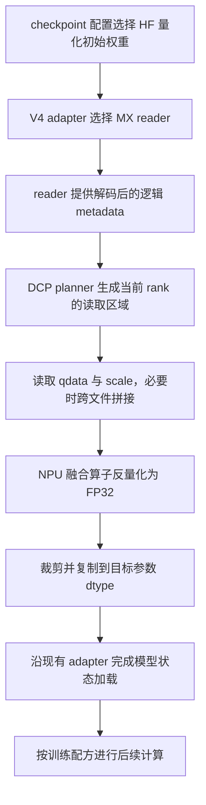

# 量化基础与 DeepSeek-V4 MX 权重加载：从零理解 PR #813

这份笔记从「计算机怎样存一个数」开始，逐步解释量化、反量化、scale、低精度训练和 MX 数据格式，最后沿真实代码理解 TorchTitan-NPU PR #813。阅读目标是能够独立回答：一个 MXFP4 文件里的字节怎样变成模型权重，加载这些权重之后为什么仍可能采用 BF16 或 block FP8 训练。

文中的小数例子用于理解数学关系；标为「本仓实现」的内容才描述当前代码。只需具备乘法、矩阵行列和简单 Python 的基础，不需要预先掌握量化。

## 1. 学习路线：需要先掌握哪些知识

建议按下面顺序阅读。先理解前一项，再理解后一项，避免直接记忆 MXFP8、E8M0 等名字。

| 顺序 | 必备知识 | 学完后应能回答的问题 |
| --- | --- | --- |
| 1 | bit、byte、dtype、shape | 一个张量究竟占多少空间？ |
| 2 | 权重、激活、梯度和矩阵乘 | 量化的是模型中的哪一部分？ |
| 3 | 整数与浮点数，范围与精度 | BF16 与 FP16 为什么各有优缺点？ |
| 4 | 量化、反量化、scale、zero point | 一个小数怎样变成低位宽编码，再变回近似小数？ |
| 5 | 舍入、截断、误差和异常值 | 为什么量化通常有损，为什么某些层更敏感？ |
| 6 | per-tensor、per-channel、per-group | 为什么需要多个 scale，scale 的形状怎样计算？ |
| 7 | 存储精度、计算精度、累加精度 | 保存为 FP4 是否意味着所有运算都使用 FP4？ |
| 8 | PTQ、QAT、动态量化和低精度训练 | 几种含有「量化」的流程分别在做什么？ |
| 9 | FP8、FP4、MX 和 E8M0 | MXFP8 比普通 FP8 多了什么？ |
| 10 | 打包与逻辑形状 | 为什么 FP4 权重在文件里可能是 `uint8`？ |
| 11 | checkpoint、safetensors、分片和 DCP | 多个进程怎样各自加载需要的权重区域？ |
| 12 | PR #813 的实现 | 这些知识怎样连接成一次完整的权重加载？ |

前 1—8 节建立基础，第 9—12 节解释 MX 和文件表示，第 13 节之后连接源码与启动脚本。

## 2. 模型里的数字、张量和内存

### 2.1 bit 与 byte

bit 是一个二进制位，只能表示 `0` 或 `1`。8 个 bit 组成 1 个 byte，即一个字节。

使用 8 个 bit，一共有 `2^8 = 256` 种不同编码；使用 4 个 bit，只有 `2^4 = 16` 种编码。编码怎样解释，要由数据格式决定。同样 8 个 bit，可以表示整数，也可以表示浮点数，不能仅凭位宽判断其数值含义。

先忽略额外信息，单个数的存储开销如下：

| 每个数的位宽 | 单个数的空间          | 10 亿个数的空间，按十进制 GB |
| ------ | --------------- | ----------------- |
| 32 bit | 4 byte          | 4 GB              |
| 16 bit | 2 byte          | 2 GB              |
| 8 bit  | 1 byte          | 1 GB              |
| 4 bit  | 0.5 byte，通常需要打包 | 0.5 GB            |

这里的 1 GB 是 `10^9` 字节，1 GiB 是 `2^30` 字节。训练日志里常用 GiB，不能直接把两种单位当成一样。

量化文件还要保存 scale、可能存在的 zero point、对齐填充和文件元信息，因此真实文件大小会比表中的纯数据估算更大。

### 2.2 tensor、shape 与 dtype

tensor，即张量，可以先理解为带形状的数字数组。

```text
标量：3.0                       shape = []
向量：[1.0, 2.0, 3.0]           shape = [3]
矩阵：[[1.0, 2.0],
       [3.0, 4.0],
       [5.0, 6.0]]             shape = [3, 2]
```

`shape=[3, 2]` 表示 3 行、2 列，一共有 6 个元素。`dtype` 决定每个元素的存储类型，例如 `float32`、`bfloat16`、`uint8`。

对普通、没有特殊包装的稠密张量，数据空间可以估算为：

$$
\text{数据字节数}=\prod_i \text{shape}_i\times\text{每个元素的字节数}
$$

例如 `[4096, 4096]` 的 BF16 权重有 `16,777,216` 个元素，纯数据占 `33,554,432` 字节，即 32 MiB。量化张量可能由多个底层张量组成，必须把其 qdata、scale 等一起算进去。

### 2.3 权重、激活和梯度分别是什么

==权重 `W` 是模型通过训练学到的参数。激活 `X` 是一次输入经过网络时产生的中间数据。梯度是损失函数对参数或中间数据的变化率，用来决定怎样更新模型。==

以不带 bias 的线性层为例，采用 PyTorch 常见权重布局：

$$
Y=XW^T
$$

其中 `X` 的形状为 `[batch, in_features]`，`W` 为 `[out_features, in_features]`，输出 `Y` 为 `[batch, out_features]`。

一个可手算的例子：

```text
X = [1, 2]
W = [[0.5, -1.0],
     [1.5,  0.25]]

Y[0] = 1 × 0.5 + 2 × (-1.0) = -1.5
Y[1] = 1 × 1.5 + 2 × 0.25  =  2.0
```

权重量化会改变 `W` 的近似表示；激活量化会改变 `X` 的近似表示。两者都可能改变 `Y`。反向传播还涉及输入梯度和权重梯度的矩阵乘，因此「前向使用 FP8」不能自动推出「所有反向运算也使用相同格式」。

训练显存里除了权重，还可能有梯度、优化器状态、保存的激活、通信 buffer 和临时工作区。因此，权重文件缩小到原来的四分之一，不等于训练显存也缩小到四分之一。

## 3. 浮点数：范围与精度是两件事

### 3.1 为什么计算机不能精确保存所有小数

固定数量的 bit 只有有限种编码，而实数有无限多个。计算机只能从有限个可表示数中选一个近似值。

十进制小数 `0.1` 在常见二进制浮点格式中通常不能被精确表示，和十进制有限小数不能精确表示 `1/3` 类似。即使 FP32，也不是任意实数的精确存储。

浮点数可以理解成二进制科学计数法。对普通正规数，可用下面的形式理解：

$$
x=(-1)^{\text{sign}}\times(1+\text{fraction})\times 2^{\text{exponent}}
$$

sign 决定正负；exponent 决定量级；fraction 决定同一量级内能区分多细。零、非正规数、无穷和 NaN 有额外编码规则，不全部套用上式。

### 3.2 FP32、FP16 和 BF16

| 格式 | 符号位 | 指数位 | 显式小数位 | 主要特点 |
| --- | --- | --- | --- | --- |
| FP32 | 1 | 8 | 23 | 范围较大、有效数字较多、占 4 字节 |
| FP16 | 1 | 5 | 10 | 占 2 字节，指数范围比 BF16 小，同量级内更精细 |
| BF16 | 1 | 8 | 7 | 占 2 字节，指数范围接近 FP32，同量级内更粗 |

「指数位多」主要有利于表示很大和很小的量级；「小数位多」主要有利于区分邻近数值。两者不是同一个指标。

例如，在 1 附近：FP32 相邻数的间隔为 `2^-23`；FP16 为 `2^-10 ≈ 0.0009765625`；BF16 为 `2^-7 = 0.0078125`。这些间隔只针对相应量级，不是全数轴统一的步长。

因此，BF16 不是「FP16 的每一方面都更精确」。它以较少的小数位换取了较大的指数范围。

### 3.3 三种常见数值问题

**舍入误差**：原数落在两个可表示数之间，只能选附近的一个。例如只能记录一位小数时，把 `1.23` 记为 `1.2`。

**上溢或饱和**：数值超出了格式可表示的范围。某些转换产生 Inf 或 NaN，某些实现把它限制在最大有限值，必须看格式及算子约定。

**下溢**：很小的数不能保留足够精度，可能进入非正规数区间或变成零。梯度过小时，这会影响参数更新。

低精度格式的可表示数更少，所以这些问题更容易出现。后面要介绍的 scale，正是调整数值量级的重要工具。

PyTorch 对 dtype 名称及特殊浮点类型的说明见 [Tensor Attributes](https://docs.pytorch.org/docs/main/tensor_attributes.html)。具体低精度运算是否可用，还取决于对应设备和算子。

## 4. 用一个整数例子理解量化与反量化

### 4.1 把连续刻度换成有限刻度

先想象一把只能精确到 0.1 的尺子。真实长度 `1.23` 只能记录为 `1.2`，`1.19` 也可能记录为 `1.2`。这样减少了需要表示的数值种类，同时丢失了一些细节。

量化做的是类似的事情：把原始值映射到较少的可表示数。反量化根据低精度编码和辅助信息，重建一个高精度类型承载的近似值。

「高精度类型承载」不等于「找回原始精度」。`1.2` 转成 FP32 后仍然只知道近似值，无法知道原来是 `1.19` 还是 `1.23`。

### 4.2 scale 是一个低精度单位代表多少原始数值

先讨论对称整数量化，取 zero point 为零：

$$
q=\operatorname{clamp}(\operatorname{round}(x/s),q_{\min},q_{\max})
$$

$$
\hat{x}=s\cdot q
$$

符号含义如下：

- `x`：原始值；`q`：量化后的整数编码。
- `s`：scale，且 `s > 0`。
- `round`：舍入到整数；`clamp`：限制到允许的整数范围。
- `x̂`：反量化后的近似值，帽子表示它通常不等于原始值。

例如固定 `s=0.1`，使用 INT8 范围 `[-128,127]`：

| 原值 x | x / s | 舍入后的 q | 反量化 x̂ | 误差 x̂ − x |
| --- | --- | --- | --- | --- |
| -1.23 | -12.3 | -12 | -1.2 | +0.03 |
| -0.26 | -2.6 | -3 | -0.3 | -0.04 |
| 0 | 0 | 0 | 0 | 0 |
| 0.74 | 7.4 | 7 | 0.7 | -0.04 |
| 1.19 | 11.9 | 12 | 1.2 | +0.01 |

文件保存整数 `[-12,-3,0,7,12]` 和 scale `0.1`，就可以恢复右侧的近似值。若只保存整数而没有 scale，就无法确定它们代表 `[-1.2,...]` 还是 `[-12,...]`。

这里按最近值舍入。遇到恰好在中间的情况，例如 `2.5`，不同规则会给出不同选择；Python 的 `round` 使用 ties-to-even，即平局时取偶数。这种差异会影响比特级数值对齐。

### 4.3 scale 太大、太小会怎样

在同一整数范围下，scale 越小，刻度越细，但能覆盖的原始数值范围越窄。scale 越大，覆盖范围越宽，但刻度越粗。

仍取 `s=0.1`，INT8 能覆盖的近似范围是 `[-12.8,12.7]`。输入 `20` 时：

```text
20 / 0.1 = 200
200 超出 INT8 最大值 127，截断为 127
反量化得到 127 × 0.1 = 12.7
误差为 12.7 − 20 = −7.3
```

没有截断、且使用最近值舍入时，均匀整数刻度上的绝对舍入误差通常不超过 `s/2`。这个结论不包含上面这种超范围截断，也不能直接套到非均匀的 FP4/FP8 数值刻度上。

### 4.4 怎样根据数据选 scale

一个容易理解的对称方案是：

$$
s=\frac{\max_i|x_i|}{Q}
$$

这里使用 `[-Q,Q]` 的对称整数范围。INT8 常见教学选择是 `Q=127`，让 `-128` 不参与编码；INT4 可选 `Q=7`，让范围成为 `[-7,7]`。实际实现也可能采用不同约定。

例如 `x=[-3.5,-1.1,0.2,2.4,3.5]`，用 `Q=7`，得到 `s=0.5`：

```text
量化编码：[-7, -2, 0, 5, 7]
反量化值：[-3.5, -1.0, 0.0, 2.5, 3.5]
```

最大值保住了，但 `0.2` 变成了 `0`。这说明「没有截断」不等于「没有量化误差」。全零张量需要单独处理 scale，不能直接除以零。

## 5. zero point 与非对称量化

### 5.1 为什么需要把零的位置平移

如果数据分布明显偏向正数，用正负对称范围可能浪费很多负数编码。非对称量化允许把真实的 `0` 映射到一个整数 `z`，称为 zero point：

$$
q=\operatorname{clamp}(\operatorname{round}(x/s)+z,q_{\min},q_{\max})
$$

$$
\hat{x}=s(q-z)
$$

例如用 UINT8 的 `[0,255]` 表示原始区间 `[-1,2]`：

```text
s = (2 − (-1)) / 255 = 1/85
z = 85

原始 -1 → q=0   → 反量化 -1
原始  0 → q=85  → 反量化  0
原始  2 → q=255 → 反量化  2
```

zero point 不是一个应当额外加到模型输出上的 bias。它属于数值编码规则：算子需要按约定减去它，才能恢复正确的数值关系。

### 5.2 不要把整数量化公式套到所有格式

整数仿射量化通常会讨论 scale 和 zero point；浮点量化则常用低精度浮点元素配合 scale，不一定有整数 zero point。

PR #813 加载的是后一类：MX 元素和 E8M0 scale。理解 zero point 是量化基础的一部分，但这个 PR 没有给 MX 权重添加 INT8 风格的 zero point。

## 6. 为什么需要分组量化

### 6.1 一个异常大值会影响其他数

假设一个张量里的大多数值在 `[-1,1]`，只有一个值为 `100`。若所有元素共用一个对称 INT8 scale，则 `s=100/127≈0.7874`。

这时 `0.1`、`0.2`、`0.3` 都可能被舍入为 0。虽然能容纳那个 100，但小值的大量信息丢失了。这种少数特别大的值称为 outlier，即异常值或离群值。

一种解决办法是让不同区域使用不同 scale。包含 100 的那组接受较粗刻度，其他组继续使用适合自身范围的细刻度。

### 6.2 量化粒度就是多少元素共享一个 scale

| 粒度 | scale 的共享方式 | 常见取舍 |
| --- | --- | --- |
| per-tensor | 整个张量一个 scale | 元信息少，容易受局部异常值影响 |
| per-channel / per-row | 每个通道或每行一个 scale | 能适应行与行之间的范围差异 |
| per-group / per-block | 每组固定数量的元素一个 scale | 适应更局部的变化，但 scale 更多 |

这些名称必须配合 axis 和布局理解。对于权重 `[N,K]`，「每行一组」通常意味着每个输出通道沿 K 共享 scale；换个布局，同样的「channel」可能对应另一维。

### 6.3 从 shape 推导 scale 的 shape

设权重 `W` 的逻辑形状为 `[2,96]`，沿最后一维每 32 个元素分一组，则每行有 3 组，scale 形状为 `[2,3]`。

```text
每一行：
列  0—31  → scale[行号, 0]
列 32—63  → scale[行号, 1]
列 64—95  → scale[行号, 2]
```

一般情况下，若每组 `B` 个元素，最后一维长度为 `K`，组数为 `ceil(K/B)`。最后不足一组时是否允许、怎样填充，取决于文件格式和算子。

「每 32 个元素一个 scale」与「32×32 个元素一个 scale」差别很大。读取代码时必须同时确认块大小、轴和 scale 形状。

## 7. 存储、计算和训练：不要混淆三种精度

### 7.1 文件怎么保存，是第一件事

checkpoint 可以把权重保存成 MXFP4，以减少磁盘空间和读取的数据量。加载程序可能马上将它反量化为 BF16，之后全程按 BF16 运行。

这仍然叫「加载量化权重」，但并没有承诺训练矩阵乘使用 FP4。

### 7.2 算子怎样计算，是第二件事

另一个流程可以在内存中保留 BF16 参数，每次矩阵乘之前动态得到 FP8 数据和 scale，再调用支持 FP8 的矩阵乘算子。

例如对称量化下，若 `X≈s_X Q_X`、`W≈s_W Q_W`，且这里为简单起见使用标量 scale，则：

$$
XW^T\approx(s_Xs_W)(Q_XQ_W^T)
$$

真正的低精度矩阵乘可以把 scale 处理融合进算子。它不一定先把完整矩阵反量化回 BF16。另一方面，如果后端缺少对应算子，也可能解码后使用普通高精度计算，性能结果会不同。

分组 scale 沿归约轴变化时，不能直接把全部 scale 当成两个标量提出求和，算子必须按块处理。

### 7.3 乘法输入、累加和输出，是第三件事

一个算子可以用 FP8 输入，使用更高精度累加，再输出 BF16。因为点积要加很多乘积，累加误差同样重要。实际累加精度和是否中途截断，由具体硬件及算子定义决定。

因此，描述「FP8 训练」时，至少应区分参数保存 dtype、算子输入 dtype、累加方式、输出 dtype、梯度 dtype 和优化器状态 dtype。不能据一个标签推断所有对象都占 1 字节。

### 7.4 为什么低精度不保证一定更快

低精度可能减少数据搬运量，也可能使用吞吐更高的硬件指令；但计算 scale、转换 dtype、打包、转置、同步和临时分配也有成本。

如果矩阵很小、转换没有融合、数据布局不合适，收益可能被额外开销抵消。判断效果要看完整任务的时间、吞吐和内存，而不能只比较位宽。

## 8. PTQ、QAT、静态量化与动态量化

### 8.1 PTQ：模型训练后再量化

PTQ 是 Post-Training Quantization，即训练后量化。先有一个训练好的模型，再为权重或激活确定低精度表示。

某些方案用一批有代表性的数据统计激活范围，称为 calibration，即校准；另一些仅处理权重的简单方案可以不需要激活校准。校准数据需要与实际输入分布有一定关联。

PTQ 的难点是既减少表示成本，又尽量保留模型质量。简单舍入只是其中一种做法，实际算法还可能优化缩放、裁剪或权重补偿。

### 8.2 QAT：训练时让模型经历量化误差

QAT 是 Quantization-Aware Training，即量化感知训练。它常在训练或微调时加入 fake quantization，即伪量化：前向计算模拟「量化再反量化」带来的数值误差，但结果仍可以由 BF16/FP32 张量承载。

例如 `1.23` 在前向里按刻度变成 `1.2`，后续网络实际看到 `1.2`。模型可以通过训练调整参数，适应这种误差。

舍入函数的梯度几乎处处为零，不能直接按普通连续函数训练。常见实现使用 STE（Straight-Through Estimator，直通估计器）近似传递梯度；具体范围及饱和区间的梯度规则取决于实现。

伪量化的「伪」指可能没有真正把长期存储变成低位宽，并不表示前向数值没有变化。TorchAO 的 QAT 工作流将准备训练和最终转换为实际量化模型分开，见 [QAT 文档](https://docs.pytorch.org/ao/stable/workflows/qat.html)。

### 8.3 低精度训练不等于 QAT

低精度训练也可以直接用 FP8/MXFP8 算子执行前向或反向矩阵乘，主要目标是加速训练或降低特定部分的开销。

QAT 主要关注模型适应将来的量化误差。两者可以组合，但「使用 FP8 算子」和「加入 FP4 伪量化误差」是两种不同操作。本仓训练配方中就存在 block-FP8 路径配合 MXFP4 fake quantization 的配置，不能因此把实际矩阵乘一概称为 FP4。

PyTorch 官方把量化训练和 QAT 分成不同工作流，见 [Quantized Training](https://docs.pytorch.org/ao/stable/workflows/training.html)。其中 GPU 实现的支持列表不能直接当作本仓 NPU 的支持列表。

### 8.4 静态与动态，讨论的是量化参数什么时候确定

静态量化通常在离线校准等阶段确定相关量化参数；动态量化在运行时根据当前输入或张量重新确定参数。不同框架对这些名称的具体范围有差异，阅读时要确认它指权重、激活还是两者。

本仓代码里的「动态生成模块类」又是另一层意思：Python 动态创建类与数值在运行时动态量化是不同机制。

PR #813 接收已经保存好的 qdata 和 scale，加载时使用已有 scale 解码。它没有重新训练量化参数，也不根据模型权重重新选择 scale。

## 9. 从整数低精度走向 FP8 和 FP4

### 9.1 INT8 与 FP8 都是 8 bit，但可表示数不同

INT8 通常表示连续整数，scale 把整数刻度映射到原始空间。FP8 则把有限 bit 分给符号、指数和小数部分，数值间隔随量级变化。

例如十进制科学计数法可以表示 `1.0×10^-3` 和 `1.0×10^3`，浮点格式同样利用指数覆盖不同量级，只是使用二进制。

因此，INT8 的编码 `64` 与 FP8 中字节值为 `64` 的编码，不必代表同一个数。正确解码既需要字节，也需要格式。

### 9.2 E4M3、E5M2 和 E2M1 的名字

`E` 表示 exponent，指数；`M` 表示 mantissa，在这里对应显式小数位。带符号的常见元素格式如下：

| 名称 | 位数分配 | 本文的用途 |
| --- | --- | --- |
| E4M3 | 1 符号位 + 4 指数位 + 3 小数位 | PR 支持的 MXFP8 元素格式 |
| E5M2 | 1 符号位 + 5 指数位 + 2 小数位 | 用于理解 FP8 格式并不唯一；PR 未接入此格式 |
| E2M1 | 1 符号位 + 2 指数位 + 1 小数位 | PR 支持的 MXFP4 元素格式 |

==指数位更多一般有助于扩大范围，小数位更多一般有助于改善同量级的精度。==不同格式还可能使用不同的特殊值约定，所以仅凭「FP8」仍不足以确定二进制解释方式。

PyTorch 名称里的 `fn`、`fnu` 等后缀属于具体格式标识。排查兼容性时应保留完整 dtype 名称，例如 `torch.float8_e4m3fn`，不要随意替换成另一个包含 `float8` 的类型。

### 9.3 FP4 的 16 个编码为什么不是 0 到 15

E2M1 的正幅值可以表示为：

```text
0、0.5、1、1.5、2、3、4、6
```

再加上负号对应的编码，形成 16 个 bit 编码，其中包括正零和负零。这里每个编码表示的是浮点值，不是普通整数编号。

后文使用本 PR 测试中的约定：4 bit 编码 `0x2` 解码为 `+1`，`0xE` 解码为 `-4`。这个例子直接对应本仓测试中的 E2M1 查找表。

所以，UINT8 值 `226` 也可能只是两个 FP4 编码的载体；直接把它数值转换成 FP32，会得到 `226.0`，完全没有完成 FP4 解码。

### 9.4 浮点量化仍然可以使用 scale

把整数的 `round` 换成低精度浮点舍入，可以用下面的数学关系理解浮点量化：

$$
q=\operatorname{cast}_{\text{low-float}}(x/s),\qquad \hat{x}=s\cdot q
$$

实际实现还需要确定 scale 的选取方式、超范围行为和舍入规则。FP8 dtype 只是元素的格式，不包含整套量化策略。

本 PR 主要实现第二步：已经知道低精度 qdata 和 scale，把它们解码为模型需要的近似权重。

## 10. MX：每小组元素共享一个 scale

### 10.1 MX 比元素 dtype 多描述了一层结构

MX 是 Microscaling。一个 MX 块由若干低精度元素和共享 scale 组成。本文涉及的 MXFP8/MXFP4 使用每 32 个元素一个 E8M0 scale；OCP 标准允许的 MXFP8 元素包括 E4M3、E5M2，而 PR 当前只识别 E4M3。

这些格式参数可查 [OCP MX v1.0 规范，第 5.2 节](https://www.opencompute.org/documents/ocp-microscaling-formats-mx-v1-0-spec-final-pdf)。具体文件命名和 NPU 所需 scale 布局，则由本 PR 的实现决定。

对普通有限值，一个块里第 i 个数的重建关系为：

$$
\hat{x}_i=s_{\text{block}}\times q_i
$$

前面的分组量化解决「不同区域尺度不同」的问题；MX 为其中一组数据格式约定了元素类型、scale 类型和块大小。

### 10.2 E8M0 scale 是什么

在本文涉及的实现中，E8M0 scale 的普通有限编码可按下式理解：

$$
s=2^{u-127}
$$

`u` 是 8 bit 编码的无符号整数值。它是 scale 的编码，不是 scale 自身的数值：

| scale 字节 u | 解码后的 scale |
| --- | --- |
| 125 | 0.25 |
| 126 | 0.5 |
| 127 | 1 |
| 128 | 2 |
| 129 | 4 |

因此字节 `128` 不表示把权重乘以 128，而是乘以 2。`u=255` 有 NaN 等特殊值语义，不能按普通有限 scale 处理。入门例子只使用表中的普通值。

E8M0 不是「8 个指数位，再加一个符号位」。这里 scale 使用 8 bit 编码，普通 scale 为正的 2 的整数次幂。仓内参考解码也使用 `exp2(scale-127)`，见 [MX 参考反量化源码][mx-reference]。

### 10.3 为什么 scale 也可能是 uint8

文件可以把 E8M0 的原始字节装在 `uint8` 张量中，也可以使用 `float8_e8m0fnu` dtype。二者可能承载相同的编码，需要按 E8M0 语义解释。

PR 通过 key 后缀区分用途：

```text
linear.weight：若 dtype 为 uint8，作为 packed FP4 权重候选
linear.scale：若 dtype 为 uint8，作为 E8M0 scale 字节
buffer：普通 uint8 buffer，不因 dtype 相同就当作 FP4 权重
```

这说明 dtype 不一定能独立确定张量含义。key、shape、量化方案和布局都可能是解码信息的一部分。

### 10.4 scale 也占空间

以下是对完整 32 元素块的纯 payload 计算，不包含文件头、填充和未量化参数：

```text
BF16： 32 × 2 byte      = 64 byte
MXFP8：32 × 1 byte + 1  = 33 byte
MXFP4：32 × 0.5 byte + 1 = 17 byte
```

所以平均每元素分别是 2、1.03125 和 0.53125 字节。相对 BF16，理想 payload 压缩比例约为 `64/33≈1.94` 和 `64/17≈3.76`，不能忽略 scale 后直接把真实文件缩小比例写成精确的 2 倍、4 倍。

这里讨论的是存储数据量，不是模型最终的训练显存或运行速度。

## 11. FP4 打包：区分字节坐标与元素坐标

### 11.1 一个字节放两个数

FP4 的一个编码占 4 bit，一个字节有 8 bit，所以可以存两个编码。4 bit 也称为 nibble，半字节。

本 PR 测试使用的例子是 `0xE2`：

```text
一个字节：0xE2 = 二进制 1110 0010

低 4 bit：0010 = 0x2 → FP4 值 +1
高 4 bit：1110 = 0xE → FP4 值 -4

按低半字节在前的约定，解码结果为 [+1, -4]
```

若这一组的 scale 字节为 `128`，即 scale 为 2，则反量化结果为 `[2,-8]`。

这涉及两步：先把两个半字节解码成 FP4 数值，再乘以 scale。把 `uint8` 直接 `.float()` 只会得到 `226.0`，不会执行这两步。

### 11.2 存储形状与逻辑形状

设模型需要 `W.shape=[2,96]`：

```text
MXFP8：
  weight 存储 shape = [2,96]
  scale  存储 shape = [2,3]
  解码后逻辑 shape  = [2,96]

MXFP4：
  weight 存储 shape = [2,48]
  scale  存储 shape = [2,3]
  解码后逻辑 shape  = [2,96]
```

FP4 最后一维的一项是一个包含两个编码的字节，所以最后一维缩短一半。模型做矩阵乘时仍然需要 96 列，不能把网络输入维度也改成 48。

### 11.3 分片偏移也要换算

如果一个 FP4 分片从存储列 16 开始，其逻辑起点为第 32 个元素。如果只修改 shape、不修改分片偏移，分布式加载器会把数据写到错误的位置。

反过来，如果请求从逻辑列 7 开始，它落在一个字节的第二个半字节。文件读取无法从「半个字节地址」开始，需要读出包含它的字节，解码后丢弃前面的元素。

PR 还要考虑 scale 的块边界，因此实际读取区域会进一步扩展，后文会用一个完整例子说明。

## 12. checkpoint、safetensors 与分布式加载

### 12.1 checkpoint 保存了什么

checkpoint 是为了保存或恢复模型状态而写出的数据。完整训练 checkpoint 可能包括权重、优化器状态、训练 step 等；模型权重 checkpoint 则可能只保存模型参数。

HF 权重常通过 safetensors 文件保存命名张量，例如 `layers.0.ffn.experts.0.w1.weight`。tensor 名称、dtype、shape 和数据字节共同构成加载所需的信息。

「使用 safetensors」只说明容器形式，不自动说明量化算法。不同模型可以在相同容器内使用不同的 key 后缀、scale 编码和打包方式。

### 12.2 三种容易混淆的「分片」

第一种是**文件分片**：把不同的完整 tensor 分散到多个文件，避免一个文件过大。

第二种是**单个 tensor 的存储分片**：同一个 tensor 的不同区域写在不同文件中，并用 metadata 记录偏移。

第三种是**运行时参数分片**：分布式训练中，不同 rank 持有模型参数的不同部分。rank 可以先理解为一个参与分布式任务的进程编号，常见部署是一张卡对应一个进程。

这三种划分不必相同。例如文件把某个 tensor 沿列切成三块，但某个 rank 需要的区域横跨其中两块。加载器必须根据坐标把它们重新组合。

### 12.3 DCP 中 reader、metadata 与 planner 的职责

DCP 是 PyTorch Distributed Checkpoint。这里需要理解三个对象：

**Storage reader** 知道文件中的数据怎样存、怎样读。MX reader 额外知道怎样解释压缩权重与 scale。

**Metadata** 描述可加载的 tensor 名称、逻辑 dtype、完整形状和存储分片。planner 依赖它来判断哪里有数据。

**Load planner** 根据目标张量及其分布，生成需要读取的区域。它不应被迫理解 FP4 半字节编码等文件格式细节。

PR 的重要设计就是：让 DCP 看见解码后的逻辑张量，再由 reader 把逻辑区域转换为实际文件读取和反量化操作。

## 13. PR #813 究竟增加了什么能力

### 13.1 用输入和输出描述这个 PR

输入是一套按特定 MX 约定保存的 DeepSeek-V4 HF safetensors 权重。输出是模型当前参数所需的浮点值及形状。

以 FP4 为例：

```text
输入：
  layers.0.ffn.experts.0.w1.weight：uint8 打包数据
  layers.0.ffn.experts.0.w1.scale：E8M0 scale

加载期间：
  按所需区域读取 → NPU 解码 → 得到浮点近似值

输出：
  模型参数的对应区域被正确填充
  参数后续按训练配置参与前向、反向和更新
```

它省去了使用这些权重之前，另行把整份 checkpoint 转换并保存为浮点文件的必要步骤。实际仍有读文件、CPU 到 NPU 传输、反量化和参数写入的成本。

### 13.2 最新版本的接入范围

PR 仅在本仓 `DeepSeekV4StateDictAdapter` 中新增 reader 选择逻辑：

```python
# 为说明控制流程而写的简化伪代码，不是独立可执行程序。
if from_quantized:
    reader = MXHuggingFaceStorageReader(path)
    reader.read_metadata()
    if reader_has_mx_weights:
        return reader
return original_reader(path, from_quantized)
```

真实代码见 [DeepSeek-V4 adapter][v4-adapter]。`from_quantized` 来自 checkpoint 加载配置。

当前版本没有全局改写上游 DeepSeek-V3 类，也没有自动为 DeepSeek-V3.2、DeepSeek-V4.1 接入 MX reader。PR 页面的早期自动评论描述过全局 patch，那不属于这次合入的最新实现。

### 13.3 量化权重的发现与校验

reader 扫描 safetensors metadata，按以下规则发现候选权重：

```text
key 以 .weight 结尾，dtype=float8_e4m3fn → MXFP8 候选
key 以 .weight 结尾，dtype=uint8          → MXFP4 候选
同一前缀的 .scale                       → 对应 scale
```

对找到的 scale，校验 dtype 为 `uint8` 或 `float8_e8m0fnu`，形状为权重前缀维度加上 `ceil(逻辑列数/32)`。

若没有 `.scale`，但存在对应的 `.weight_scale_inv`，该权重被留给 block-FP8 路径。若同时发现 MX 权重和 block-FP8 的 scale key，则明确报错。

这是一套固定格式适配。dtype 推断是过渡方案，源码留有 TODO：未来应从 checkpoint 的量化配置确定格式。不能把任意 UINT8 权重都视为受支持的 MXFP4。

### 13.4 为什么 metadata 要提前改成浮点形状

reader 向 DCP 暴露 MX 权重时，会把逻辑 dtype 设为 FP32。对于 FP4，还将最后一维的 size 和 chunk offset 都乘以 2。

配套 `.scale` 从对外可加载的 tensor metadata 中移除，因为它属于解码所需的辅助信息，不是模型需要额外注册的参数。

同时，reader 保留原始压缩 tensor 的存储信息。可以把两套 metadata 理解为两张表：一张告诉 DCP「模型能得到什么」，另一张告诉 reader「磁盘上实际放了什么」。

### 13.5 完整调用关系

上游 TorchTitan `v0.3.0` 的 HF 加载流程先将目标 state dict 映射为 HF key，交给 DCP 填充，再通过 adapter 映射回模型格式并加载。PR 插入的是中间的 storage reader。需要看上游时，应读取 `v0.3.0` 的 `torchtitan/components/checkpointer/dcp.py`，而不是把相邻 checkout 的浮动 HEAD 当作相同版本。



## 14. 用一个具体 FP4 权重走完加载过程

### 14.1 准备一份容易手算的权重

继续使用逻辑 shape `[2,96]`。假设每个存储字节都是 `0xE2`，每行有 48 个字节；scale 如下：

```text
weight：uint8，shape=[2,48]，每个字节都是 0xE2

scale：uint8，shape=[2,3]
第 0 行：[126,127,128] → [0.5,1,2]
第 1 行：[129,128,127] → [4,2,1]
```

每个 `0xE2` 解码为 `[1,-4]`。每个 scale 管 32 个逻辑元素，即 16 个字节。

第 0 行的反量化结果是：

```text
列  0—31：重复 [0.5,-2] 16 次
列 32—63：重复 [1,-4]   16 次
列 64—95：重复 [2,-8]   16 次
```

第 1 行相应为重复的 `[4,-16]`、`[2,-8]`、`[1,-4]`。这正对应 PR 小规模测试的数据构造与独立预期。

### 14.2 某个 rank 只需要列 [7:96]

Python 切片 `[7:96]` 包含列 7，不包含列 96，所以需要 `96-7=89` 列。

MX 块包含 32 个元素，但当前 NPU 调用要求 scale 成对整理，因此 reader 将读取区域按 64 个逻辑元素对齐。源码中的两个常量分别是 `MX_BLOCK_SIZE=32` 和 `MX_SCALE_PAIR_SIZE=64`。

```text
原始请求：逻辑列 [7:96]
向下对齐起点：floor(7 / 64) × 64 = 0
向上对齐终点：ceil(96 / 64) × 64 = 128
限制到原张量长度：min(128,96) = 96

实际解码覆盖：逻辑列 [0:96]
读取 FP4 字节：存储列 [0:48]
读取 scale：列 [0:3]
解码后裁掉前 7 列，保留 89 列
```

为什么不能只改为读取第 `7//2=3` 个字节？因为还必须知道这个字节对应哪个 scale，以及原请求处于解码结果中的什么位置。对齐读取使这些关系明确。

真实 DCP plan 可能按已有 chunk 将大请求进一步拆成多个 ReadItem，上面的计算说明单个覆盖区域的原则；不能把它当作任意分片布局下唯一的一次文件读取。

### 14.3 跨文件读取时如何恢复区域

假设 FP4 的 48 个字节分别放在三个文件中：

```text
weight-0：存储列 [0:16]  → 逻辑列 [0:32]
weight-1：存储列 [16:32] → 逻辑列 [32:64]
weight-2：存储列 [32:48] → 逻辑列 [64:96]
```

scale 又可以分成两个文件，一个保存第 0 个 scale，另一个保存第 1、2 个 scale。reader 根据每个 tensor 的 metadata 查询与所需区域相交的 chunk，再把数据复制到正确位置。

当前 `_read_tensor_region()` 会检查计划读取的元素数是否与目标区域相符，发现数量不完整时抛错。这是实现中的完整性检查，不能扩展理解成它已经验证了任意畸形分片的全部空间覆盖性质。

### 14.4 scale 为什么从 3 个变成 4 个

NPU wrapper 将最后一维 scale 整理为 `[..., pair_count, 2]`。3 个 scale 不能直接两两分组，因此补一个字节 `127`，表示 scale 1：

```text
原 scale：[126,127,128]
补齐后： [126,127,128,127]
成对：   [[126,127],[128,127]]
```

这里补的是辅助 scale，原权重逻辑长度仍为 96，不能据此把模型权重扩成 128 列。真实算子对这种尾块的处理由 NPU 冒烟测试覆盖；仅看 CPU 模拟不能代替设备验证。

### 14.5 NPU 解码和最终参数 dtype

`dequantize_mx_on_npu()` 把压缩权重和 scale 放入 pinned host memory，再以非阻塞复制提交到目标 NPU，调用：

```python
# 摘取关键参数；qdata_npu、scale_npu 已由上文流程构造。
aligned_fp32 = torch_npu.npu_anti_mx_quant(
    qdata_npu,
    scale_npu,
    axis=-1,
    dst_type=torch.float32,
    src_type=src_type,
)
```

其中 `axis=-1` 表示沿最后一维处理分组；FP4 的 `src_type` 为 `torch_npu.float4_e2m1fn_x2`；FP8 为 `torch.float8_e4m3fn`。

结果为 FP32，然后按请求裁剪，并 `copy_` 到目标 tensor。如果目标是 BF16，复制过程会转换为 BF16。解码输出的 dtype 与最终参数 dtype 可以不同。

### 14.6 stream、event 与在途请求

CPU 发出设备操作后，不一定立刻等它结束。stream 可以理解为设备操作队列，event 是记录队列进度的标记。

既然复制可能尚未完成，就必须保证源 buffer 还活着。代码在队列里保留 qdata、scale 和中间结果，等待 event 完成后才提交对应 tensor。

默认最多安排到 `npu_max_inflight=2` 的在途请求阈值，并在退出前同步 stream。这控制的是请求数量，不是严格的内存字节上限：不同请求可以包含不同大小的张量。

CPU 文件读取在当前 MX 路径中仍按顺序推进。异步提交允许某些工作重叠，但最终返回前仍等待全部完成；这不是一个立即返回、后台继续加载整份模型的 API。

## 15. 和当前 A5 启动脚本怎样对应

### 15.1 先把两个开关分开理解

| 配置 | 生效阶段 | 回答的问题 |
| --- | --- | --- |
| `checkpoint.initial_load_in_hf` | 初始权重加载 | 输入是否按 HF safetensors 处理？ |
| `checkpoint.initial_load_in_hf_quantized` | 初始权重加载 | reader 是否需要处理量化表示？ |
| `extension.quantization.enable_quantized_training` | 模型构造及训练 | 是否配置量化训练模块？ |
| `extension.quantization.recipe` | 模型构造及训练 | 哪些目标模块采用哪套量化策略？ |
| `extension.quantization.enable_mxfp4_qat` | 对应训练配方 | 是否在适用路径引入 MXFP4 伪量化？ |

在配置对象里使用下划线名称，在启动脚本里通常表现为连字符，例如 `initial_load_in_hf_quantized` 对应 `--checkpoint.initial-load-in-hf-quantized`。

### 15.2 当前 A5 脚本的默认行为

本次更新后的 [A5 启动脚本][a5-launcher] 默认启用量化训练，配方为 `all_block_fp8`，并设置 `fsdp_prequantize` 和 `li_quantization=fp8`。这些都是训练侧配置。

其中 `all_block_fp8` 也不能理解为「模型所有 tensor、激活和梯度都变成同一种 block FP8」。实际 [converter][quant-converter] 对筛选到的 dense、routed expert 配置安装策略；`_block_fp8_param_swap()` 中权重使用 `BlockMXQuantizeConfig`，激活使用 `MXQuantizeConfig`，其他对象的精度不能仅凭配方名推断。

A5 脚本调用公共 [A3 命名的启动脚本][common-launcher] 来复用启动逻辑。公共脚本设置了 HF 初始权重加载，但没有默认追加量化 HF 加载开关。这是为什么启用了量化训练，还可能需要单独设置量化 checkpoint 加载。

### 15.3 加载 MX 权重需要哪些配置

从配置对象角度，需要让以下值生效。这里是配置字段示意，不是独立 Python 程序：

```python
enable = True
initial_load_path = "/path/to/DeepSeek-V4-Flash-MXFP8"
initial_load_in_hf = True
initial_load_in_hf_quantized = True
initial_load_model_only = True
```

对于现有 A5 启动命令，公共脚本已经提供部分字段；需要按实际路径追加的关键参数片段为：

```text
--checkpoint.initial-load-path /path/to/DeepSeek-V4-Flash-MXFP8
--checkpoint.initial-load-in-hf-quantized
--checkpoint.initial-load-model-only
```

MXFP4 使用相同的量化加载开关，路径换成符合本 PR 格式的 MXFP4 checkpoint。路径里的文字不会决定格式；真正的判断来自文件 metadata。

这些参数只描述加载，不能代替实际的节点 IP、NPU 数量、tokenizer、数据集和并行配置。当前公共脚本默认 EP 与 DP shard 都为 128；单机运行时必须重新配置可成立的拓扑，不能仅把节点数改成 1 就认为脚本已经适配。

### 15.4 从 MX checkpoint 开始，训练用什么精度

一种合理的概念流程是：

```text
磁盘：MXFP4 / MXFP8
  ↓ 本 PR reader
加载中：FP32 解码结果
  ↓ 复制到模型目标参数
模型状态：目标参数的 dtype / 表示
  ↓ 训练配方在受支持模块中生效
训练计算：BF16 或配置选择的低精度路径
```

加载器本身不会把训练配方改为 `all_mxfp8`，也不会因为读取 FP4 就自动启用 FP4 QAT。

如果使用 A5 默认配方，训练侧继续由 `all_block_fp8` 配置控制；若需要关闭训练量化，脚本支持尾部传入 `--extension.quantization.no-enable-quantized-training`。输入 checkpoint 若仍为 MX，量化加载开关仍需保留。

这描述的是代码职责与配置关系，不构成对所有 checkpoint、训练配方及并行组合均已验证的承诺。

### 15.5 为什么更换初始权重路径可能没有效果

上游优先从输出 checkpoint 目录里的可恢复训练 checkpoint 续训。如果找到可用的 `step-*`，就会忽略初始加载的 `initial_load_*` 配置。

因此，要从新的 MX 权重开始，应使用新的输出 checkpoint 目录，并在日志里确认实际加载路径。不要为了切换初始权重，直接删除原训练数据；保留原目录也便于回看和恢复。

HF 初始权重一般只恢复模型参数，不意味着恢复原始训练的优化器动量、学习率进度和训练 step。把「续训练」理解为继续优化这些模型权重，与从完整训练 checkpoint 精确恢复，是两种不同起点。

## 16. 这个实现的边界与实际价值

### 16.1 已有代码明确实现的范围

| 输入或场景 | 当前行为 |
| --- | --- |
| V4、E4M3 MXFP8、配套合法 `.scale` | 选择 MX reader 并在 NPU 解码 |
| V4、UINT8 打包 E2M1 MXFP4、配套合法 `.scale` | 按每字节两个元素解码 |
| 同一 checkpoint 中混合 MXFP8、MXFP4 | reader 可以逐 tensor 识别 |
| MX 权重夹杂普通浮点参数或普通 buffer | 普通 tensor 按对应读取路径复制 |
| 纯 block-FP8 checkpoint | 探测后回退到原有量化 reader |
| MX 与 block FP8 同时存在 | 明确拒绝 |
| 任意其他 UINT8 / INT4 / FP4 布局 | 不能视为通用兼容 |
| 保存或导出 MX checkpoint | 本 PR 没有新增这项能力 |
| V3.2、V4.1 自动使用新 reader | 本 PR 没有接入 |

「能从 MX checkpoint 初始化」不等于「能把之后训练得到的模型再原样保存成相同 MX 文件」。输入能力与输出能力必须分别实现。

### 16.2 设备与版本条件

生产路径依赖 `torch_npu.npu_anti_mx_quant`，要求匹配的 NPU 硬件和软件栈。新增 smoke 测试明确在 Ascend 950 上执行，其他设备会跳过。不能把这份实现理解为通用 CPU loader。

同一 rank 的读取计划要求目标 tensor 位于同一个设备。代码与测试的目标是每个 rank 向其 NPU 参数加载，不是支持任意 CPU/NPU 混合目标。

PR 依赖 PyTorch DCP 的若干内部 metadata 和 planner 接口。更新 PyTorch 或 safetensors 时，需要重新确认接口和 dtype 读取行为，而不能仅凭 Python 导入成功判断兼容。

### 16.3 它可能减少什么成本，尚未证明什么收益

这个 reader 能直接消费压缩 checkpoint，减少额外离线转换步骤，并按读取请求处理权重区域。传输到 NPU 的主要输入是压缩 qdata 与 scale。

但加载时仍需要目标参数、压缩数据的设备副本和 FP32 解码临时张量。不同分片请求的对齐区域还可能重叠，产生重复读取或解码。

此外，V4 adapter 先调用一次 `read_metadata()` 发现格式，DCP 正式加载又会读取 metadata；当前没有相应的扫描结果缓存。MX 数据路径按顺序读取文件，也没有直接使用父类普通路径的文件并行读取方式。

因此，加载耗时、峰值 CPU 内存和 NPU 显存，需要针对真实模型、存储介质、分片方式与 rank 数测量。PR 的功能实现本身不能证明吞吐提高了多少。

## 17. 如何判断量化和加载是否正确

### 17.1 先比较正确的两个对象

这里至少有三份不同的数据：

```text
A：量化之前的原始高精度权重
B：对 checkpoint 中 qdata 和 scale 进行独立解码得到的权重
C：PR loader 最终写入模型的权重
```

比较 A 与 B，衡量的是量化本身损失了多少信息。比较 B 与 C，衡量的是加载器有没有正确解释字节、scale、形状和切片。

一个正确的 loader 应在目标 dtype 的相同转换规则下与 B 一致；它不可能凭空使 C 恢复成已经丢失信息的 A。

这是判断 PR #813 时最重要的验证对象区别。

### 17.2 常见误差指标

对一组参考值 `x` 和近似值 `x̂`，可以计算：

$$
\text{最大绝对误差}=\max_i|\hat{x}_i-x_i|
$$

$$
\text{MSE}=\frac{1}{n}\sum_i(\hat{x}_i-x_i)^2
$$

相对误差常写为 `|x̂-x|/max(|x|,epsilon)`，但原值接近零时要特别解释。不能只报一个最大相对误差，就断言模型质量好坏。

还应检查 NaN/Inf、误差集中在哪些层，以及模型实际任务的 loss、质量指标和收敛行为。几个小 tensor 完全一致，也不能证明所有形状与分布式组合正确。

### 17.3 当前 PR 的测试能证明哪些部分

[CPU 单测][cpu-tests] 构造真实 safetensors 文件，经由 DCP 加载，检查分片读取、FP4 逻辑形状、非对齐切片、scale 类型与形状、混合 MX 格式及 reader 选择。NPU 边界被 CPU 实现替代，所以它验证的是 CPU 可观察逻辑。

[NPU 冒烟测试][npu-tests] 在 Ascend 950 上，通过 V4 adapter 选择真实 reader，加载小规模 MXFP8/MXFP4 权重，并与手工构造的 BF16 预期逐值比较。测试在没有 NPU 或设备型号不符时会跳过，所以「测试套件完成」不等于该用例确实执行。

PR 作者附带的截图显示训练到第 100 步并正常结束，结合说明可作为 MXFP8 场景的作者自测记录。它没有包含完整的环境、配置及参考权重对照，不能外推为全部场景的精度证明。

最新 PR 没有增加从 MX checkpoint 开始的模型 integration testcase。现有普通训练或 DCP 恢复用例，不会仅因位于同一个测试仓库就自动覆盖新 reader 的加载入口。

### 17.4 本次本机验证记录

本次进行了 Git 历史检查、合并检查、差异空白检查、六个变更 Python 文件的语法解析、文中纯 Python 数值例子检查，以及文档链接和结构检查。

本机默认 Python 环境缺少 `torch` 与 `safetensors`；没有执行 PR 的 CPU pytest，也没有执行 NPU 冒烟或模型训练。完整 pre-commit/Pyrefly 未执行，不能将语法解析写成完整 lint 通过。

上面的测试覆盖描述来自源码静态阅读，不是本次运行得到的测试通过报告。

## 18. 两个可在普通 Python 中运行的学习实验

下面两个完整代码块仅依赖 Python 标准库，不需要 PyTorch 或 NPU。它们用于理解数值关系，不调用生产 loader，也不能替代设备测试。

### 18.1 实验一：观察量化、反量化和误差

保存到任意临时 `.py` 文件后使用 `python3 文件名.py` 运行，或直接复制到 Python 解释器。

```python
from math import isclose

values = [-1.23, -0.26, 0.0, 0.74, 1.19]
scale = 0.1
qmin, qmax = -128, 127

quantized = [max(qmin, min(qmax, round(x / scale))) for x in values]
restored = [q * scale for q in quantized]
errors = [y - x for x, y in zip(values, restored)]
mse = sum(e * e for e in errors) / len(errors)

print("整数编码:", quantized)
print("反量化值:", [round(x, 6) for x in restored])
print("误差:", [round(x, 6) for x in errors])
print("MSE:", round(mse, 8))

assert quantized == [-12, -3, 0, 7, 12]
assert isclose(mse, 0.00084, abs_tol=1e-12)
```

预期反量化值为 `[-1.2,-0.3,0.0,0.7,1.2]`，MSE 为 `0.00084`。把最后一个数改为 20，观察截断如何显著增大误差；修改例子时也应相应调整固定断言。

### 18.2 实验二：解包 MXFP4 并按 32 元素应用 scale

```python
fp4_values = [
    0.0, 0.5, 1.0, 1.5, 2.0, 3.0, 4.0, 6.0,
    -0.0, -0.5, -1.0, -1.5, -2.0, -3.0, -4.0, -6.0,
]
packed_row = bytes([0xE2] * 48)
scale_bytes = [126, 127, 128]

unpacked = []
for byte in packed_row:
    unpacked.append(fp4_values[byte & 0x0F])
    unpacked.append(fp4_values[byte >> 4])

restored = [
    value * (2.0 ** (scale_bytes[i // 32] - 127))
    for i, value in enumerate(unpacked)
]
requested = restored[7:96]

assert len(packed_row) == 48
assert len(restored) == 96
assert restored[:32] == [0.5, -2.0] * 16
assert restored[32:64] == [1.0, -4.0] * 16
assert restored[64:96] == [2.0, -8.0] * 16
assert len(requested) == 89
assert requested[0] == -2.0

print("存储字节数:", len(packed_row))
print("解码元素数:", len(restored))
print("前三组开头:", restored[:4], restored[32:36], restored[64:68])
print("切片长度和首项:", len(requested), requested[0])
```

预期输出的三个分组开头分别是 `[0.5,-2.0,0.5,-2.0]`、`[1.0,-4.0,1.0,-4.0]`、`[2.0,-8.0,2.0,-8.0]`。切片有 89 个元素，首项为 `-2.0`。

这个例子还说明：切片从奇数列开始后，结果不再从 `[正数,负数]` 中的正数开始。真实 loader 如果弄错半字节顺序或裁剪位置，就会在这里暴露问题。

## 19. 阅读源码时可以按这个顺序走

先打开 [DeepSeek-V4 adapter][v4-adapter] 的 `get_hf_storage_reader()`，确认什么时候选择 MX reader。这里代码短，适合作为入口。

然后打开 [hf_storage.py][mx-reader]，先看 `MXTensorDescriptor.packing`，将「1 字节两个 FP4」对应到代码。接着看 `read_metadata()` 和 `_discover_mx_tensors()`，核对逻辑 shape、scale shape 和 key 规则。

第三步只看 `get_mx_regions()`。拿纸写下请求 `[7:96]`，逐行算出 `aligned_k_start`、`aligned_k_end`、qdata 区域、scale 区域和 `crop_start`。这比先看完整异步循环更容易建立坐标概念。

第四步看 `_read_tensor_region()`，理解同一个逻辑区域如何从多个文件取齐。再看 [mx_dequant_backend.py][mx-backend]，将字节与 scale 配对交给真实算子。

最后看 `_read_data_npu()` 的 stream、event 和 keepalive。这部分解决的是执行顺序和 buffer 生命周期，理解它之前不必先掌握全部 NPU 异步细节。

有了这条加载链，再去读 [训练量化 converter][quant-converter]，就容易区分「读取已经量化的权重」和「为模型安装训练时量化策略」。相邻笔记 [TorchTitan-NPU 动态量化与模型配置树梳理](TorchTitan-NPU-动态量化与模型配置树梳理.md) 可以作为后续阅读，但其中代码基线早于本文，应按各自记录的版本理解。

## 20. 自测：能否把关键概念用自己的话说清楚

1. **反量化成 FP32，会恢复量化前的原始数吗？** 不会。FP32 是结果的承载格式，量化时丢失的信息不会自动回来。
2. **MXFP4 的 `.weight` 是 UINT8，是否表示 INT8 量化？** 不能这样判断。在本 PR 中它是每字节两个 FP4 编码。
3. **scale 字节 128 是否表示乘以 128？** 不是。本文的 E8M0 普通编码下表示乘以 `2^(128-127)=2`。
4. **逻辑 `[2,96]` 的 MXFP4 权重为什么存成 `[2,48]`？** 因为每个存储字节承载两个逻辑元素。
5. **scale 的 shape 为什么是 `[2,3]`？** 每行有 96 个逻辑元素，每 32 个一组，共 3 组。
6. **已启用量化训练，为何还要设置量化 HF 加载？** 两个开关分别控制训练计算和输入文件解释。
7. **每 32 个元素一个 scale，为何读取按 64 对齐？** 当前 NPU 调用使用 scale 成对布局，64 是 reader 的处理对齐粒度，量化块仍为 32。
8. **一个训练截图正常结束，能否证明 loader 完全正确？** 不能，还需独立解码对照、边界和分布式路径检查。
9. **MXFP8 和 MXFP4 能共存，是否说明 MX 和 block FP8 也能共存？** 不能推导，当前代码明确拒绝后一种混合。
10. **PR #813 是否计算了新 scale？** 没有。它读取文件中已有 scale 并用于反量化。

如果仍难以回答第 2—5 题，回到第 11 和第 14 节，用 `0xE2` 的两个半字节重新手算一次；如果第 6 题容易混淆，回到第 7、8、15 节分别确认存储、计算和训练阶段。

## 21. 版本、合入记录与参考资料

本文整理日期为 2026-09-20，源码定位以本次本地合入状态为准。

| 对象 | 版本或状态 |
| --- | --- |
| 远端主线快照 | `84b4c5149062f05aca4f009b103138d286fb7ac0` |
| PR #813 最新提交 | `9f84a815f9ec52108bf74457e37fb9f11ae9a7f0` |
| 本地 master 合并提交 | `9f9e12be90a49e28c3ed66b4d2b53319b9ec2032` |
| 本地 PR 分支 | `pr-813-mx-hf-loading` |
| 更新前 master 备份 | `backup/master-before-pr813-20260920`，指向 `0fd6d7a` |
| 原 SwiGLU 工作分支 | `swiglu_group_quant_fix_20260917`，保留在 `74e7443` |
| 固定 TorchTitan | `v0.3.0`，tag 提交 `086bf6c166ec85c1298eb5596fa9bf95f6a2d840` |
| PR 改动规模 | 6 个文件，新增 639 行 |

本次是本地 master 的合并，没有向远端推送；仓库原有未跟踪目录 `docs/superpowers/` 保留。与远端对齐后，再加入 PR 和本地 merge commit，所以最终本地 master 比此次 `origin/master` 快照领先两个提交，属于预期状态。

### 一手资料与进一步阅读

- [PR #813 页面](https://gitcode.com/cann/torchtitan-npu/pull/813)：需求、作者测试说明与讨论；早期评论要结合对应版本阅读。
- [PR 固定提交](https://gitcode.com/rui-zhang/torchtitan-npu_main/commit/9f84a815f9ec52108bf74457e37fb9f11ae9a7f0)：本文分析的 PR 版本。
- [OCP Microscaling Formats v1.0](https://www.opencompute.org/documents/ocp-microscaling-formats-mx-v1-0-spec-final-pdf)：MX 元素、scale 和块大小的标准定义。
- [PyTorch Tensor Attributes](https://docs.pytorch.org/docs/main/tensor_attributes.html)：dtype 名称与格式说明。
- [TorchAO QAT 工作流](https://docs.pytorch.org/ao/stable/workflows/qat.html)：伪量化与训练后的实际量化转换。
- [TorchAO Quantized Training 工作流](https://docs.pytorch.org/ao/stable/workflows/training.html)：低精度计算如何进入训练。
- [TorchTitan v0.3.0 HF checkpoint 加载代码](https://github.com/pytorch/torchtitan/blob/v0.3.0/torchtitan/components/checkpointer/dcp.py)：reader 选择、DCP 加载与 state dict 映射的上游调用链。

外部工作流页面用于理解通用概念；本仓的实际支持范围以固定代码、配置和真实 NPU 验证为准。

[v4-adapter]: ../../../下载/NPU/2026_05/torchtitan-npu/torchtitan_npu/models/deepseek_v4/state_dict_adapter.py
[mx-reader]: ../../../下载/NPU/2026_05/torchtitan-npu/torchtitan_npu/extensions/mx_storage_reader/hf_storage.py
[mx-backend]: ../../../下载/NPU/2026_05/torchtitan-npu/torchtitan_npu/extensions/mx_storage_reader/mx_dequant_backend.py
[mx-reference]: ../../../下载/NPU/2026_05/torchtitan-npu/experiments/torchao-npu/torchao_npu/quantization/quant_primitives/mx.py
[cpu-tests]: ../../../下载/NPU/2026_05/torchtitan-npu/tests/unit_tests/extensions/mx_storage_reader/test_mx_loader.py
[npu-tests]: ../../../下载/NPU/2026_05/torchtitan-npu/tests/smoke_tests/checkpoint/test_mx_loading.py
[a5-launcher]: ../../../下载/NPU/2026_05/torchtitan-npu/examples/deepseek_v4/deepseek_v4_flash_cpt_4k_a5.sh
[common-launcher]: ../../../下载/NPU/2026_05/torchtitan-npu/examples/deepseek_v4/deepseek_v4_flash_cpt_4k_a3.sh
[quant-converter]: ../../../下载/NPU/2026_05/torchtitan-npu/interfaces/torchao_converter.py
